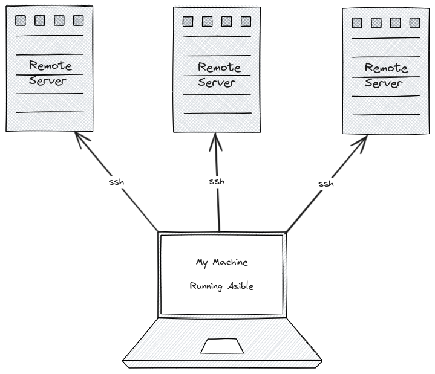
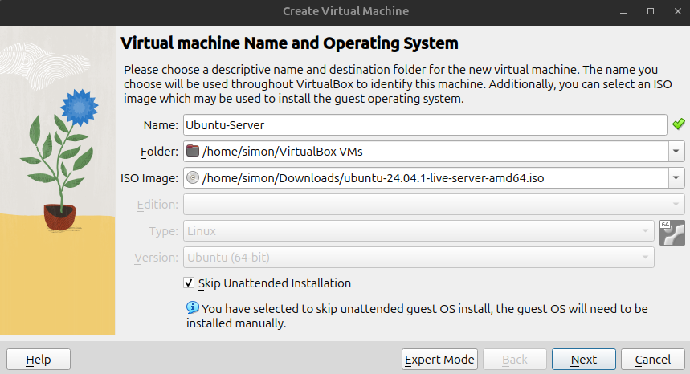
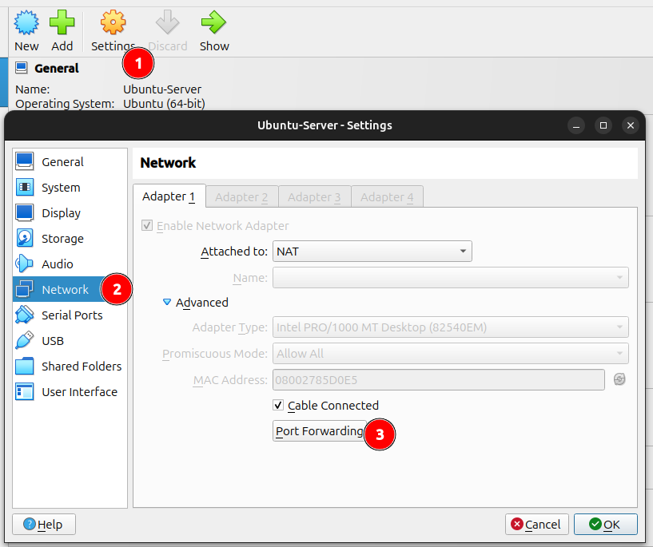
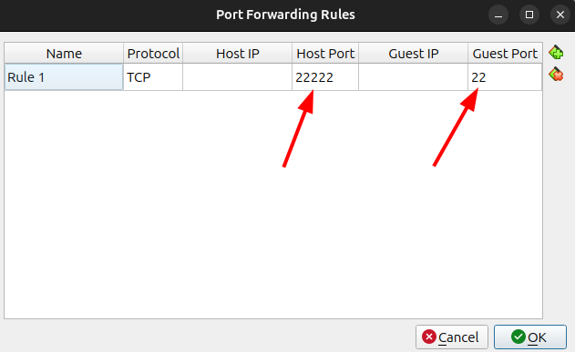
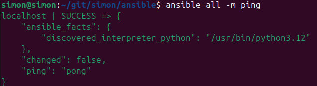
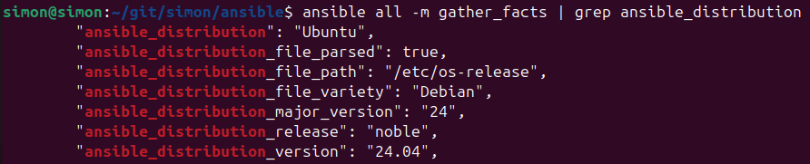
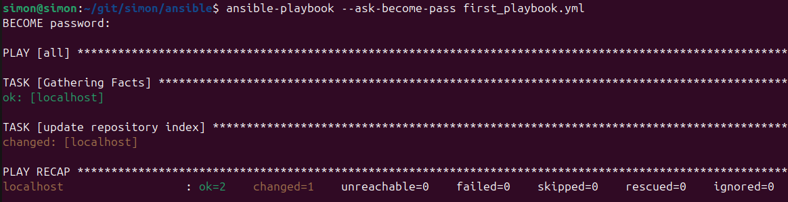
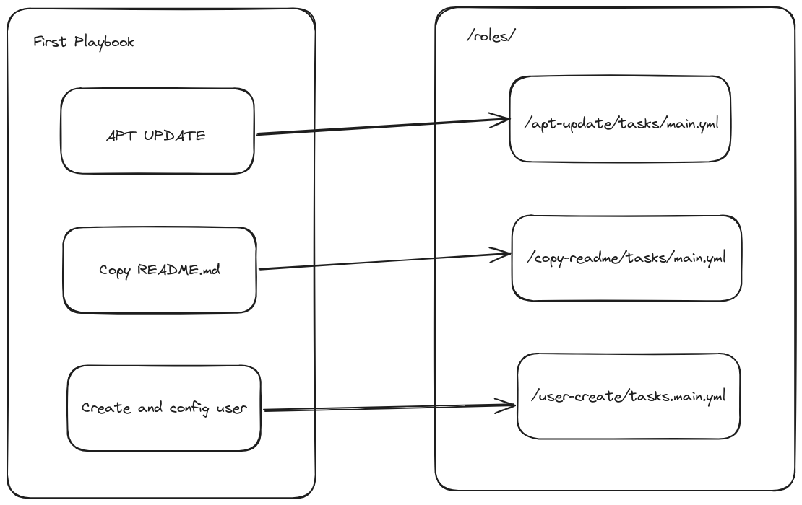
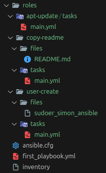
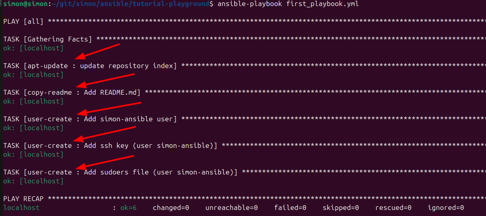

Ansible is a IaC (infrastructure as code) tool, which can automate a lot of tasks and makes setups reproducible.
Ansible has a concept of playbooks to be run to apply certain workflows, e.g., setting up a server using a VPS provider.
It is good practice to use a distributed version control system, e.g., GIT, to store all ansible files.



## Install

There are several ways to install ansible, which can be found here: https://docs.ansible.com/ansible/latest/installation_guide/intro_installation.html

For Ubuntu it can be done like this:

```bash
# Install pipx (if not already installed)
sudo apt install pipx

# Install Ansible
pipx install --include-deps ansible
```

To validate if Ansible is installed properly on your machine just run `ansible ---version`

### Install Ansible Lint (optional)

It is helpful to check for having proper yml files in your Ansible setup.

```bash
pipx install ansible-dev-tools && pipx install ansible-lint
```

With the dev tools in place `ansible-lint` can be run from the command line
or will be used by the Ansible VS Code extension, which we'll discuss later on.

## Install Virtualbox (optional)

In case you already have a server, which you intend to use you can skip this step.

In order to test ansible you can run an Ubuntu server in Virtualbox on your local machine.

```bash
sudo apt install virtualbox virtualbox-qt virtualbox-dkms
```

Now you can download the latest ubuntu server version here: https://ubuntu.com/download/server

Once the Ubuntu iso file is downloaded you can start Virtualbox and hit the `New` button.



Then just follow the steps and finally run the Ubuntu server in Virtualbox.

When installing Ubuntu server please make sure to select and install OpenSSH server
by checking the box "Install OpenSSH server".

There are plenty of tutorials out there in case you face issues.
I myself found this Video really helpful: [How to Run an Ubuntu Server VM with VirtualBox (and login via SSH)](https://www.youtube.com/watch?v=wqm_DXh0PlQ)

### Virtualbox network issues

In case port 22 is already occupied or you face other network issues you can configure the network of your VM.



And then you can change the port to talk to by using port forwarding:



## Setup ssh key

For better security and convenience it is highly recommended to use ssh keys to connect to a machine via ssh.

```bash
ssh-keygen -t ed25519 -C "ansible"
```

Now you'll be prompted to enter the file path.
Since there usually already is a default file you might want to choose a different file name, e.g., `/home/your-username/.ssh/ansible`.

In order to let ansible do it's job later on we won't add a passphrase for this ssh key.

⚠️ Please keep this ssh secret, since this will be the credential/password to your server.

## Copy ssh key to the server

Now the generated ssh key has to be propagated to the server.

```bash
ssh-copy-id -i ~/.ssh/ansible.pub -p 22222 localhost
```

In case that did not work you can also ssh into your server using the password and then copy the contents of your `~/.ssh/ansible.pub` file and write it to `~/.ssh/authorized_keys`:

```bash
echo "ssh-ed25519 AAAAC3NzaC1lZDI1NTE5AAAAIM0IWm4fVLFOYFydagOnkqaEvu9jnTUARRUYfQ0XnxFR ansible" >> authorized_keys
```

Now you can ssh into your server using your ssh key:

```bash
ssh -i ~/.ssh/ansible -p 22222 localhost
```

`-p 22222` is used to set 22222 as port, because otherwise the default ssh port 22 is used.

## Git Repository

As mentioned earlier it makes sense to use version control to store the ansible config and playbooks.

```bash
mkdir ansible
cd ansible
git init
```

To let Ansible know, which servers it should ssh into an `inventory` file can be created:

```txt [inventory]
localhost

{other-ip-addresses-or-domains}
```

To let Ansible implicitly pickup the `inventory` file an `ansible.cfg` config file can be created:

```ini [ansible.cfg]
[defaults]
inventory = inventory
private_key_file = ~/.ssh/ansible
# optional if not using default 22 port
remote_port = 22222
```

### Ansible Lint GitHub Action

Ansible lint also provides a GitHub Action to check your Ansible files hosted on GitHub.

Please see [Installing Ansible Lint as a GitHub Action](https://ansible.readthedocs.io/projects/lint/installing/#installing-ansible-lint-as-a-github-action) for detailed information.

## First Ansible commands

Within the git repository `ansible` folder the following commands can be run:

```bash
# Simply ping all servers
ansible all -m ping

# Gather meta data from all servers
ansible all -m gather_facts
```

The ping command will result in the following:



In case you do not have the `ansible.cfg` in place you can reference the key file and inventory.

```bash
# Simply ping all servers
ansible all --key-file ~/.ssh/ansible -i inventory -m ping

# Gather meta data from all servers
ansible all --key-file ~/.ssh/ansible -i inventory -m gather_facts
```

### Grep dedicated facts

When running `gather_facts` the list is quite long 
and using `grep` can help to target certain meta data.

```bash
ansible all -m gather_facts | grep ansible_distribution
```



In case you're having multiple servers in your inventory
and want to target a certain server the `--limit` flag can be used:

```bash
ansible all -m gather_facts --limit localhost | grep ansible_distribution
```

## Using VS Code (optional)

Red Hat provides a helpful Ansible extension for VS Code in the [Extension marketplace](https://marketplace.visualstudio.com/items?itemName=redhat.ansible).

This extension comes with reasonable syntax highlighting and code completion for Ansible files.

The following rules apply to make the Ansible extension work out of the box.

* yaml files under /playbooks dir.
* files with the following double extension: .ansible.yml or .ansible.yaml.
* notable yaml names recognized by ansible like site.yml or site.yaml
* yaml files having playbook in their filename: *playbook*.yml or *playbook*.yaml

That's the reason why I add `playbook` to the file name of a playbook in the next chapter.

In case you've installed the Ansible Lint, which I recommend, the Ansible VS Code extension run ansible-lint automatically
and shows lint issues right away in the editor.

## First Ansible playbook

Let's create our first Ansible playbook called `first_playbook.yml` inside the git repository.

```yml [first_playbook.yml]
---

- hosts: all
  become: true
  tasks:

  - name: update repository index
    apt:
      update_cache: yes
    when: ansible_distribution == "Ubuntu"
```

1. `become: true` is used since we need `sudo` for the `apt` commands.
2. Then we simply give the one task a `name`.
3. Using the `apt` instruction. See [ansible apt module](https://docs.ansible.com/ansible/latest/collections/ansible/builtin/apt_module.html).
4. The `when` expression can be used to specify for which kind of server this task applies.

The `first_playbook.yml` playbook can be run like this:

```bash
ansible-playbook --ask-become-pass first_playbook.yml
```

Running this should lead to a similar result:



Any time a playbook is run the `gather_facts` task will be run implicitly to make use of the facts within the playbooks,
e.g., in the `when` expression.

We can also see here that the apt cache is updated, so we successfully ran our first playbook. 🙌

In case you do not want to consider apt update as a change, since it is normal that this changes, `changed_when: false` can be used:

```yml [first_playbook.yml]
---
- hosts: all
  become: true
  tasks:

  - name: update repository index
    apt:
      update_cache: yes
    changed_when: false
```

1. `changed_when: false` means that this task won't be considered as change, since apt update usually changes a lot

## Adding files to the system

In order to work with files a `files` directory needs to be added.

So let's create a `files` directory and create a `README.md` file in it.

```bash
mkdir files
echo "## My Ansible Setup" >> files/README.md
```

Now that the README.md is in place another `Add README.md` task can be added to our playbook.

```yml [first_playbook.yml]
---
- hosts: all
  become: true
  tasks:

  - name: update repository index
    apt:
      update_cache: yes
    changed_when: false
    when: ansible_distribution == "Ubuntu"

  - name: Add README.md
    copy:
      src: README.md
      dest: /home/simon
      owner: root
      group: root
```

Please note that `src:` assumes that the files are located in the `files` directory.

```bash
ansible-playbook --ask-become-pass first_playbook.yml
```

After running the playbook the `README.md` file can be found in `/home/simon/` on the server.

## Dedicated ansible user

It is considered good practice to have a dedicated user to run the ansible playbooks.

Since that new user should also be a sudoer (allowed to run sudo commands),
we'll add a `sudoer_simon_ansible` file to the `files` directory.

```bash
echo "simon-ansible ALL=(ALL) NOPASSWD: ALL" >> files/sudoer_simon_ansible
```

This `sudoer_simon_ansible` will now also be used in the playbook:

```yml [first_playbook.yml]
---
- hosts: all
  become: true
  tasks:

  - name: update repository index
    apt:
      update_cache: yes
    changed_when: false
    when: ansible_distribution == "Ubuntu"

  - name: Add README.md
    copy:
      src: README.md
      dest: /home/simon
      owner: root
      group: root

  - name: Add simon-ansible user
    user:
      name: simon-ansible
      groups:
        - root

  - name: Add ssh key (user simon-ansible)
    authorized_key:
      user: simon-ansible
      key: "ssh-ed25519 AAAAC3NzaC1lZDI1NTE5AAAAIM0IWm4fVLFOYFydagOnkqaEvu9jnTUARRUYfQ0XnxFR ansible"

  - name: Add sudoers file (user simon-ansible)
    copy:
      src: sudoer_simon_ansible
      dest: /etc/sudoers.d/simon-ansible
      owner: root
      group: root
```

1. The `Add simon-ansible user` task just creates a user called `simon-ansible` and adds it to the root group.
2. `Add ssh key (user simon-ansible)` adds our public key `~/.ssh/ansible.pub` for the user `simon-ansible` as authorized_key
3. `Add sudoers file (user simon-ansible)` will copy the contents of `sudoer_simon_ansible` into `/etc/sudoers.d/simon-ansible`.

⚠️ Please be cautious adding a user to the root group, but we'll elaborate on security later on.

Now we can run the playbook once again to create the `simon-ansible` user.

```bash
ansible-playbook --ask-become-pass first_playbook.yml
```

Once the user is in place we can tell ansible to use this user using the `remote_user` property.

`remote_user:` can either be added to any task, but I prefer to simply add it to the `ansible.cfg` file:

```ini [ansible.cfg]
[defaults]
inventory = inventory
private_key_file = ~/.ssh/ansible
remote_user=simon-ansible
# optional if not using default 22 port
remote_port = 22222
```

Once this is done `--ask-become-pass` can be omitted, since the `simon-ansible` is authorized by the ssh key:

```bash
ansible-playbook first_playbook.yml
```

## Working with variables

Variables can be used in Ansible files using `{{your_variable}}`
and there are several ways to inject variables into a playbook run.

You can pass them via command line, e.g., using `-e "user=simon`,
where variables have highest precedence.

Also see [Understanding variable precedence](https://docs.ansible.com/ansible/latest/playbook_guide/playbooks_variables.html#ansible-variable-precedence)

Since I myself prefer to not have a too complex cli command to be run,
I'd rather put my variable in a dedicated file.

```bash
mkdir vars && echo "user: simon-ansible" >> vars/variables.yml
```

Now that we have the user variable in place, let's reference it in the playbook:
```yml [first_playbook.yml]
---
- hosts: all
  become: true
  vars_files:
    - ./vars/variables.yml
  tasks:

  ### ... other tasks

  - name: Add simon-ansible user
    user:
      name: "{{ user }}"
      groups:
        - root

  ### more tasks ...

```

1. `vars_files` is a list of files, which can include variables.
2. The `{{ user }}` variable is referenced from `./vars/variables.yml`

When you now run the playbook the user will be taken from the `./vars/variables.yml` file.

```bash
ansible-playbook first_playbook.yml
```

For more information also see [Ansible Docs: Using Variables](https://docs.ansible.com/ansible/latest/playbook_guide/playbooks_variables.html)

## Encrypt secrets (Ansible Vault)

Since Ansible are usually shared in a git repo, you should encrypt your secret data,
even though the git repo might be private.

### Encrypt

In order to encrypt a file you can run the following command:


```bash
ansible-vault encrypt {filename}

# e.g.
ansible-vault encrypt my-secrets.yml
```

### Decrypt

Decryption works in a similar manner:

```bash
ansible-vault decrypt {filename}

# e.g.
ansible-vault decrypt my-secrets.yml
```

### View and Edit

In order to view or edit the secret on the fly without changing the actual file
you can use the following commands:

```bash
ansible-vault view {filename}

# e.g.
ansible-vault view my-secrets.yml
```

```bash
ansible-vault edit {filename}

# e.g.
ansible-vault edit my-secrets.yml
```

### Change encryption password

The passphrase of an encrypted file can also be changed:

```bash
ansible-vault rekey {filename}

# e.g.
ansible-vault rekey my-secrets.yml
```

This will ask you for the current password and then you can enter a new one.

### Vault password file

Since it is preferable to run Ansible in headless mode
the need to enter a password is not helpful.

Therefore you can create a vault password file, which is supposed to be picked up by Ansible.

⚠️ Please make sure to **not push** this vault password file to version control!
So either put it outside the repository or add it to your `.gitignore` file.

```bash
echo "my_super_secret_password" >> .vault_password
```

To secure this even more we'd want to change the permissions of this file:

```bash
chmod 600 .vault_password
```

This ensures that only the root user can read and write to this file.

With the `.vault_password` in place it can be passed to the commands above like this.

```bash
ansible-vault encrypt --vault-password-file .vault_password {filename}

# e.g.
ansible-vault encrypt --vault-password-file .vault_password my-secrets.yml
```

Also this can be specified in the ansible.cfg file,
so that passing `--vault-password-file` is not mandatory.

```ini [ansible.cfg]
[defaults]
inventory = inventory
private_key_file = ~/.ssh/ansible
remote_user=simon-ansible
vault_password_file=./.vault_password
# optional if not using default 22 port
remote_port = 22222
```

### Ansible using encrypted files

Now that we know how to encrypt files, let us make use of these when running our playbook.

For this purpose we encrypt the `./vars/variables.yml` file from the former chapter,
to not expose the user name.

```bash
ansible-vault encrypt ./vars/variables.yml
```

Running this command will turn the contents of ./vars/variables.yml into this:

```yml [./vars/variables.yml]
$ANSIBLE_VAULT;1.1;AES256
32326530343030663238663666356335656330353430313333613130316631636466343339626361
6435383533386663613464613161303636343165303536330a656331323061643831366238316333
36613933373262303365353533616362353461626239323832396530663266373463633739386430
3234643164316639390a366338643130383331616632323264373466346137363165396236656134
33366632356232343963306562633864636434643237646363353431333566643936
```

Running `ansible-playbook first_playbook.yml` should just work as before, but the `./vars/variables.yml` is now encrypted.

## Using roles

Having all tasks inside one playbook will decrease the readability
and harder to maintain.
Roles can be used to organize certain tasks in a dedicated file structure,
which make them reusable and fosters proper separation of concerns.

Basically our current playbook does 3 things right now:

* apt update
* copy a file
* creates and configures a dedicated ansible user

We now intend to move these tasks into respective roles and just let the playbook delegate to these roles:



Therefore we create the following directories and files:

```bash
mkdir -p roles/apt-update/tasks/ \
         roles/copy-readme/tasks/ \
         roles/copy-readme/files/ \
         roles/user-create/tasks/ \
         roles/user-create/files/ \
&& touch roles/apt-update/tasks/main.yml \
         roles/copy-readme/tasks/main.yml \
         roles/user-create/tasks/main.yml \
&& mv files/README.md roles/copy-readme/files/README.md \
&& mv files/sudoer_simon_ansible roles/user-create/files/sudoer_simon_ansible \
&& rm -r files
```

After that the folder structure should look like this:



Now that the folder structure is in place we can copy the tasks from `first_playbook.yml` to the respective `main.yml` files.

`/roles/apt-update/tasks/main.yml`:

```yml [/roles/apt-update/tasks/main.yml]
- name: update repository index
  apt:
    update_cache: yes
  changed_when: false
  when: ansible_distribution == "Ubuntu"
```

`/roles/copy-readme/tasks/main.yml`:

```yml [/roles/copy-readme/tasks/main.yml]
- name: Add README.md
  copy:
    src: README.md
    dest: /home/simon
    owner: root
    group: root
```

`/roles/user-create/tasks/main.yml`:

```yml [/roles/user-create/tasks/main.yml]
- name: Add simon-ansible user
  user:
    name: simon-ansible
    groups:
      - root

- name: Add ssh key (user simon-ansible)
  authorized_key:
    user: simon-ansible
    key: "ssh-ed25519 AAAAC3NzaC1lZDI1NTE5AAAAIM0IWm4fVLFOYFydagOnkqaEvu9jnTUARRUYfQ0XnxFR ansible"

- name: Add sudoers file (user simon-ansible)
  copy:
    src: sudoer_simon_ansible
    dest: /etc/sudoers.d/simon-ansible
    owner: root
    group: root
```

The `first_playbook.yml` file can now use the `roles:` property to delegate to the roles:

```yml [first_playbook.yml]
---
- hosts: all
  become: true
  roles:
    - apt-update
    - copy-readme
    - user-create
```

When you now run the playbook...

```bash
ansible-playbook first_playbook.yml
```
... nothing should've changed and the outcome should still be the same.
But we now have cleaned up a bit and have clear separation of concerns.



Note that the roles are also mentioned in the console output.

If you want to create a new role from scratch the `ansible-galaxy` cli can be used for this:

```bash
ansible-galaxy role init {role-name}

# e.g.
ansible-galaxy role init custom
```

## Sources

- https://www.ansible.com/
- https://docs.ansible.com/ansible/latest/playbook_guide/playbooks_variables.html
- https://www.youtube.com/watch?v=GROqwFFLl3s
