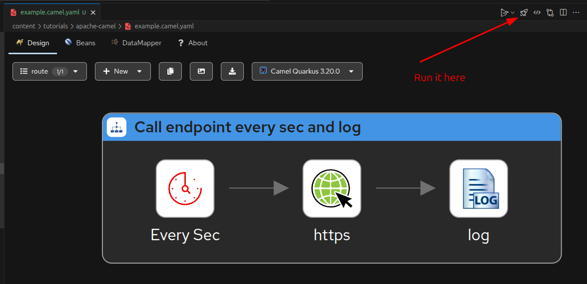

Apache Camel is a really powerful integration framework that enables you to connect diverse systems using enterprise integration patterns.
With its flexible routing and transformation capabilities, Camel simplifies complex workflows and data exchanges.
Combined with Kaoto you can visually design and configure Camel routes with ease.

## Prerequisites

- Java / Kotlin
- VS Code
- Gradle
- Quarkus (optional)

## Install Extension Pack for Apache Camel by Red Hat

In order to create Camel Routes in VS Code the [Extension Pack for Apache Camel by Red Hat](https://marketplace.visualstudio.com/items?itemName=redhat.apache-camel-extension-pack) is really helpful.

## Create a new Camel Route

Open VS Code and create a new file with the extension `.camel.yaml`, for example `example.camel.yaml`.

You can then open the file using the Kaoto editor.



The source of the route depicted in the screenshot looks like this:

```yaml[example.camel.yaml]
- route:
    id: route
    description: Call endpoint every sec and log
    from:
      id: timer
      description: Every Sec
      uri: timer
      parameters:
        delay: "1000"
        period: "1000"
        timerName: Tick-Every-Second
      steps:
        - to:
            id: request
            uri: https
            parameters:
              httpUri: https://jsonplaceholder.typicode.com/todos/1
        - log:
            id: log
            message: ${body}
```

This route will trigger every second, call the specified HTTP endpoint, and log the response body.

## Using camel yaml in Quarkus

In order to use the Camel YAML DSL in Quarkus, you need to add the following dependencies to your `build.gradle.kts` file:

```kotlin[build.gradle.kts]
dependencies {
    implementation("org.apache.camel.quarkus:camel-quarkus-yaml")

    // dependencies used by the route specified in the yaml file
    implementation("org.apache.camel.quarkus:camel-quarkus-timer")
    implementation("org.apache.camel.quarkus:camel-quarkus-http")
    implementation("org.apache.camel.quarkus:camel-quarkus-log")
}
```

Once you have added the dependency, you can move your yaml files designed with Kaoto to the `src/main/resources/camel` directory.
The filename must be `{your-custom-route-name}.camel.yaml`, because the default config will look for files with this pattern.

## Sources

- https://marketplace.visualstudio.com/items?itemName=redhat.apache-camel-extension-pack
