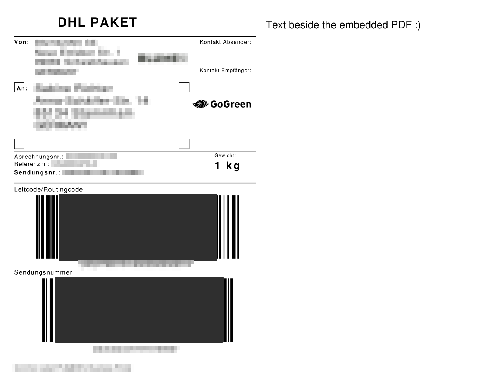

Apache PDFBox is a really powerful tool to work with PDF files and create or manipulate them.

## Prerequisites

- Java / Kotlin
- Gradle

## Create a project and adding dependencies

The following command will generate a kotlin application project called `jlama-example`.

```bash
gradle init \
    --type kotlin-application \
    --dsl kotlin \
    --test-framework junit-jupiter \
    --project-name pdfbox-example \
    --package dev.simonscholz \
    --no-split-project \
    --no-incubating \
    --java-version 21
```

For other options run `gradle help --task init`.

Now that we have a project in place we can add the required dependencies to it.

First the `libs.versions.toml` file in the `gradle` folder needs to be modified:

```toml[libs.versions.toml]
[versions]
kotlin = "2.1.0"
pdfbox = "3.0.3"

[libraries]
pdfbox = { module = "org.apache.pdfbox:pdfbox", version.ref = "pdfbox" }

[plugins]
kotlin-jvm = { id = "org.jetbrains.kotlin.jvm", version.ref = "kotlin" }
```

Feel free to leave the existing declarations in the `libs.versions.toml` file as is, but we do not need them for this tutorial.

The `build.gradle.kts` can be adjusted accordingly:

```kotlin[build.gradle.kts]
dependencies {
    implementation(libs.pdfbox)
}
```

For more information on how to use toml files in Gradle please see my other tutorial on this topic: https://simonscholz.dev/tutorials/gradle-toml-version-catalogs

## Render pdf page onto another page

Recently I wanted to create a PDF page with some custom text on it and also embed a [delivery label from fulfillmenttools](https://github.com/fulfillmenttools/fulfillmenttools-api-reference/blob/ab9b6f8ed7845775588e39e8741533bd5a0eaa71/api.swagger.yaml#L5694), which itself also is a pdf file.

Here is the code, which actually puts a pdf page, e.g. a delivery label, onto a newly created pdf page and also adds some text besides it.

```kotlin[App.kt]
package dev.simonscholz

import org.apache.pdfbox.Loader
import org.apache.pdfbox.pdmodel.PDDocument
import org.apache.pdfbox.pdmodel.PDPage
import org.apache.pdfbox.pdmodel.PDPageContentStream
import org.apache.pdfbox.pdmodel.PDResources
import org.apache.pdfbox.pdmodel.common.PDRectangle
import org.apache.pdfbox.pdmodel.font.PDType1Font
import org.apache.pdfbox.pdmodel.font.Standard14Fonts
import org.apache.pdfbox.pdmodel.graphics.form.PDFormXObject
import org.apache.pdfbox.util.Matrix
import java.io.File

fun main() {
    renderSourcePdfOntoNewPdfPage(
        sourcePdfPath = "/home/simon/parcel-label.pdf",
        outputPdfPath = "/home/simon/tutorial.pdf",
    )
}

fun renderSourcePdfOntoNewPdfPage(
    sourcePdfPath: String,
    outputPdfPath: String,
) {
    PDDocument().use { targetPdf ->
        val page = PDPage(PDRectangle.A4)
        targetPdf.addPage(page)

        val sourcePdf = Loader.loadPDF(File(sourcePdfPath))

        val sourcePage = sourcePdf.getPage(0)

        val resources = sourcePage.resources
        val mediaBox = sourcePage.mediaBox
        val formXObject = PDFormXObject(targetPdf)
        formXObject.bBox = mediaBox
        formXObject.resources = PDResources(resources.cosObject)

        val sourceStream = sourcePage.contents
        val formStream = formXObject.stream.createOutputStream()
        formStream.use { output ->
            sourceStream.use { input ->
                input.copyTo(output)
            }
        }

        val targetPage = targetPdf.getPage(0)
        PDPageContentStream(targetPdf, targetPage, PDPageContentStream.AppendMode.APPEND, true).use { contentStream ->
            val margin = 20f
            contentStream.saveGraphicsState()
            contentStream.transform(
                Matrix(
                    1f,
                    0f,
                    0f,
                    1f,
                    margin,
                    targetPage.mediaBox.height - mediaBox.height - margin,
                ),
            )
            contentStream.drawForm(formXObject)
            contentStream.restoreGraphicsState()

            // Write text beside the embedded PDF
            val font = PDType1Font(Standard14Fonts.FontName.HELVETICA)
            contentStream.beginText()
            contentStream.setFont(font, 12f)
            contentStream.newLineAtOffset(
                mediaBox.width + margin + 10f,
                targetPage.mediaBox.height - margin - 20f,
            )
            contentStream.showText("Text beside the embedded PDF :)")
            contentStream.endText()
        }

        targetPdf.save(outputPdfPath)

        sourcePdf.close()
    }
}
```

The result could then look like this:



## Sources

- https://pdfbox.apache.org/
