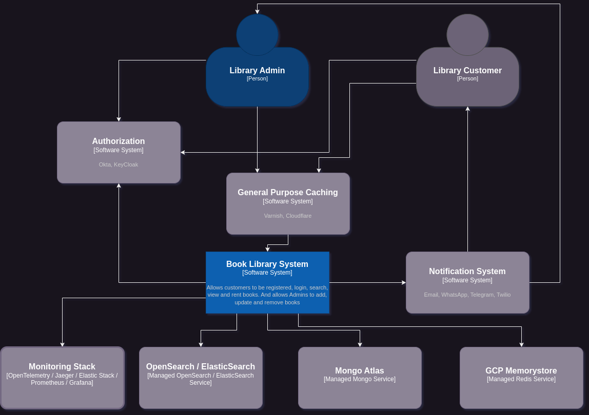
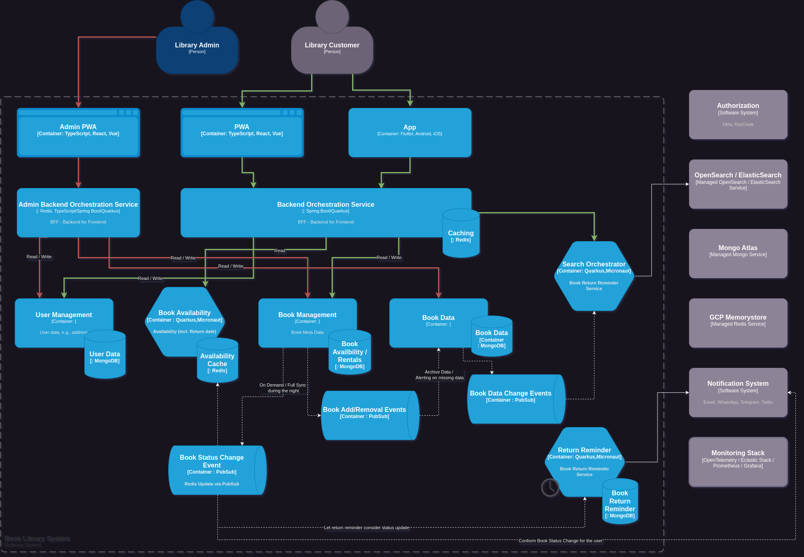
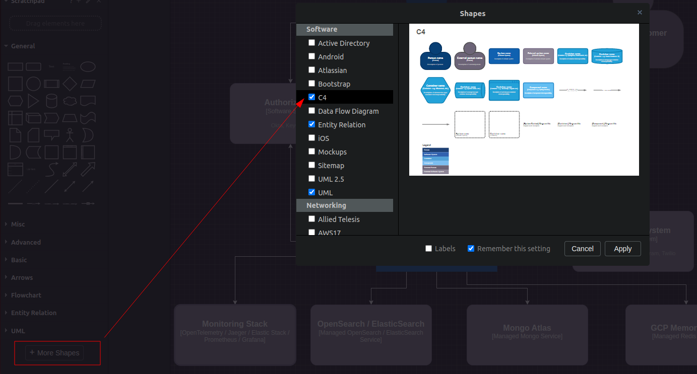
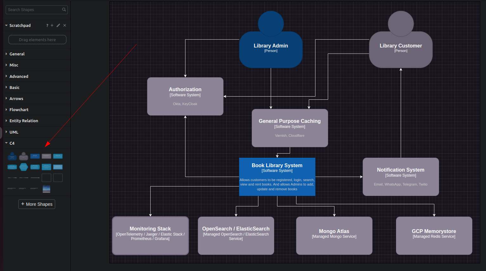
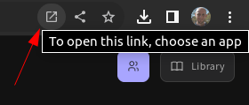
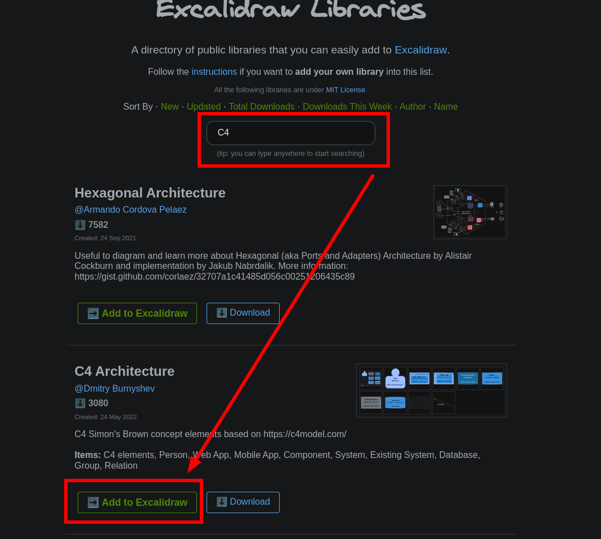

In software architecture, the C4 model is a visual representation technique used to communicate different levels of abstraction in a clear and concise manner. The C4 model consists of four levels: Context, Container, Component, and Code. These levels help in describing the architecture of a software system from a high-level overview to detailed code-level components. One of the strengths of the C4 model is its simplicity and effectiveness in communicating complex architecture concepts.

It was invented by Simon Brown and can be found here: https://c4model.com/

## C1 - System Context

The Context Diagram provides a high-level overview of the software system's interactions with external entities. It's often used to depict the system's boundaries and its interactions with users, external systems, and actors.

So let's try to model a library:

## C2 - Container

The container diagram zooms in from the Context Diagram and focuses on the major high-level components of the system, also known as containers. Containers can be web servers, databases, desktop applications, mobile apps, etc.

To drill a little bit into the system container diagrams can be used. So let's look further into the library system itself:

## C3 - Component

The component diagram delves further into each container, breaking it down into its internal components/modules. This diagram highlights the key functional parts within each container.

With component diagram we would now look into a specific container, which were depicted formerly in the container diagram:

## C4 - Code

The Code Diagram is the most detailed level and showcases the internal structure of a specific component/module from the Component Diagram. It can illustrate classes, functions, methods, and their relationships.

Often this is reflected as UML class diagrams, but even Simon Brown himself says that C4 should not be done, since it could be generated automatically based on your code.

## Tools

Here I will list the tools I've been using so far to create C4 model diagrams.

Also see here for a more complete list: https://c4model.com/#Tooling

### Markup Language

#### Mermaid

Besides Mermaid there is also PlantUML, which is similar to Mermaid, but the nice thing about Mermaid is that GitHub is capable of rendering Mermaid Diagrams directly in the markdown files.

Also see https://mermaid.js.org/syntax/c4.html

### WYSIWYG (What you see is what you get)

I am sure there are plenty of WYSIWYG editors, which provide C4 diagram shapes, but draw.io and excalidraw are the ones I have been using so far.

#### Draw.io

You can go to https://www.drawio.com/ and simply press [Start] or [Download].

In my case I downloaded the latest deb file from https://github.com/jgraph/drawio-desktop/releases and ran `sudo apt install ./drawio-amd64-21.6.8.deb`.

Once the shapes have been added they can easily be dragged from the left side panel to be used in a diagram.

#### Excalidraw

Excalidraw can directly be used within the browser: https://excalidraw.com/ or like an app using the following button in your browser, e.g., Google Chrome:

In order to add the C4 shapes to Excalidraw simply press the [Library] button in the right top corner.

Basically you'd then get redirected to https://libraries.excalidraw.com/ and can search for C4.

## Sources

- https://c4model.com
- https://mermaid.js.org/syntax/c4.html
