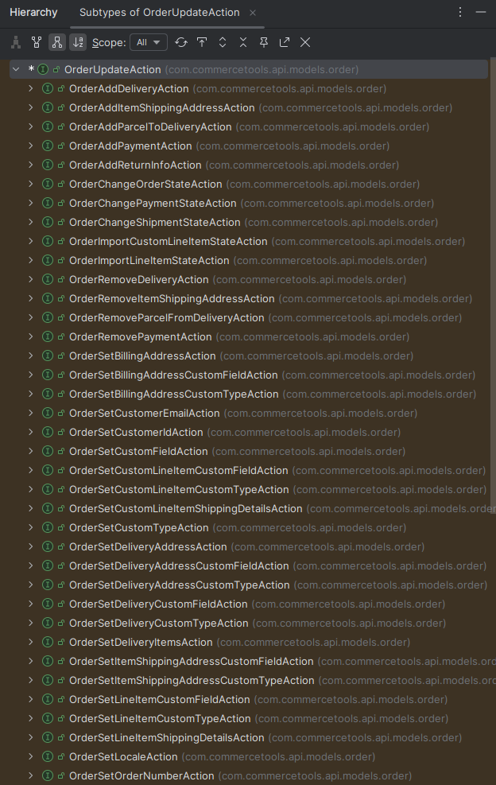
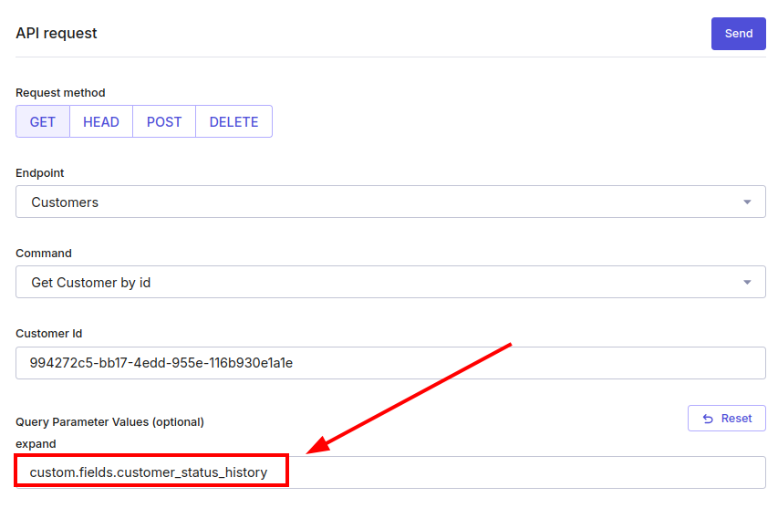

Commercetools is a cloud-based headless commerce platform that provides APIs to handle commerce processes like customer management, order management, product catalogs and many more commerce related properties.

The Commercetools Java SDK overview can be found [here](https://docs.commercetools.com/sdk/jvm-sdk)

## Prerequisites

- Java / Kotlin
- Gradle
- Commercetools Java SDK

## Create a project and adding dependencies

The following command will generate a kotlin application project called `commercetools-example`.

```bash
gradle init \
    --type kotlin-application \
    --dsl kotlin \
    --test-framework junit-jupiter \
    --project-name commercetools-example \
    --package dev.simonscholz \
    --no-split-project \
    --no-incubating \
    --java-version 21
```

For other options run `gradle help --task init`.

Now that we have a project in place we can add the required dependencies to it.

First the `libs.versions.toml` file in the `gradle` folder needs to be modified:

```toml[libs.versions.toml]
[versions]
kotlin = "2.1.0"
commercetools = "latest.release"

[libraries]
commercetools-client = { module = "com.commercetools.sdk:commercetools-http-client", version.ref = "commercetools"}
commercetools-api = { module = "com.commercetools.sdk:commercetools-sdk-java-api", version.ref = "commercetools"}

[plugins]
jvm = { id = "org.jetbrains.kotlin.jvm", version.ref = "kotlin" }
```

Feel free to leave the existing declarations in the `libs.versions.toml` file as is, but we do not need them for this tutorial.

Please be aware that using `latest.release` is not recommended for a production environment!

```kotlin[build.gradle.kts]
dependencies {

    // ... other dependencies ...

    implementation(libs.commercetools.api)
    implementation(libs.commercetools.client)
}
```

For more information on how to use toml files in Gradle please see my other tutorial on this topic: https://simonscholz.dev/tutorials/gradle-toml-version-catalogs

## Creating the general purpose client

Usually you´d add an instance of `ProjectApiRoot` as bean to your application context, e.g. for Spring or Quarkus, but in this tutorial we´ll stick to the basics and therefore simply create a `ProjectApiRootFactory`.

```kotlin[ProjectApiRootFactory.kt]
import com.commercetools.api.client.ProjectApiRoot
import com.commercetools.api.defaultconfig.ApiRootBuilder
import com.commercetools.api.defaultconfig.ServiceRegion

object ProjectApiRootFactory {
    fun commerceToolsProjectApiRoot(
        clientID: String,
        clientSecret: String,
        projectKey: String,
    ): ProjectApiRoot =
        ApiRootBuilder
            .of()
            .defaultClient(
                ClientCredentials
                    .of()
                    .withClientId(clientID)
                    .withClientSecret(clientSecret)
                    .build(),
                ServiceRegion.GCP_EUROPE_WEST1,
            ).build(projectKey)
}
```

Here I´d leave the `ServiceRegion` hard coded as `ServiceRegion.GCP_EUROPE_WEST1`, but feel free to adjust it according to your needs.

## Adding a middleware to log requests and responses (optional)

During the creation of a `ProjectApiRoot` a middleware can be added:

```kotlin[ProjectApiRootFactory.kt]
import com.commercetools.api.client.ProjectApiRoot
import com.commercetools.api.defaultconfig.ApiRootBuilder
import com.commercetools.api.defaultconfig.ServiceRegion
import io.vrap.rmf.base.client.http.Middleware
import io.vrap.rmf.base.client.oauth2.ClientCredentials
import kotlin.text.Charsets.UTF_8

object ProjectApiRootFactory {
    fun commerceToolsProjectApiRoot(
        clientID: String,
        clientSecret: String,
        projectKey: String,
    ): ProjectApiRoot =
        ApiRootBuilder
            .of()
            .defaultClient(
                ClientCredentials
                    .of()
                    .withClientId(clientID)
                    .withClientSecret(clientSecret)
                    .build(),
                ServiceRegion.GCP_EUROPE_WEST1,
            ).addMiddleware(createLoggingMiddleware())
            .build(projectKey)

    private fun createLoggingMiddleware(): Middleware =
        Middleware { request, next ->
            println("Request:")
            println("  URL: ${request.url}")
            println("  Method: ${request.method}")
            request.body?.let {
                println("  Payload: ${it.toString(UTF_8)}")
            }

            next.apply(request).thenApply { response ->
                println("Response:")
                println("  Status Code: ${response.statusCode}")
                response.body?.let {
                    println("  Payload: ${it.toString(UTF_8)}")
                }
                response
            }
        }
}
```

## Creating a CommercetoolsOrderAdapter

To have proper separation of concern let´s create a `CommercetoolsOrderAdapter` class for updating orders in Commercetools.

In the following code the postal code of the billing address of an order can be updated.

```kotlin[CommercetoolsOrderAdapter.kt]
import com.commercetools.api.client.ProjectApiRoot
import com.commercetools.api.models.order.Order
import com.commercetools.api.models.order.OrderSetBillingAddressAction
import com.commercetools.api.models.order.OrderUpdate
import com.commercetools.api.models.order.OrderUpdateAction

class CommercetoolsOrderAdapter(
    private val apiRoot: ProjectApiRoot,
) {
    fun updateOrderBillingAddressPostalCode(
        orderId: String,
        newPostalCode: String,
    ) {
        val order = order(orderId) // 1

        val addressDraft = // 2
            order.billingAddress
                .toDraftBuilder()
                .postalCode(newPostalCode)
                .build()

        val setBillingAddressAction = // 3
            OrderSetBillingAddressAction
                .builder()
                .address(addressDraft)
                .build()

        executeOrderUpdate(order, listOf(setBillingAddressAction)) // 4
    }

    private fun executeOrderUpdate(
        order: Order,
        orderUpdateActions: List<OrderUpdateAction>,
    ) {
        require(orderUpdateActions.isNotEmpty()) { "orderUpdateActions must not be empty." }

        val orderUpdate =
            OrderUpdate
                .builder()
                .version(order.version) // 5
                .actions(orderUpdateActions.toMutableList())
                .build()

        val response =
            apiRoot
                .orders()
                .withId(order.id)
                .post(orderUpdate)
                .executeBlocking()

        println("Reponse: $response")

        println("Body: ${response.body}")
    }

    private fun order(orderId: String): Order =
        apiRoot
            .orders()
            .withId(orderId)
            .get()
            .executeBlocking()
            .body
}
```

1. Get the latest order object from Commercetools
2. Copy the existing billing address by using the `toDraftBuilder()` function and only modify the postal code
3. Create an instance of `OrderSetBillingAddressAction`
4. Execute the update on the order using the `ProjectApiRoot`, which has been passed to the constructor
5. Be aware that commercetools uses versioning to avoid concurrent modifications of domain objects. Due to this the latest version of a domain object, e.g. order, has to be passed with the update request.

Note: Using `toDraftBuilder()` on existing objects is really handy when using the SDK, because the API only allows to update whole objects like addresses.
So if you wanted to update the billing address using Postman or any other rest client you´d be forced to copy over the whole existing address into the request payload.
Therefore using `toDraftBuilder()` is way more convenient as it allows to just pass the new postal code or whatever needs to be changed.

## Run the code

```kotlin[App.kt]
package dev.simonscholz

fun main() {
    val apiRoot =
        ProjectApiRootFactory.commerceToolsProjectApiRoot(
            clientID = "your-client-id",
            clientSecret = "your-client-secret",
            projectKey = "your-project-key",
        )

    val orderAdapter = CommercetoolsOrderAdapter(apiRoot)

    orderAdapter.updateOrderBillingAddressPostalCode("51a570ee-e10a-4ee6-b4d0-94c9bc014bd3", "22415")
}
```

This will then print the response to the console and in case you added the middleware both the request data and response data is printed.

## Exploring the API further

Thanks to the strong typing it is pretty straight forward to find the proper actions, by using content assist and looking at the class hierarchy.

In IntelliJ you can click on the `OrderUpdateAction` and press `CTRL+H` in order to see the subclasses of `OrderUpdateAction` to figure out that specific actions can be applied to an order.
The same logic can be applied to any other `ResourceUpdateAction` like `CartUpdateAction`, `CustomerUpdateAction`, `ProductUpdateAction` or many others.



## Resetting values

To reset/remove a certain value it can usually be set to `null` and then send the update.
But be aware that commercetools has a lot of validations when doing API requests and will give insights what failed in the response in case the request causes any problems.

## Custom fields and custom objects

Custom fields are great to adjust additional data to existing domain objects, like orders, customers and others.
For a customer you might want to have a custom customer_status attached to the customer domain object of commercetools.

### Add custom fields using Terraform

Commercetools can be configured using IAC like Terraform using the [labd terraform provider](https://registry.terraform.io/providers/labd/commercetools/latest)

Adding this provider to your terraform setup works like this:

```terraform[providers.tf]
terraform {
  required_providers {
    commercetools = {
      source = "labd/commercetools"
    }
  }
}

provider "commercetools" {
  client_id     = var.commercetools_client_id
  client_secret = var.commercetools_client_secret
  project_key   = var.commercetools_project_key
  scopes        = var.commercetools_scopes
  token_url     = var.commercetools_token_url
  api_url       = var.commercetools_api_url
}
```

The variables above need to be specified by the a `variables.tf` file.

```terraform[variables.tf]
variable "commercetools_client_id" {
  description = "The client ID for accessing the Commercetools API."
  type        = string
}

variable "commercetools_client_secret" {
  description = "The client secret for accessing the Commercetools API."
  type        = string
  sensitive   = true
}

variable "commercetools_project_key" {
  description = "The project key for the Commercetools project."
  type        = string
}

variable "commercetools_scopes" {
  description = "The scopes for the Commercetools API access."
  type        = string
}

variable "commercetools_token_url" {
  description = "The token URL for the Commercetools authentication."
  type        = string
}

variable "commercetools_api_url" {
  description = "The API URL for the Commercetools services."
  type        = string
}
```

These variables can then be provided by using a `TF_VAR_commercetools_client_id` environment variable.

Also see my other terraform tutorial, called [Reading .env file and use it for sensitive vars in Terraform](https://simonscholz.dev/tutorials/terraform-sensitive-vars), on how to conveniently provide `TF_VAR` variables for Terraform.

An appropriate `.env` file would then look like this:

```shell[.env]
TF_VAR_commercetools_client_id=
TF_VAR_commercetools_client_secret=
TF_VAR_commercetools_project_key=
TF_VAR_commercetools_scopes=
TF_VAR_commercetools_token_url=
TF_VAR_commercetools_api_url=
```
Be sure to put proper values behind the `=`.

Of course you can also utilize GitHub actions to do a terraform apply and then provide these `TF_VAR` variables as environment variables for the GitHub action.

Once the provider is available custom types can be added to domain objects:

```terraform[customer_attributes.tf]
resource "commercetools_type" "my-custom-type" {
  key = "custom-customer-type"
  name = {
    en = "Custom properties"
    de = "Individuelle Attribute"
  }
  description = {
    en = "Custom customer properties"
    de = "Individuelle Attribute des Kunden"
  }

  resource_type_ids = ["customer"]

  field {
    name = "customer_status"
    label = {
      en = "Customer Status"
      de = "Kundenstatus"
    }
    type {
      name = "LocalizedEnum"
      localized_value {
        key = "regular"
        label = {
          en = "Regular Status"
          de = "Normal-Status"
        }
      }
      localized_value {
        key = "premium"
        label = {
          en = "Premium Status"
          de = "Premium-Status"
        }
      }
      localized_value {
        key = "gold"
        label = {
          en = "Gold Status"
          de = "Gold-Status"
        }
      }
    }
  }

  field {
    name = "customer_status_history"
    label = {
      en = "customer status change history"
      de = "Kundenstatus Historie"
    }
    type {
      name              = "Reference"
      reference_type_id = "key-value-document"
    }
  }
}
```

Also see https://registry.terraform.io/providers/labd/commercetools/latest/docs/resources/type

### Insert json data into custom object

In the terraform code from above we do have a `customer_status_history` of type `Reference`.
This `Reference` is supposed to point to a custom object, which consists of a json object, which represents the `customer_status_history`.

First of all let´s add the jackson object mapper dependencies:

```toml[libs.versions.toml]
[versions]
kotlin = "2.1.0"
commercetools = "latest.release"
jackson = "2.18.2"

[libraries]
jackson-core = { module = "com.fasterxml.jackson.core:jackson-core", version.ref = "jackson" }
jackson-databind = { module = "com.fasterxml.jackson.core:jackson-databind", version.ref = "jackson" }
jackson-datatype-jsr310 = { module = "com.fasterxml.jackson.datatype:jackson-datatype-jsr310", version.ref = "jackson" }
jackson-module-kotlin = { module = "com.fasterxml.jackson.module:jackson-module-kotlin", version.ref = "jackson" }
commercetools-client = { module = "com.commercetools.sdk:commercetools-http-client", version.ref = "commercetools"}
commercetools-api = { module = "com.commercetools.sdk:commercetools-sdk-java-api", version.ref = "commercetools"}

[plugins]
jvm = { id = "org.jetbrains.kotlin.jvm", version.ref = "kotlin" }
```

And the `build.gradle.kts` must now be adjusted to include jackson:

```kotlin[build.gradle.kts]
dependencies {

    // ... other dependencies ...

    implementation(libs.jackson.core)
    implementation(libs.jackson.databind)
    implementation(libs.jackson.datatype.jsr310)
    implementation(libs.jackson.module.kotlin)

    implementation(libs.commercetools.api)
    implementation(libs.commercetools.client)
}
```

Now we need some classes to be stored as json.

Let´s begin with the `CustomerStatus` enum:

```kotlin[CustomerStatus.kt]
package dev.simonscholz

enum class CustomerStatus {
    REGULAR,
    PREMIUM,
    GOLD,
}
```

To store the state changes we need a `CustomerStatusHistoryEntry`:

```kotlin[CustomerStatusHistoryEntry.kt]
package dev.simonscholz

import java.time.Instant

data class CustomerStatusHistoryEntry(
    val oldStatus: CustomerStatus,
    val newStatus: CustomerStatus,
    val date: Instant,
)
```

Once this data model is in place let´s serialize this model data and store it as custom object in commercetools.
To archive this we create a `CommercetoolsCustomerAdapter`:

```kotlin[CommercetoolsCustomerAdapter.kt]
package dev.simonscholz

import com.commercetools.api.client.ProjectApiRoot
import com.commercetools.api.models.custom_object.CustomObjectDraftBuilder
import com.fasterxml.jackson.databind.JsonNode
import com.fasterxml.jackson.datatype.jsr310.JavaTimeModule
import com.fasterxml.jackson.module.kotlin.jacksonObjectMapper

class CommercetoolsCustomerAdapter(
    private val apiRoot: ProjectApiRoot,
) {
    fun createJsonCustomObject(
        customerId: String,
        customerStatusHistoryEntries: List<CustomerStatusHistoryEntry>,
    ): String {
        val customerStatusHistoryEntriesJson: JsonNode = objectMapper.valueToTree(customerStatusHistoryEntries) // 1

        val customObjectDraft =
            CustomObjectDraftBuilder
                .of()
                .container("customer-status-history") // 2
                .key("customer-status-history-$customerId") // 3
                .value(customerStatusHistoryEntriesJson) // 4
                .build()

        val customObjectId =
            apiRoot
                .customObjects()
                .post(customObjectDraft)
                .executeBlocking()
                .body.id

        return customObjectId // 5
    }

    companion object {
        val objectMapper =
            jacksonObjectMapper().apply {
                registerModule(
                    JavaTimeModule(),
                )
            }
    }
}
```

1. Serialize the data model as `JsonNode`
2. Specify a container name
3. Specify a dedicated key for this particular custom object by also adding the `customerId`
4. Set the `JsonNode` as value
5. Return the actual id of the custom object, which will later be used for the reference in the `customer_status_history` custom `Reference` field, which was specified for customers in Terraform.

Please note that using a `JsonNode` instance is mandatory, because simply sending a json string would cause the string to be escaped.

### Relate the custom object

Now that we created a custom object containing a json representation of `CustomerStatusHistoryEntry` objects, we´d want to relate it to the `Reference` of the `customer_status_history` custom field, which was defined earlier via Terraform.

Therefore the `addStatusHistoryReferenceToCustomer` function is added to the `CommercetoolsCustomerAdapter`.

```kotlin[CommercetoolsCustomerAdapter.kt]
package dev.simonscholz

import com.commercetools.api.client.ProjectApiRoot
import com.commercetools.api.models.custom_object.CustomObjectDraftBuilder
import com.commercetools.api.models.custom_object.CustomObjectReferenceBuilder
import com.commercetools.api.models.customer.CustomerSetCustomFieldAction
import com.commercetools.api.models.customer.CustomerUpdateBuilder
import com.fasterxml.jackson.databind.JsonNode
import com.fasterxml.jackson.datatype.jsr310.JavaTimeModule
import com.fasterxml.jackson.module.kotlin.jacksonObjectMapper

class CommercetoolsCustomerAdapter(
    private val apiRoot: ProjectApiRoot,
) {
    fun createJsonCustomObject(
        customerId: String,
        customerStatusHistoryEntries: List<CustomerStatusHistoryEntry>,
    ): String {
        val customerStatusHistoryEntriesJson: JsonNode = objectMapper.valueToTree(customerStatusHistoryEntries)

        val customObjectDraft =
            CustomObjectDraftBuilder
                .of()
                .container("customer-status-history")
                .key("customer-status-history-$customerId")
                .value(customerStatusHistoryEntriesJson)
                .build()

        val customObjectId =
            apiRoot
                .customObjects()
                .post(customObjectDraft)
                .executeBlocking()
                .body.id

        return customObjectId
    }

    fun addStatusHistoryReferenceToCustomer(
        customerId: String,
        customObjectId: String,
    ) {
        val customer =
            apiRoot
                .customers()
                .withId(customerId)
                .get()
                .executeBlocking()
                .body

        val customObjectReference =
            CustomObjectReferenceBuilder
                .of()
                .id(customObjectId)
                .build()
        val setTransactionHistoryReference =
            CustomerSetCustomFieldAction
                .builder()
                .name(CUSTOMER_STATUS_HISTORY)
                .value(customObjectReference)
                .build()
        val customerUpdate =
            CustomerUpdateBuilder
                .of()
                .version(customer.version)
                .actions(setTransactionHistoryReference)
                .build()
        apiRoot
            .customers()
            .withId(customer.id)
            .post(customerUpdate)
            .executeBlocking()
    }

    companion object {
        const val CUSTOMER_STATUS_HISTORY = "customer_status_history"
        val objectMapper =
            jacksonObjectMapper().apply {
                registerModule(
                    JavaTimeModule(),
                )
            }
    }
}
```

Having the `customer_status_history` reference in place it can be queried, when a customer is fetched from the commercetools api by using an expand in the `CommercetoolsCustomerAdapter`:

```kotlin[CommercetoolsCustomerAdapter.kt]

    // .. other declarations of CommercetoolsCustomerAdapter from above

    fun getCustomerWithStatusHistoryExpand(customerId: String): List<CustomerStatusHistoryEntry> {
        val customer =
            apiRoot
                .customers()
                .withId(customerId)
                .get()
                .withExpand { "custom.fields.$CUSTOMER_STATUS_HISTORY" }
                .executeBlocking()
                .body

        val customerStatusHistoryJson =
            customer.custom.fields.values()[CUSTOMER_STATUS_HISTORY] as? String
                ?: return emptyList()

        val customerStatusHistory =
            objectMapper.readValue(
                customerStatusHistoryJson,
                object : TypeReference<List<CustomerStatusHistoryEntry>>() {},
            )

        return customerStatusHistory
    }
```

You can also go to the [API Playground of Commercetools](https://docs.commercetools.com/merchant-center/developer-settings#api-playgrounds) to query a customer and expand the `custom.fields.customer_status_history`.



### Run the CommercetoolsCustomerAdapter code

```kotlin[App.kt]
package dev.simonscholz

fun main() {
    val apiRoot =
        ProjectApiRootFactory.commerceToolsProjectApiRoot(
            clientID = "your-client-id",
            clientSecret = "your-client-secret",
            projectKey = "your-project-key",
        )

    val customerId = "desired-customer-uuid"
    val customerStatusHistory = // 1
        listOf(
            CustomerStatusHistoryEntry(
                oldStatus = CustomerStatus.REGULAR,
                newStatus = CustomerStatus.PREMIUM,
                date = Instant.now(),
            ),
        )

    val customerAdapter = CommercetoolsCustomerAdapter(apiRoot)
    val customObjectId = customerAdapter.createJsonCustomObject(customerId, customerStatusHistory) // 2
    customerAdapter.addStatusHistoryReferenceToCustomer(customerId, customObjectId) // 3

    val customerWithStatusHistory = customerAdapter.getCustomerWithStatusHistoryExpand(customerId) // 4

    println(customerWithStatusHistory) // 5
}
```

1. Create some sample data of `CustomerStatusHistoryEntry`
2. Store the list of `CustomerStatusHistoryEntry` objects as json in a custom object in Commercetools and obtain the id of that custom object.
3. Set the id of the custom object as reference for the customer´s `customer_status_history` custom field.
4. Fetch the customer including the expand of the custom `customer_status_history` reference. Without the expand only the id would be returned, but not the json itself.
5. Print the customer domain object and look for the `customer_status_history` json ;)


## Async / Concurrent calls

Besides the `executeBlocking()` method the Commercetools SDK also offers an `execute()` method, which returns a `CompletableFuture`.

The `CompletableFuture` can be used to do concurrent calls towards the Commercetools API by using the `CompletableFuture` directly or by converting it into reactive types provided by RxJava, Project Reactor or Mutiny.
Those reactive libraries all provide adapter to turn a `CompletableFuture` into a reactive type.

And of course Kotlin Coroutines can be used as depicted in the next chapter.

### Using kotlin coroutines

When adding Kotlin Coroutines as dependency the `CompletableFuture` can be turned into a suspending function using the `await()` extension function.

```toml[libs.versions.toml]
[versions]
kotlin = "2.1.0"
kotlinx-coroutines = "1.10.1"
commercetools = "latest.release"
jackson = "2.18.2"

[libraries]
kotlinx-coroutines = { module = "org.jetbrains.kotlinx:kotlinx-coroutines-core", version.ref = "kotlinx-coroutines" }
jackson-core = { module = "com.fasterxml.jackson.core:jackson-core", version.ref = "jackson" }
jackson-databind = { module = "com.fasterxml.jackson.core:jackson-databind", version.ref = "jackson" }
jackson-datatype-jsr310 = { module = "com.fasterxml.jackson.datatype:jackson-datatype-jsr310", version.ref = "jackson" }
jackson-module-kotlin = { module = "com.fasterxml.jackson.module:jackson-module-kotlin", version.ref = "jackson" }
commercetools-client = { module = "com.commercetools.sdk:commercetools-http-client", version.ref = "commercetools"}
commercetools-api = { module = "com.commercetools.sdk:commercetools-sdk-java-api", version.ref = "commercetools"}

[plugins]
jvm = { id = "org.jetbrains.kotlin.jvm", version.ref = "kotlin" }
```

1. Add kotlinx-coroutines version
2. Add `org.jetbrains.kotlinx:kotlinx-coroutines-core` library

```kotlin[build.gradle.kts]
dependencies {

    // ... other dependencies ...

    implementation(libs.kotlinx.coroutines)
    implementation(libs.jackson.core)
    implementation(libs.jackson.databind)
    implementation(libs.jackson.datatype.jsr310)
    implementation(libs.jackson.module.kotlin)
    implementation(libs.commercetools.api)
    implementation(libs.commercetools.client)
}
```

After adding the dependency getting an order can be modified as follows:

```kotlin
private suspend fun order(orderId: String): Order = // 1
    apiRoot
        .orders()
        .withId(orderId)
        .get()
        .execute() // 2
        .await() // 3
        .body
```

1. The function needs to have the `suspending` modifier
2. `execute()` returns the `CompletableFuture`
3. `await()` turns the `CompletableFuture` into a suspending function call

Feel free to adjust the rest of the code to be suspending.

## Sources

- https://docs.commercetools.com/docs/
- https://docs.commercetools.com/sdk/jvm-sdk
- https://registry.terraform.io/providers/labd/commercetools/latest/docs/resources/type
