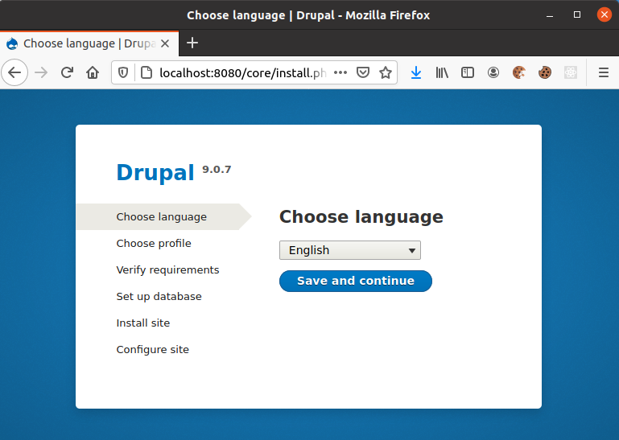
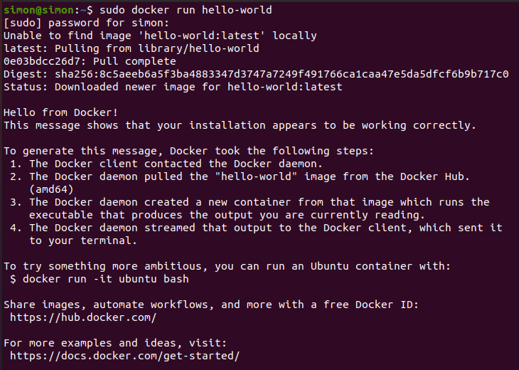

Docker can be used to package software bundles inside so called containers. Docker has a similarity with virtual machines, but it consumes less resources since containers run on a single OS kernel and therefore also boot up way faster than a virtual machine would do.

A really popular resource to obtain production ready predefined containers is https://hub.docker.com/. There you can find sample containers for many different software bundles. It is often easier to run certain software inside a docker container instead of directly installing the software on your local machine, because containers are easy manageable and encapsulated from the host system.

Wanna try out some software without bothering about the dependencies and configuration of this piece of software + dependencies? Then Docker can also help.
Let's take Drupal (nice cms api server, which I sometimes use for my Gatsby websites) as an example.
By simply running `docker run --name some-drupal -p 8080:80 -d drupal` (also see https://hub.docker.com/_/drupal) a Drupal Docker image will be pulled from Docker hub and started right away and will out of the box come with a PHP server, SQLite database and you can simply try Drupal by looking up http://localhost:8080 in your favorite browser.



Of course docker can do way more and even bigger frameworks like Kubernetes and other utilize Docker as well.

# Docker Install

A good and official description on how to install Docker on your operating system can be found here: https://docs.docker.com/engine/install/.

For Ubuntu I had to enter the following commands inside a terminal:

```console
sudo apt-get update

sudo apt-get install \
    apt-transport-https \
    ca-certificates \
    curl \
    gnupg-agent \
    software-properties-common

curl -fsSL https://download.docker.com/linux/ubuntu/gpg | sudo apt-key add -

sudo add-apt-repository \
   "deb [arch=amd64] https://download.docker.com/linux/ubuntu \
   $(lsb_release -cs) \
   stable"

sudo apt-get update

sudo apt-get install docker-ce docker-ce-cli containerd.io
```

To verify that docker works properly you can run a simple `hello-world` container:

```console
sudo docker run hello-world
```

The result should look similar to this:



# Start and run container

Running a certain docker image:

```shell
docker run -d --name=grafana -p 3000:3000 grafana/grafana
```

- `-d` says that the container application is supposed to run in detached mode
- `--name` applies a custom name for the container
- `-p` enables port forwarding from the host machine, where docker runs on
- `grafana/grafana` is the name of the docker container

With `docker run` docker also will be downloading the desired docker image from docker hub in case it is not already available on the machine.

Also see https://hub.docker.com/r/grafana/grafana

You can also pull the docker image from docker hub by using the following command:

```shell
docker pull grafana/grafana
```

To start a docker container, which already has been running on your machine you can use:

```shell
docker start <your-desired-container-id>
```

# Stop and remove container

With `docker ps` you also get the ids of the container, which can be used to stop a certain container like this:

```shell
docker stop <your-desired-container-id>
```

To stop all running container the following command can be used:

```shell
docker stop $(docker ps -aq)
```

To remove a container `docker rm` can be used.

```shell
docker rm <your-desired-container-id>
```

So removing all containers would look like this:

```shell
docker rm $(docker ps -aq)
```

In case you also want to remove a docker image from your machine the `docker rmi` command can be used.
To see the images and its ids the `docker images` command can be used.

```shell
docker rmi <your-desired-image-id>
```

To remove all images the following command can be used.

```shell
docker rmi $(docker images -q)
```

# List containers and images

Running containers

```shell
docker ps
```

Existing containers

```shell
docker ps -a
```

Existing containers' ids

```shell
docker ps -aq
```

Show existing images.

```shell
docker images
```

Only query images ids:

```shell
docker images -q
```

# Access Docker Container

```shell
docker exec -it <container name> /bin/bash
```

# Docker Network

Find out the ip address of a certain container:

```shell
docker inspect --format='{{range .NetworkSettings.Networks}}{{.IPAddress}}{{end}}' your-container-id
```

Find out the docker host's ip address:

```shell
ip a
```

This will show the different network adapter and `docker0` will be one of them:

```shell
5: docker0: <BROADCAST,MULTICAST,UP,LOWER_UP> mtu 1500 qdisc noqueue state UP group default
    link/ether 02:42:48:96:f6:80 brd ff:ff:ff:ff:ff:ff
    inet 172.17.0.1/16 brd 172.17.255.255 scope global docker0
       valid_lft forever preferred_lft forever
    inet6 fe80::42:48ff:fe96:f680/64 scope link
       valid_lft forever preferred_lft forever
```

This means that `172.17.0.1` is the docker host's ip address.

This can be helpful in case a docker container is supposed to access services of the host machine.

# Sources

- https://thispointer.com/how-to-get-ip-address-of-running-docker-container-from-host-using-inspect-command/
- https://phase2.github.io/devtools/common-tasks/ssh-into-a-container/
