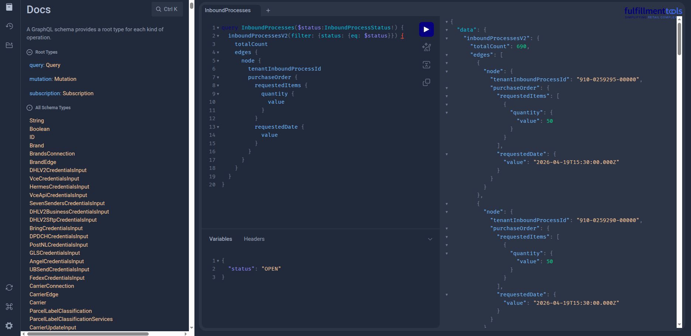
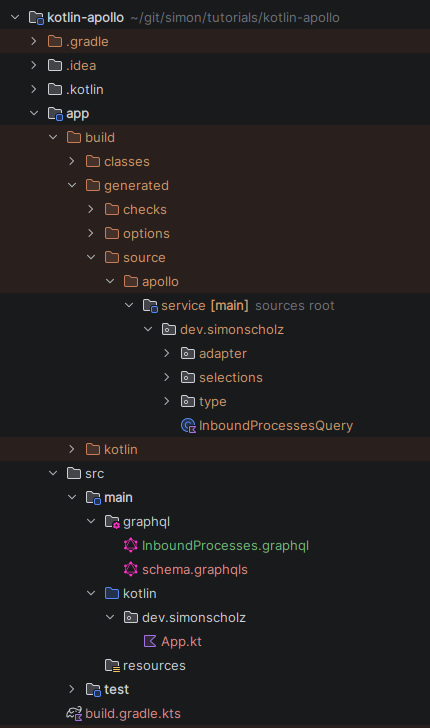

In this tutorial, we will show you how to use the Apollo Kotlin library to call the fulfillmenttools GraphQL API. We will cover how to set up your project, generate the necessary code, and make a simple query to retrieve data from the API.

## Prerequisites

- Installed Java (using SDKMAN or any other method)
- Installed Gradle
- Access to the fulfillmenttools GraphQL API (API key or bearer token)

## Init project

First, we need to create a new Gradle project:

```bash
mkdir kotlin-apollo

cd kotlin-apollo

gradle init \      
    --type kotlin-application \
    --dsl kotlin \
    --test-framework junit-jupiter \
    --project-name kotlin-apollo \
    --package dev.simonscholz \
    --no-split-project \
    --no-incubating \
    --java-version 25
```

Please choose whatever java version you have installed on your machine.

## Add Apollo Kotlin dependencies

Next, we need to add the Apollo Kotlin dependencies to our `build.gradle.kts` file:

```kotlin
plugins {
    // Other plugins...

    id("com.apollographql.apollo") version "4.4.3"
}

dependencies {
    // Other dependencies...

    implementation("com.apollographql.apollo:apollo-runtime:4.4.3")
}

apollo {
    service("service") {
        packageName.set("dev.simonscholz")
    }
}
```

## Download GraphQL schema

The `com.apollographql.apollo` gradle plugin provides a task to download the GraphQL schema from the API:

```bash
./gradlew downloadApolloSchema \
  --endpoint=https://{projectId}.graphql.fulfillmenttools.com/graphql \
  --schema=app/src/main/graphql/schema.graphqls \
  --header="Authorization: Bearer {token}"
```

Make sure to replace `{projectId}` with your actual project ID and `{token}` with your actual API token.

## Create GraphQL query

You can play around with the GraphQL API using the [GraphiQL UI](https://{projectId}.graphql.fulfillmenttools.com/graphiql) to create your query. 



The screenshot above shows the GraphiQL editor where you can write and test your GraphQL queries. 

Once you have your query, you can create a `.graphql` file in your `app/src/main/graphql` directory of your project and paste your query there.

For example, if you want to retrieve a list of open inbound processes, you can create a file named `InboundProcesses.graphql` with the following content:

```graphql
query InboundProcesses($status:InboundProcessStatus!) {
  inboundProcessesV2(filter: {status: {eq: $status}}) {
    totalCount
    edges {
      node {
        tenantInboundProcessId
        purchaseOrder {
          requestedItems {
            quantity {
              value
            }
          }
          requestedDate {
            value
          }
        }
      }
    }
  }
}
```

## Generate code

Now that we have our query and schema in the `app/src/main/graphql` directory, we can generate the necessary code to call the API.

```bash
./gradlew generateApolloSources
```

Your project structure should now look like this:



## Call the GraphQL API

The gradle init task created a `App.kt` file in the `app/src/main/kotlin/dev/simonscholz` directory. You can replace the content of this file with the following code to call the GraphQL API:

```kotlin[App.kt]
/*
 * This source file was generated by the Gradle 'init' task
 */
package dev.simonscholz

import com.apollographql.apollo.ApolloClient

suspend fun main() {
    val token = "your_bearer_token_here"

    val apolloClient =
        ApolloClient
            .Builder()
            .serverUrl("https://{projectId}.graphql.fulfillmenttools.com/graphql")
            .addHttpHeader("Authorization", "Bearer $token")
            .build()

    val response =
        apolloClient
            .query(InboundProcessesQuery(status = InboundProcessStatus.OPEN))
            .execute()

    if (response.errors.isNullOrEmpty()) {
        println("inboundProcessesV2.totalCount=${response.data?.inboundProcessesV2?.totalCount}")
        println("inboundProcessesV2.edges=${response.data?.inboundProcessesV2?.edges}")
    } else {
        println("Errors: ${response.errors}")
    }
}
```

Make sure to replace `your_bearer_token_here` with your actual bearer token and `{projectId}` with your actual project ID.

## Run the application

Finally, you can run the application to see the results:

```bash
./gradlew run
```

You should see the total count of open inbound processes and their details printed in the console.

## Looking for the fulfillmenttools REST API?

I´ve also written a tutorial on how to use the fulfillmenttools Open Api specification to call the REST API using the OpenAPI Generator. You can find it here: [Using OpenAPI Generator to call the fulfillmenttools REST API](https://simonscholz.dev/tutorials/open-api-parsing-normalizing).

## Sources

- [Apollo Kotlin documentation](https://www.apollographql.com/docs/kotlin)
- [Fulfillmenttools GraphQL API documentation](https://docs.fulfillmenttools.com/documentation/apis/api-reference#graphql-api)
