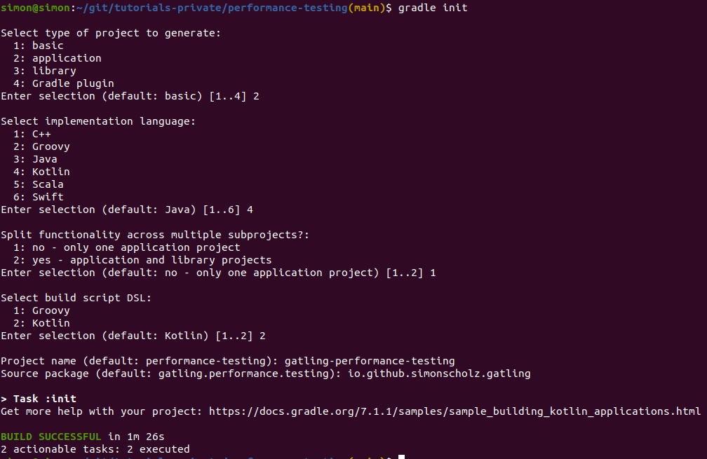

## Start a new project using Gradle

To create a new project the `gradle init` task can be used.

Then you can open the project in IntelliJ and add the gatling source folder. This is necessary because the gatling plugin provides the gatling dependencies for this source set by default. This of course could also be adjusted, but usually it's best to stick to the conventions.

More information on this can be found here: https://gatling.io/docs/gatling/reference/current/extensions/gradle_plugin/

## Creating general classes for performance testing

## Gatling Scenario setup

## Gatling Simulations

## Sources

- https://gatling.io/docs/
- https://gatling.io/docs/gatling/reference/current/extensions/gradle_plugin/
