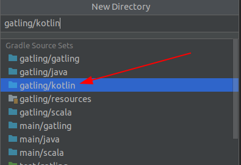
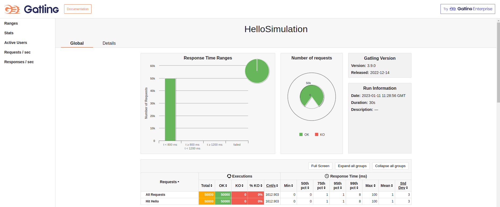
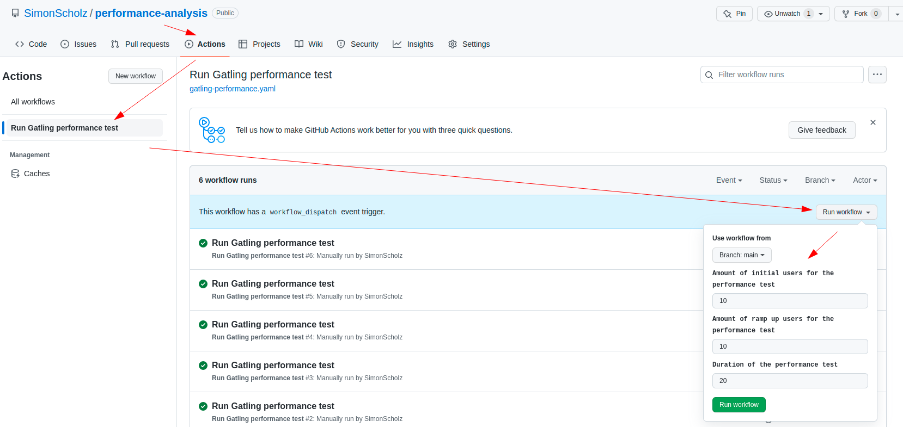
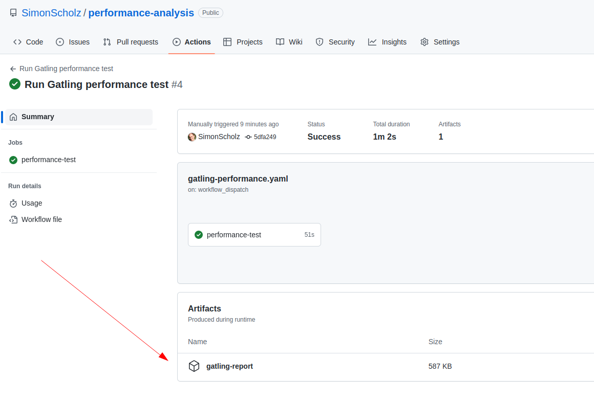
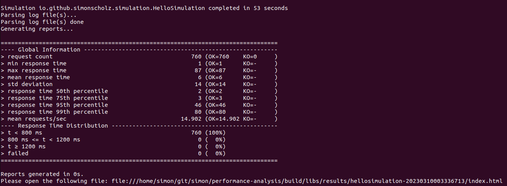
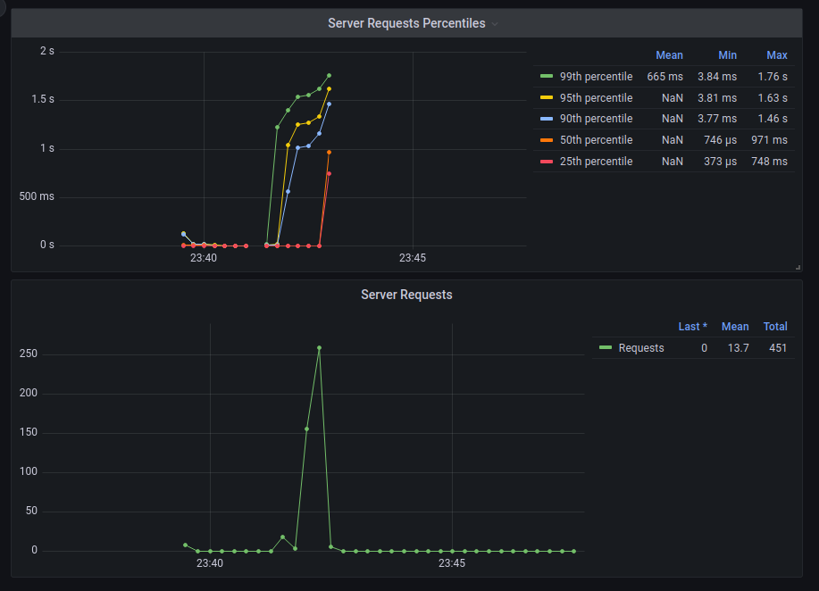

Gatling is an open source project (Apache License 2.0), which offers capabilities to performance test several things, e.g., http endpoints, JMS and more.

Also see the great documentation of Gatling here: https://gatling.io/docs/gatling/

This tutorial will be a step by step guide to:

- Create a web application (using Quarkus)
- Add the `io.gatling.gradle` gradle plug-in to the project
- Setup Gatling simulations with scenarios, feeder and more
- Passing dynamic data to the performance test
- Use a GitHub action to run the Gatling performance test

## Create a new Quarkus project

Go to https://code.quarkus.io/ and add the following Quarkus modules:


After downloading the Quarkus starter code it can be opened in IntelliJ.

## Add the Gatling Gradle plugin

Besides the other plugins the `io.gatling.gradle` needs to be added:

```kotlin [build.gradle.kts]
plugins {
    kotlin("jvm") version "1.7.21"
    kotlin("plugin.allopen") version "1.7.21"
    id("io.quarkus")

    id("io.gatling.gradle") version "3.9.0.2"
}
```

Once the plugin is added a `gatling` source folder can easily be created. This is necessary because the gatling plugin provides the gatling dependencies for this source set by default. This of course could also be adjusted, but usually it's best to stick to the conventions.



More information on this can be found here: https://gatling.io/docs/gatling/reference/current/extensions/gradle_plugin/

## Performance test the hello endpoint

To have a quick win, let's create a small simulation for the hello endpoint, which comes with the Quarkus starter code.

First create a `HelloScenario` object to provide a scenario:

```kotlin [HelloScenario.kt]
package io.github.simonscholz.scenario

import io.gatling.javaapi.core.CoreDsl.exec
import io.gatling.javaapi.core.CoreDsl.scenario
import io.gatling.javaapi.http.HttpDsl.http

object HelloScenario {
    private val hitHello =
        exec(
            http("Hit Hello").get("/hello")
        ).pause(1) // Gatling's default is seconds

    val hello = scenario("Hello").exec(hitHello)
}
```

And then a `Simulation`, which runs the scenario:

```kotlin [HelloSimulation.kt]
package io.github.simonscholz.simulation

/* ktlint-disable no-wildcard-imports */
import io.gatling.javaapi.core.CoreDsl
import io.gatling.javaapi.core.Simulation
import io.gatling.javaapi.http.HttpDsl.http
import io.github.simonscholz.scenario.HelloScenario.hello
/* ktlint-disable no-wildcard-imports */

class HelloSimulation : Simulation() {

    private val baseUrl = System.getenv("gatlingBaseUrl")
        ?: System.getProperty("gatlingBaseUrl", "http://localhost:8080")

    private val httpProtocol =
        http.baseUrl(baseUrl)
            .acceptHeader("text/html,application/xhtml+xml,application/xml;q=0.9,*/*;q=0.8") /**/
            .acceptLanguageHeader("en-US,en;q=0.5")
            .acceptEncodingHeader("gzip, deflate")
            .userAgentHeader(
                "Mozilla/5.0 (Macintosh; Intel Mac OS X 10.8; rv:16.0) Gecko/20100101 Firefox/16.0"
            )

    init {
        setUp(
            hello.injectOpen(CoreDsl.rampUsers(10).during(30)),
        ).protocols(httpProtocol)
    }
}
```

Note what the documentation says about the imports: https://gatling.io/docs/gatling/reference/current/core/simulation/#dsl-imports
But for me the simulation even works without these wild card imports.

Now that the first simulation is in place we can run the Quarkus application and afterwards run the Gatling performance test.

```bash
# Start quarkus application
./gradlew qDev

# Run gatling performance test
./gradlew gRun
```

Then click on the link at the end of the output of the gatlingRun task and enjoy the beautiful html report.



## Passing dynamic data

### Pass values to the Gradle task

The `HelloSimulation` class uses the `gatlingBaseUrl` system property to obtain the baseUrl for http requests.
This property can be set using `-D` to provide properties:

```bash
./gradlew gRun -DgatlingBaseUrl="http://localhost:8080"
```

### A more complex endpoint to be used by a Scenario

Let's create an endpoint, which returns availability information of certain products.

```kotlin [AvailabilityResource.kt]
package io.github.simonscholz

import java.util.concurrent.TimeUnit
import javax.ws.rs.GET
import javax.ws.rs.Path
import javax.ws.rs.Produces
import javax.ws.rs.QueryParam
import javax.ws.rs.core.MediaType
import javax.ws.rs.core.Response

@Path("/availability")
class AvailabilityResource {

    @GET
    @Produces(MediaType.APPLICATION_JSON)
    fun productAvailability(@QueryParam("productId") productId: String): Response = when (productId) {
        "1234" -> Response.ok(AvailabilityDTO(productId, 10)).build()
        "5678" -> Response.ok(AvailabilityDTO(productId, 30)).build()
        "91011" -> Response.ok(AvailabilityDTO(productId, 50)).build()
        "121314" -> Response.ok(AvailabilityDTO(productId, 70)).build()
        "151617" -> {
            TimeUnit.SECONDS.sleep(2)
            Response.ok(AvailabilityDTO(productId, 90)).build()
        }
        else -> Response.status(Response.Status.NOT_FOUND).build()
    }

    data class AvailabilityDTO(val productId: String, val quantity: Int)
}
```

The code consist of delays and error responses on purpose to see these later in in the report.
The `/availability` endpoint expects a product id to return availability information about certain products.

### Move the http setup to Config object

To avoid cluttering our Gatling code we'd move the http protocol setup to a `Config` object class.

```kotlin [Config.kt]
package io.github.simonscholz.config

import io.gatling.javaapi.http.HttpDsl.http

object Config {
    private const val BASE_URL_VARIABLE = "gatlingBaseUrl"

    val BASE_URL: String = System.getenv(BASE_URL_VARIABLE)
        ?: System.getProperty(BASE_URL_VARIABLE, "http://localhost:8080")

    val HTTP_PROTOCOL =
        http.baseUrl(BASE_URL)
            .acceptHeader("text/html,application/xhtml+xml,application/xml;q=0.9,*/*;q=0.8")
            .acceptLanguageHeader("en-US,en;q=0.5")
            .acceptEncodingHeader("gzip, deflate")
            .userAgentHeader(
                "Mozilla/5.0 (Macintosh; Intel Mac OS X 10.8; rv:16.0) Gecko/20100101 Firefox/16.0",
            )
}
```

Now the `HTTP_PROTOCOL` object can simply be used as protocols for the simulation.

### Utilize a csv feeder

Feeders allow to inject dynamic data into a simulation and to choose this data in a random fashion, e.g., a list of product ids to be used.

Therefore we'd place a `productIds.csv` file inside the `src/gatling/resources` folder to feed the Gating simulation with dynamic product ids.

```[productIds.csv]
productId
1234
5678
91011
121314
151617
181920
```

The next step would be to create a scenario, which calls the new `/availability` API and utilizes the product ids given in the `productIds.csv` file.

```kotlin [CSVFeederProductAvailabilityScenario.kt]
package io.github.simonscholz.scenario

import io.gatling.javaapi.core.CoreDsl.feed
import io.gatling.javaapi.core.CoreDsl.scenario
import io.gatling.javaapi.http.HttpDsl.http

object CSVFeederProductAvailabilityScenario {
    private val csvProductFeeder = csv("productIds.csv").circular()

    private val hitAvailability =
        feed(csvProductFeeder)
            .exec(
                http("Hit Availability").get("/availability?productId=#{productId}"),
            ).pause(1) // Gatling's default is seconds

    val productAvailabilityScenario = scenario("ProductAvailabilityScenario").exec(hitAvailability)
}
```

Also see https://gatling.io/docs/gatling/reference/current/core/session/feeder/

You can now add this `productAvailabilityScenario` to the `HelloSimulation`.

```kotlin [HelloSimulation.kt]
package io.github.simonscholz.simulation

import io.gatling.javaapi.core.CoreDsl.rampUsers
import io.gatling.javaapi.core.Simulation
import io.github.simonscholz.config.Config.HTTP_PROTOCOL
import io.github.simonscholz.scenario.CSVFeederProductAvailabilityScenario.productAvailabilityScenario
import io.github.simonscholz.scenario.HelloScenario.hello
import java.time.Duration

class HelloSimulation : Simulation() {

    init {
        val users = 10
        val duration = Duration.ofSeconds(30)
        setUp(
            hello.injectOpen(rampUsers(users).during(duration)),
            productAvailabilityScenario.injectOpen(rampUsers(users).during(duration)),
        ).protocols(HTTP_PROTOCOL)
    }
}
```

With this in place we're now hitting both the `/hello` endpoint and the `/availability` endpoint.

In case the Quarkus application is still running you can simply run `./gradlew gRun` to trigger another performance test.

### Using remote feed data

Sometimes you'd want to obtain the feed data from a remote resource to be more dynamic than for example using a CSV file.

So let's create a new endpoint in the Quarkus app (`src/main/kotlin`), which provides the product data from before:

```kotlin [CustomerFeederResource.kt]
package io.github.simonscholz

import javax.ws.rs.GET
import javax.ws.rs.Path
import javax.ws.rs.Produces
import javax.ws.rs.core.MediaType
import javax.ws.rs.core.Response

@Path("/feederproducts")
class CustomerFeederResource {
    @GET
    @Produces(MediaType.APPLICATION_JSON)
    fun productAvailability(): Response =
        Response
            .ok(listOf("1234", "5678", "91011", "121314", "151617", "181920"))
            .build()
}

```

And then create a `Feeder` object with both feeders in `src/gatling/kotlin`:

```kotlin [Feeder.kt]
package io.github.simonscholz.feeder

import com.fasterxml.jackson.databind.ObjectMapper
import com.fasterxml.jackson.module.kotlin.readValue
import io.gatling.javaapi.core.CoreDsl.csv
import io.gatling.javaapi.core.CoreDsl.listFeeder
import io.github.simonscholz.config.Config
import java.net.URL

object Feeder {
    private val httpFeed: List<String> = URL("${Config.BASE_URL}/feederproducts").openStream().bufferedReader().use {
        ObjectMapper().readValue(it.readText())
    }

    val httpProductFeeder = listFeeder(httpFeed.map { mapOf("productId" to it) }).circular()

    val csvProductFeeder = csv("productIds.csv").circular()
}
```

For the sake of simplicity a Jackson `ObjectMapper` is used to return the product ids as `List<String>`.
To make use of this `gatlingImplementation("com.fasterxml.jackson.module:jackson-module-kotlin:2.14.1")` needs to be added to the `dependencies` in the `build.gradle.kts` file.

Once the list of product ids is obtained a `listFeeder` can be used, which expects a `List<Map<String, Object>> data`.

With that in place the `CSVFeederProductAvailabilityScenario` could now also use the `httpProductFeeder` instead of the `csvProductFeeder`.

To test it again run:

```bash
# Start Quarkus application, in case it isn't still running
./gradlew qDev

# Run gatling performance test
./gradlew gRun
```

## Chain requests and save data in between

Simulating real user behavior in a performance test also means to simulate the user browsing though a website and therefore chaining requests towards REST apis.

Let's simply reuse the existing endpoints our Quarkus app currently offers and hit the `/hello` endpoint, then hit the `/feederproducts` four times saving one of the returned products based on the index in each iteration and then reuse the saved product id for the `/availability` endpoint.

```kotlin [ChainScenario.kt]
package io.github.simonscholz.scenario

import io.gatling.javaapi.core.CoreDsl.* // ktlint-disable no-wildcard-imports
import io.gatling.javaapi.http.HttpDsl.http

object ChainScenario {
    private val chain =
        exec(
            http("Hit Hello").get("/hello"),
        ).pause(1) // Gatling's default is seconds
            .repeat(4, "i").on(
                exec(
                    http("Get Product Ids")
                        .get("/feederproducts")
                        .check(
                            jmesPath("[#{i}]")
                                .saveAs("productId"),
                        ),
                )
                    .pause(2)
                    .exec(
                        http("Hit Availability").get("/availability?productId=#{productId}"),
                    ),
            )

    val chainScenario = scenario("ChainScenario").exec(chain)
}
```

More details can be found in the https://gatling.io/docs/gatling/reference/current/core/check/ section of the Gatling documentation.

## GitHub action to run a performance test

With a GitHub action in place we cannot simply hit our localhost Quarkus app.
So let's use `https://computer-database.gatling.io` of Gatling from this sample: https://github.com/gatling/gatling-gradle-plugin-demo-kotlin

```kotlin [ComputerDatabaseSimXulation.kt]
package io.github.simonscholz.simulation

import io.gatling.javaapi.core.CoreDsl.* // ktlint-disable no-wildcard-imports
import io.gatling.javaapi.core.Simulation
import io.gatling.javaapi.http.HttpDsl.http

class ComputerDatabaseSimXulation : Simulation() {
    private val AT_ONCE_USERS: Int = Integer.getInteger("atOnceUsers", 10)
    private val RAMP_UP_USERS: Int = Integer.getInteger("rampUpUsers", 10)
    private val DURATION: Int = Integer.getInteger("duration", 10)

    private val browse =
        repeat(4, "i").on(
            exec(
                http("Page #{i}").get("/computers?p=#{i}"),
            ).pause(1),
        )

    private val httpProtocol =
        http.baseUrl("https://computer-database.gatling.io")
            .acceptHeader("text/html,application/xhtml+xml,application/xml;q=0.9,*/*;q=0.8")
            .acceptLanguageHeader("en-US,en;q=0.5")
            .acceptEncodingHeader("gzip, deflate")
            .userAgentHeader(
                "Mozilla/5.0 (Macintosh; Intel Mac OS X 10.8; rv:16.0) Gecko/20100101 Firefox/16.0",
            )

    private val users = scenario("Users").exec(browse)

    init {
        setUp(
            users.injectOpen(
                atOnceUsers(AT_ONCE_USERS),
                rampUsers(RAMP_UP_USERS).during(DURATION.toLong()),
            ),
        ).protocols(httpProtocol)
    }
}
```

The following GitHub action (`./github/workflows/gatling-performance.yaml`) can be used to run the Gatling simulation and upload the report:

```yaml [gatling-performance.yaml]
name: Run Gatling performance test

# Controls when the workflow will run
on:
  # Allows you to run this workflow manually from the Actions tab
  workflow_dispatch:
    inputs:
      atOnceUsers:
        type: number
        description: Amount of initial users for the performance test
        default: 10
      rampUpUsers:
        type: number
        description: Amount of ramp up users for the performance test
        default: 10
      duration:
        type: number
        description: Duration of the performance test
        default: 20

# A workflow run is made up of one or more jobs that can run sequentially or in parallel
jobs:
  performance-test:
    # The type of runner that the job will run on
    runs-on: ubuntu-latest

    # Steps represent a sequence of tasks that will be executed as part of the job
    steps:
      # Checks-out your repository under $GITHUB_WORKSPACE, so your job can access it
      - uses: actions/checkout@v3

      - name: Set up JDK
        uses: actions/setup-java@v3
        with:
          java-version: "17"
          distribution: "temurin"

      - name: Use Gradle packages cache
        uses: actions/cache@v3
        with:
          path: |
            ~/.gradle/caches/
            ~/.gradle/wrapper/
          key: ${{ runner.os }}-gradle-release-${{ hashFiles('**/build.gradle.kts') }}
          restore-keys: ${{ runner.os }}-gradle-release

      - name: Execute Gradle
        run: ./gradlew gRun -DatOnceUsers=${{ inputs.atOnceUsers }} -DrampUpUsers=${{ inputs.rampUpUsers }} -Dduration=${{ inputs.duration }}

      - name: Upload Gatling report
        uses: actions/upload-artifact@v3
        with:
          name: gatling-report
          path: ./build/reports/gatling/
```

When running this GitHub action manually `atOnceUsers`, `rampUpUsers` and `duration` and be specified dynamically:



These inputs are then passed as properties to the gradle task.

Once the workflow is done the Gatling report can be downloaded afterwards.



## Building an executable Jar for gatling performance tests

In some cases you'd rather want to have an executable Jar file to run a performance test.
To archive this the following can to be added at the end of the `build.gradle.kts` file to create an executable jar file.

```kotlin [build.gradle.kts]
tasks.register("gatlingJar", Jar::class) {
    group = "build"
    archiveBaseName.set("gatling-performance-analysis")
    dependsOn("gatlingClasses", "processResources")

    manifest {
        attributes["Implementation-Title"] = "Gradle Jar File Example"
        attributes["Implementation-Version"] = archiveVersion
        attributes["Main-Class"] = "io.gatling.app.Gatling"
    }

    duplicatesStrategy = DuplicatesStrategy.EXCLUDE

    from(sourceSets.gatling.get().output)
    from(configurations.kotlinCompilerPluginClasspathGatling.get().map { if (it.isDirectory) it else zipTree(it) })
    from(configurations.gatling.get().map { if (it.isDirectory) it else zipTree(it) }) {
        exclude("META-INF/MANIFEST.MF")
        exclude("META-INF/*.SF")
        exclude("META-INF/*.DSA")
        exclude("META-INF/*.RSA")
    }
    with(tasks.jar.get() as CopySpec)
}
```

Building and running the jar file from your terminal:

```bash
# build the gatlingJar
./gradlew gJar

# Go into the folder of the built jar
cd /build/libs

# run the jar by mentioning the simulation you want to run
java -jar gatling-performance-analysis-1.0.0-SNAPSHOT.jar -s io.github.simonscholz.simulation.HelloSimulation
```

The result should look similar to this:



## Creating a Docker Image using Jib

Instead of using a Dockerfile to create a docker image from ,e.g., the Jar file of the previous section,
I decided to use Jib, which is great for layering of JVM apps.

For this to work we have to add the Jib Gradle plugin to our project:

```kotlin [build.gradle.kts]
plugins {
    // .... other plugins ....

    id("com.google.cloud.tools.jib") version "3.3.1"
}
```

Jib as of now cannot easily deal with custom source folders used by Gatling, e.g., `src/gatling/kotlin/`.
That's why we need to tweak our build config a little bit.

```kotlin [build.gradle.kts]
// Copy over the gatling classes to the app/classes folder
tasks.register("copyGatlingToAppDir", Copy::class) {
    dependsOn("gatlingClasses")
    from("build/classes/kotlin/gatling")
    into("build/extra-directory/app/classes/")
}

// Copy over the gatling resources folder
tasks.register("copyGatlingResources", Copy::class) {
    from("src/gatling/resources")
    into("build/extra-directory/app/resources")
}

tasks.named("jib") {
    dependsOn("copyGatlingToAppDir", "copyGatlingResources")
}

tasks.named("jibDockerBuild") {
    dependsOn("copyGatlingToAppDir", "copyGatlingResources")
}

tasks.named("jibBuildTar") {
    dependsOn("appDir", "copyGatlingResources")
}

// Configuration, which should be used by Jib
val gatlingJibDocker: Configuration by configurations.creating {
    extendsFrom(
        configurations.kotlinCompilerPluginClasspathGatling.get(),
        configurations.gatling.get(),
    )
}

jib {
    configurationName.set("gatlingJibDocker")
    extraDirectories.setPaths("build/extra-directory")
    container {
        mainClass = "io.gatling.app.Gatling"
        args = listOf("-s", "io.github.simonscholz.simulation.HelloSimulation")
    }
}
```

With these additional tasks and configurations, the docker images can be created.
To simply see how the docker image contents would look like the `./gradlew jibBuildTar --image=desired-image-name` task can be run, which will create a tar file with all the contents in the `build` folder.

To push the generated docker images to your local docker daemon the `./gradlew jibDockerBuild` task can be run.
To run this image locally you can run:

```bash
docker run --rm -it -e gatlingBaseUrl='http://host.docker.internal:8080' --add-host=host.docker.internal:host-gateway performance-analysis:1.0.0-SNAPSHOT
```

`--add-host=host.docker.internal:host-gateway` is necessary to allow the docker container to call our Quarkus application, which runs on localhost.
Therefore also the `gatlingBaseUrl` must be changed to `http://host.docker.internal:8080`.

For testing purposes the `--rm` flag is added to remove the container after it has run, which makes cleanups easier.
Also see https://simonscholz.github.io/tutorials/docker#run-docker-container-and-immediately-remove-it-again

Optionally you can also add the `--image=desired-image-name` flag to have a different image name as `performance-analysis:1.0.0-SNAPSHOT`.

In a real world scenario you then could run the `jib` task to also push the Docker image to a desired Docker registry in order to run this image in a dedicated environment, e.g., Kubernetes.

## Monitor performance of real traffic

My sample code from https://github.com/SimonScholz/performance-analysis not only contains the Gatling part, but also uses Micrometer + Prometheus + Grafana to gather performance metrics of the Quarkus application.



The graph above shows the run of the `ChainScenario`.

## Sources

- https://github.com/SimonScholz/performance-analysis
- https://gatling.io/docs/
- https://gatling.io/docs/gatling/reference/current/extensions/gradle_plugin/
- https://github.com/gatling/gatling-gradle-plugin-demo-kotlin
