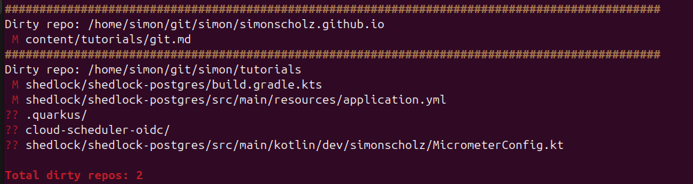

Git is a commonly used DVCS (distributed version control system), which was introduced by Linus Torvalds.
GitHub, GitLab, Bitbucket and others are services, where you can easily create a remote git repository.

## Install Git

On Ubuntu is is fairly easy:

```shell
sudo apt install git
```

For Windows you'll have to install the following:

https://git-scm.com/download/win

## Configure Git

It is good practice to apply a common global Git config:

```shell
git config --global user.name "Simon Scholz"
git config --global user.email opensource.simon@gmail.com

git config --global branch.autosetuprebase always
git config --global pull.rebase true
git config --global rebase.autoStash true
git config --global core.autocrlf input


git config --global gpg.program gpg
git config --global commit.gpgsign true
```

Besides configuring name and email setting up rebase and autoStash is really helpful, since this will stash uncommitted changes when pulling from the remote and then pop the changes once your local commits have been rebased onto the changes from the remote repository.
The GPG configs will verify that your commits are really created by you.

Use `git config --list` to see all your current Git configs.
To see the config of a repository use `git config --list --show-origin`.

## Create a SSH key

In case you want to make use of SSH for cloning a SSH key needs to be created:

```shell
ssh-keygen -t ed25519 -C $USER

# or use rsa in case ed25519 is not available on your system

ssh-keygen -q -t rsa -b 4096 -f ~/.ssh/id_rsa -C $USER
```

The created public key needs to be configured on the remote origin, e.g., GitHub.

You can show the public key by running `cat ~/.ssh/id_ed25519.pub` or `cat ~/.ssh/id_rsa.pub`.

## Clone a remote Git repository

```shell
git clone {uri-of-your-desired-repo}

e.g.

# ssh
git clone git@github.com:SimonScholz/tutorials.git

# https
git clone https://github.com/SimonScholz/tutorials.git
```

## Creating a Git repository locally

Besides cloning a remote repository, you can also initialize it locally.
And on demand this local Git repository can be pushed to a remote origin.

```shell
cd desired-folder-for-git-repo

git init
```

## Adding files to the staging area and commit changes

Before files can be commited locally, the desired files have to reside in the staging area.

Using `git add desired-file` adds a particular file to the staging area.
But you can also add each and every changed file inside the current folder by using `git add .`
And with `git add -A` all changed files of the whole repo will be added.

Once there are the desired files inside the staging area they can be commited:

```shell
git commit -m "Message, which describes what will be commited"
```

NOTE: When changes are commited, they only reside in your local git repository.

# Undo the last commit

To see what has changed due to the undo `--soft` can be used.

```shell
git reset --soft HEAD~1
```

In case you're certain that you want the latest commit to be undone `--hard` can be used.

```shell
git reset --hard HEAD~1
```

## Add a remote origin to your local git repository

```shell
git remote add git@github.com:SimonScholz/tutorials.git
```

Once the remote is added a an upstream branch can be configured.

```shell
git push --set-upstream origin main
```

## Pushing changes to a remote repository

```shell
git push origin main
```

## Deleting already merged branches on remote repository

```shell
git branch -r --merge
```

This will show all branches, which already have been merged to your current `HEAD`.

To remove a certain branch use the following command then:

```shell
git push origin --delete "<branch-name>"
```

## Find dirty git repositories

I usually have a `git` folder in my home directory, which contains a lot of git repositories.
In order to find all repositories, which have uncommitted changes, I created the following script:

```shell[git-status-all.sh]
#!/bin/bash

GIT_DIR=~/git

# ANSI color codes
YELLOW='\033[1;33m'
RED='\033[1;31m'
NC='\033[0m' # No Color

dirty_count=0

# Use mapfile to safely handle repo paths
mapfile -t git_dirs < <(find "$GIT_DIR" -type d -name ".git")

for gitdir in "${git_dirs[@]}"; do
  repo_dir=$(dirname "$gitdir")
  cd "$repo_dir"

  # Check for clean tree
  if [ -n "$(git status --porcelain)" ]; then
    echo -e "${YELLOW}###############################################################################################${NC}"
    echo "Dirty repo: $repo_dir"
    git status -s
    ((dirty_count++))
  fi
done

echo
echo -e "${RED}Total dirty repos: $dirty_count${NC}"
```

This script will find all git repositories in the `~/git` directory and check if they have uncommitted changes.



## Show all commits since last git tag

Quite often git tags are used for deployments to production.
In order to get an overview on what is going live it can be convenient to list all commits being done since the last git tag was created.

```bash
git log $(git describe --tags --abbrev=0)..HEAD \
  --graph --abbrev-commit --decorate --date=relative \
  --format="%C(yellow)%h%Creset - %Cgreen(%cr)%Creset %C(bold blue)<%an>%Creset %C(auto)%d%Creset %s"
```

- `git describe --tags --abbrev=0` finds the most recent tag reachable from HEAD
- `..HEAD` is used to show commits after **the tag** up to `HEAD`
- The other two lines below is used for formatting and styling
