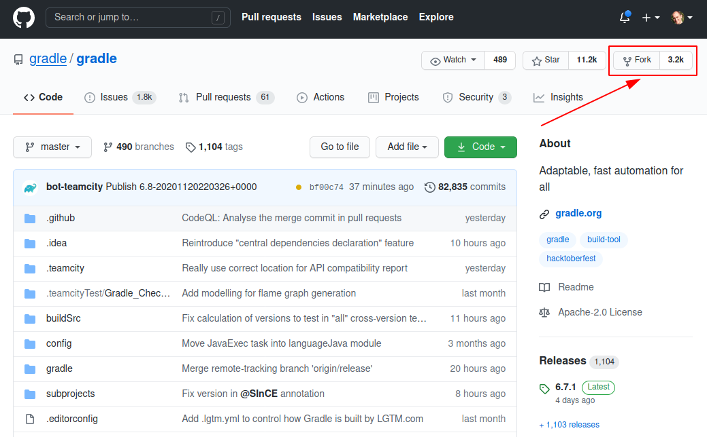
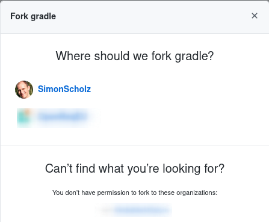
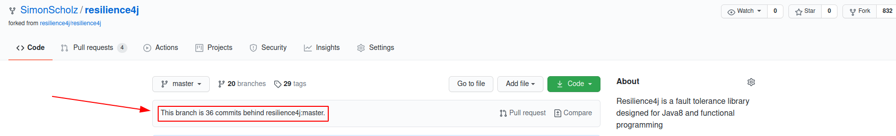
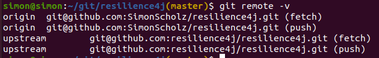
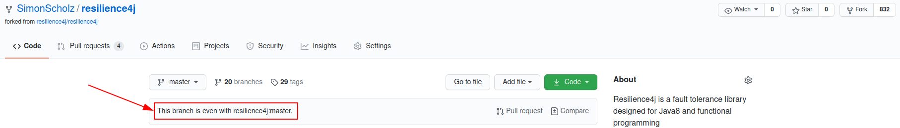

# Forks on GitHub

When you intent to contribute to a project, which is not owned by you or no one has given you write access to the repository, you'd usually do this via forks.
Basically forking a repository means that you're copying the repository to your account so that you can make changes to it.
After the changes are done you may create a PR (pull request) against the original repository.

## Forking a public repository

In order to create a fork you can navigate to this repository and hit the fork button:



When clicking the fork button you should see a similar dialog, where you can choose where to copy the repository.



Once this has been done you can clone the forked repository, change it according to your needs and also provide a PR for the original repository.

# Sync fork with upstream

Of course your fork belongs to you and therefore will remain unchanged while the original repository evolves.
To catch up with the changes you might want to sync your own repository with the original repository`s master branch.



## Add the original repository as remote

See existing remotes:

```bash
git remote -v
```

This command usually shows the `origin` remote, which points to your forked repository.

To also get (read) access to the original repository an upstream remote can be added:

```bash
git remote add upstream https://github.com/ORIGINAL_OWNER/ORIGINAL_REPOSITORY.git

e.g.

git remote add upstream git@github.com:gradle/gradle.git
```

When `git remote -v` is invoked once again there should be an `upstream` remote besides the existing `origin` remote.



## Sync fork with the upstream master

To get the latest changes from the upstream remote you checkout the master branch (usually left untouched, because your changes are in feature or bugfix branches) and then fetch + merge the changes from the upstream master branch.

```bash
git checkout master
git fetch upstream
git merge upstream/master
git push origin master
```

After merging the changes from the upstream remote your own master branch is even with the upstream.


