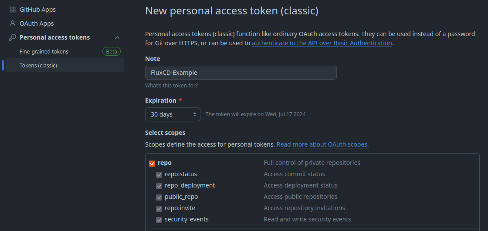
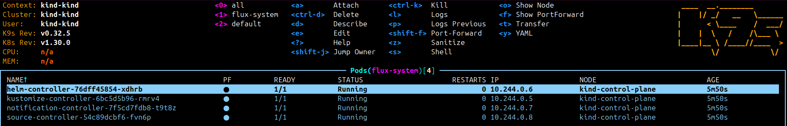

Using GitOps has immense benefits in terms of security and having configuration of code using Git makes it easy to revert changes and see the history of a kubernetes cluster´s configuration.

## Install flux using bash

```bash
curl -s https://fluxcd.io/install.sh | sudo bash
```

Also see https://fluxcd.io/flux/installation/

You can run `flux -v` to check whether flux is properly installed.

## Using GitHub to bootstrap flux

FluxCD is cabable to support any git repository.
GitHub, GitLab, Bitbucket and any other generic Git Repository are supported.

Also see: https://fluxcd.io/flux/installation/bootstrap/

Since I am used to GitHub and so far its the most popular Git service, I´ll be using GitHub here.

### Creating a Personal Access Token

FluxCD needs a PAT to do the bootstrapping with GitHub.
It can be created by going to the settings section in your GitHub profile.
In the settings sections you can scroll down to the "<> Developer settings".
And then you can go to "Personal access tokens" > Tokens(classic) or simply use this link: https://github.com/settings/tokens

Then you can hit the "Generate new token" button and click on "Generate new Token(classic)".
As note you can add `FluxCD-Example` and check the repo scope like this:



After generating the token, please make sure to copy it directly and store it somewhere safely, e.g., in your keepassxc database, because it won´t be shown anymore later on.

### Export PAT and bootstrap flux

Now that you have your PAT at hand you can export it as `GITHUB_TOKEN`.

```bash
export GITHUB_TOKEN=<your-gh-PAT>
```

With that token in place the GitHub repo can be bootstrapped.
The following command will create a **private** GitHub repo, which consists of the yaml files configuring your active kubernetes cluster/context.

So be sure your kind test cluster is active and not your current production cluster, which you might maintain from your maschine. (Which should in the future be done by flux)

When running the [k9s tool](https://github.com/derailed/k9s) you can see the active context or cluster, but also this can reveal the current context.

```bash
kubectl config current-context
```

Once you´re certain to apply the FluxCD bootstrapping to the right cluster, you can run the following command:

```bash
flux bootstrap github \
  --token-auth \
  --owner=SimonScholz \
  --repository=flux-cd-gitops-example \
  --branch=main \
  --path=clusters/development \
  --personal
```

By using the [k9s tool](https://github.com/derailed/k9s) you can now see certain default pods in the new `flux-system` namespace being started to let FluxCD do it´s magic.



## Clone the bootstrapped repository

In my case it is a simple `git clone git@github.com:SimonScholz/flux-cd-gitops-example.git`

In case you have chosen the same repository name, you just need to change the owner.

## Deploy a container to the cluster using FluxCD

Within the `clusters/development/` folder you can add a `podinfo` folder, which would contain the following yaml files.

One file for declaring the source where to obtain the HelmChart from:

```yaml [podinfo-source.yaml]
---
apiVersion: source.toolkit.fluxcd.io/v1
kind: HelmRepository
metadata:
  name: podinfo
  namespace: default
spec:
  interval: 10m
  url: https://stefanprodan.github.io/podinfo
```

And a file to declare the HelmRelease itself:

```yaml [podinfo-helmrelease.yaml]
---
apiVersion: helm.toolkit.fluxcd.io/v2
kind: HelmRelease
metadata:
  name: podinfo
  namespace: default
spec:
  interval: 10m
  chart:
    spec:
      chart: podinfo
      version: '6.6.3'
      sourceRef:
        kind: HelmRepository
        name: podinfo
        namespace: default
      interval: 10m
  values:
    replicaCount: 1
```

When you now push these files to the remote repository Flux will grab the changes and apply it to your cluster.

While Flux is applying the changes your can run `flux get all -A --status-selector ready=false` to see whats happening. Also see https://fluxcd.io/flux/cheatsheets/troubleshooting/


## Sources

- https://fluxcd.io/flux/concepts/
- https://fluxcd.io/flux/cheatsheets/troubleshooting/
