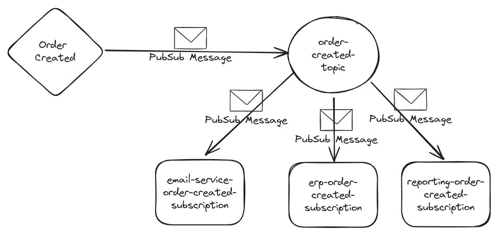

In this tutorial, we'll learn how to use the Google Cloud Pub/Sub and how to interact with it using simple http requests.

Benefits of having such an easy way to interact with Google Pubsub is for example the fact that events can easily be retriggered, even if the original message has already been acknowledged.

Google Cloud Pub/Sub is a fully-managed real-time messaging service that allows you to send and receive messages between independent applications. It is a scalable, durable, and highly available messaging service that can be used to decouple applications and components deployed on Google Cloud.



One trigger like a `order created event` can send a pubsub message to a google pubsub topic and one pubsub topic can have n pubsub subscriptions.

## Prerequisites

- curl, Postman or any other http client
- Docker and Docker Compose for using the emulator
- Actual GCP project with pubsub enabled (optional)

## Run the Google Cloud Pub/Sub Emulator

To run the Google Cloud Pub/Sub Emulator, you can use the following Docker Compose file:

```yaml [docker-compose.yml]
---
services:
  pubsub-emulator:
    image: gcr.io/google.com/cloudsdktool/cloud-sdk:507.0.0-emulators
    container_name: pubsub-emulator
    ports:
      - "8685:8685"
    volumes:
      - ./init-pubsub-curl.sh:/init-pubsub-curl.sh
    entrypoint: ["/init-pubsub-curl.sh"]
    restart: always
```

The `init-pubsub.sh` script is used to start the emulator, create a topic and a subscription:

```bash [init-pubsub.sh]
#!/bin/sh

# Start the Pub/Sub emulator
gcloud beta emulators pubsub start --host-port 0.0.0.0:8685 --project=sample-project-id &

# Wait for the emulator to start (adjust sleep time as needed)
sleep 5

# Create Pub/Sub topics
curl -s -X PUT 'http://0.0.0.0:8685/v1/projects/sample-project-id/topics/order-created-topic'

# Create Pub/Sub subscriptions
curl -s -X PUT 'http://0.0.0.0:8685/v1/projects/sample-project-id/subscriptions/order-created-topic-sub' \
    -H 'Content-Type: application/json' \
    --data '{"topic":"projects/sample-project-id/topics/order-created-topic"}'

# Keep the script running to keep the container alive
tail -f /dev/null
```

Make sure that the `init-pubsub.sh` script is executable:

```bash
chmod +x init-pubsub.sh
```

The `&` at the end of the emulator start command is used to run the emulator in the background. The `tail -f /dev/null` command is used to keep the container alive.

Check if topics and subscriptions were created successfully:

```bash
curl -X GET 'http://0.0.0.0:8685/v1/projects/sample-project-id/topics'

curl -X GET 'http://0.0.0.0:8685/v1/projects/sample-project-id/subscriptions'
```

## Publish to a Google Cloud Pub/Sub Topic

To publish to a Google Cloud Pub/Sub topic, you can use the following `curl` command:

```bash
curl -X POST "http://0.0.0.0:8685/v1/projects/sample-project-id/topics/order-created-topic:publish" \
-H "Content-Type: application/json" \
-d '{
  "messages": [
    {
      "attributes": {
        "DOMAIN_OBJECT_ID": "12345",
        "anotherKey": "anotherValue"
      }
    }
  ]
}'
```

Or also send json data:

```bash
curl -X POST "http://0.0.0.0:8685/v1/projects/sample-project-id/topics/order-created-topic:publish" \
-H "Content-Type: application/json" \
-d '{
  "messages": [
    {
      "attributes": {
        "DOMAIN_OBJECT_ID": "12345",
        "anotherKey": "anotherValue"
      },
      "data": "eyJpZCI6ICIxMjM0NSIsICJtZXNzYWdlIjogIkpvaG4gRG9lIn0="
    }
  ]
}'
```

The actual json data is `{"DOMAIN_OBJECT_ID": "12345", "name": "John Doe"}`, but it must be base64 encoded.
Also see [Publishing json message to PubSub](https://cloud.google.com/knowledge/kb/publishing-json-message-to-pub-sub-topic-fails-with-400-bad-request-error-000004171)

The first example does not use the `data` property, since it is optional.
You'll have to use at least one property in `attributes` or `data` or both.


## Pull from a Google Cloud Pub/Sub Subscription

To pull from a Google Cloud Pub/Sub subscription, you can use the following `curl` command:

```bash
curl -X POST "http://0.0.0.0:8685/v1/projects/sample-project-id/subscriptions/order-created-topic-sub:pull" \
-H "Content-Type: application/json" \
-d '{
  "maxMessages": 10
}'
```

When the message is only pulled, PubSub will keep the message, unless it is `acked`.

The return value of a pull should look similar to this:

```json
{
  "receivedMessages": [{
    "ackId": "projects/sample-project-id/subscriptions/order-created-topic-sub:1",
    "message": {
      "data": "eyJpZCI6ICIxMjM0NSIsICJtZXNzYWdlIjogIkpvaG4gRG9lIn0=",
      "attributes": {
        "DOMAIN_OBJECT_ID": "12345",
        "anotherKey": "anotherValue"
      },
      "messageId": "1",
      "publishTime": "2025-01-27T22:42:17.450Z"
    }
  }]
}
```

You can acknowledge these messages by using the given `ackId` and calling the following:

```bash
curl -X POST "http://0.0.0.0:8685/v1/projects/sample-project-id/subscriptions/order-created-topic-sub:acknowledge" \
-H "Content-Type: application/json" \
-d '{
  "ackIds": [
    "projects/sample-project-id/subscriptions/order-created-topic-sub:1"
  ]
}'
```

## Sending http requests to the actual GCP

Of course not only the emulator can be used, but also a real GCP Project with pubsub in place.

The following comand can be used to obtain a bearer access token for your GCP project.

```bash
gcloud auth application-default print-access-token
```

NOTE: Also have a look at my tutorial on how to [Easily switch gcloud config and kubectl context](https://simonscholz.dev/tutorials/switch-gcloud-kubectl-configs).

Once you´ve copied the access token it can be used in the curl requests:

```bash
--header 'Authorization: Bearer ${previously-printed-access-token}
```

With this in place actual requests can be fired towards your GCP project´s pubsub topics.

```bash
curl --location 'https://pubsub.googleapis.com/v1/projects/${your-gcp-project-id}/topics/${your-gcp-pubsub-topic}:publish' \
--header 'Content-Type: application/json' \
--header 'Authorization: Bearer ${previously-printed-access-token}' \
--data '{
    "messages": [
        {
            "data": "${your-base64-encoded-data}"
        }
    ]
}'
```

Replace `${your-gcp-project-id}`, `${your-gcp-pubsub-topic}`, `${previously-printed-access-token}` and `${your-base64-encoded-data}` with your individual data and send messages to this topic in the gcp.

## Sources

- https://cloud.google.com/pubsub/docs/publisher#rest
- https://cloud.google.com/pubsub/docs/emulator
- https://cloud.google.com/pubsub/docs/reference/rest/v1/projects.topics
- https://cloud.google.com/pubsub/docs/reference/rest/v1/projects.subscriptions
