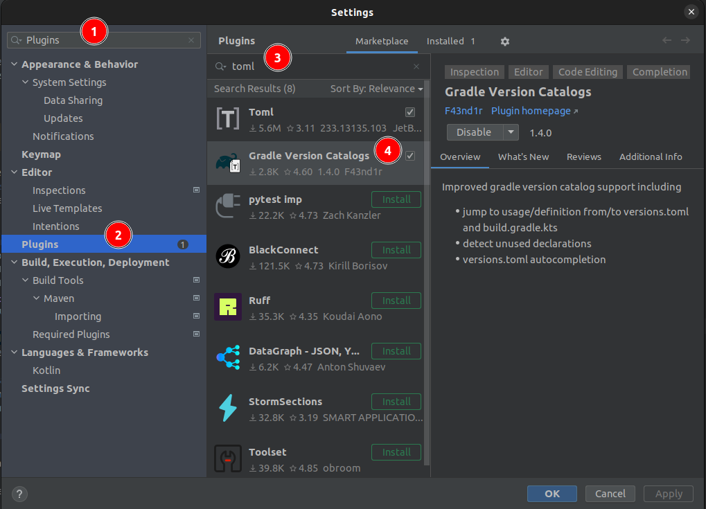
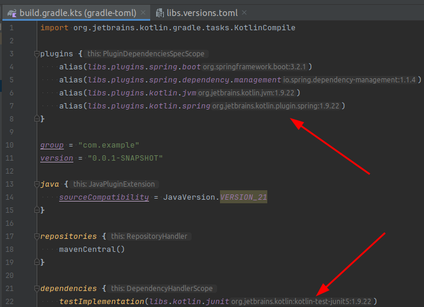

Using toml version catalogs in Gradle is a great way to manage dependencies and their versions.

Also GitHub's Dependabot supports toml version catalogs. So it is pretty neat to maintain versions of dependencies, especially if certain dependencies share the same version, e.g., Kotlin and its plugins.

## Prerequisites

- Gradle
- Java and/or Kotlin
- IntelliJ IDEA (optional)
- IntelliJ IDEA plugin [Gradle Version Catalogs](https://plugins.jetbrains.com/plugin/20324-gradle-version-catalogs) (optional)

## Install the Gradle Version Catalogs plugin

The [Gradle Version Catalogs](https://plugins.jetbrains.com/plugin/20324-gradle-version-catalogs) plugin for IntelliJ IDEA is not necessary to use toml version catalogs in Gradle, but it makes it easier to use them.



For example it adds syntax highlighting, auto completion, navigation to the version references and shows the versions within the `build.gradle.kts` file.

## Create a Spring Boot Project (optional)

In case you want to migrate an existing project to use toml version catalogs, you can skip this step.

```bash
curl https://start.spring.io/starter.zip \
 -d javaVersion=21 \
 -d language=kotlin \
 -d type=gradle-project-kotlin \
 -d applicationName=gradle-toml \
 -d groupId=com.example \
 -d artifactId=gradle-toml \
 -d packageName=com.example \
 -o gradle-toml.zip

unzip gradle-toml.zip
```

The `gradle-toml.zip` file can be extracted and then opened in IntelliJ IDEA.

The generated project contains a `build.gradle.kts` file, which should look similar to:

```kotlin [build.gradle.kts]
import org.jetbrains.kotlin.gradle.tasks.KotlinCompile

plugins {
    id("org.springframework.boot") version "3.2.1"
    id("io.spring.dependency-management") version "1.1.4"
    kotlin("jvm") version "1.9.22"
    kotlin("plugin.spring") version "1.9.22"
}

group = "com.example"
version = "0.0.1-SNAPSHOT"

java {
    sourceCompatibility = JavaVersion.VERSION_21
}

repositories {
    mavenCentral()
}

dependencies {
    implementation("org.springframework.boot:spring-boot-starter")
    implementation("org.jetbrains.kotlin:kotlin-reflect")
    testImplementation("org.springframework.boot:spring-boot-starter-test")
    testImplementation("org.jetbrains.kotlin:kotlin-test-junit5:1.9.22")
}

tasks.withType<KotlinCompile> {
    kotlinOptions {
        freeCompilerArgs += "-Xjsr305=strict"
        jvmTarget = "21"
    }
}

tasks.withType<Test> {
    useJUnitPlatform()
}
```

As you can see, the Kotlin version `1.9.22` is repeated multiple times.

## Create a toml file

As I said earlier it is pretty neat to maintain versions of dependencies, especially if certain dependencies share the same version, e.g., Kotlin and its plugins, as you can see in the following example.

You can create a `libs.versions.toml` file in the `gradle` directory of your project.

```toml [libs.versions.toml]
[versions]
kotlin = "1.9.22"

[libraries]
kotlin-junit = { group = "org.jetbrains.kotlin", name = "kotlin-test-junit5", version.ref = "kotlin" }

[plugins]
kotlin-jvm = { id = "org.jetbrains.kotlin.jvm", version.ref = "kotlin" }
kotlin-spring = { id = "org.jetbrains.kotlin.plugin.spring", version.ref = "kotlin" }
spring-boot = { id = "org.springframework.boot", version = "3.2.1" }
spring-dependency-management = { id = "io.spring.dependency-management", version = "1.1.4" }

```

Every dependency that uses the Kotlin version can now use the `kotlin` version reference.

Note that `kotlin("jvm")` in the `build.gradle.kt` becomes `org.jetbrains.kotlin.jvm` in the `libs.versions.toml`, since the kotlin function is just an extension function used as shortcut for the full dependency notation.

## Use it in build.gradle.kts

After you created the `libs.versions.toml` file, you can use it in your `build.gradle.kts` file.

```kotlin [build.gradle.kts]
import org.jetbrains.kotlin.gradle.tasks.KotlinCompile

plugins {
    alias(libs.plugins.spring.boot)
    alias(libs.plugins.spring.dependency.management)
    alias(libs.plugins.kotlin.jvm)
    alias(libs.plugins.kotlin.spring)
}

group = "com.example"
version = "0.0.1-SNAPSHOT"

java {
    sourceCompatibility = JavaVersion.VERSION_21
}

repositories {
    mavenCentral()
}

dependencies {
    implementation("org.springframework.boot:spring-boot-starter")
    implementation("org.jetbrains.kotlin:kotlin-reflect")
    testImplementation("org.springframework.boot:spring-boot-starter-test")
    testImplementation(libs.kotlin.junit)
}

tasks.withType<KotlinCompile> {
    kotlinOptions {
        freeCompilerArgs += "-Xjsr305=strict"
        jvmTarget = "21"
    }
}

tasks.withType<Test> {
    useJUnitPlatform()
}
```

As stated earlier, with the [Gradle Version Catalogs](https://plugins.jetbrains.com/plugin/20324-gradle-version-catalogs) plugin you can now simply use auto completion by typing `libs.` and then pressing `Ctrl + Space` to see all available versions.



## Using GitHub's Dependabot (optional)

Dependabot is a GitHub feature that automatically creates pull requests to update dependencies in your project.
It supports toml version catalogs, so you can use it to update your dependencies.
Therefore the dependabot configuration file `.github/dependabot.yml` does not need to have special treatment and can look like this:

```yaml [.github/dependabot.yml]
version: 2
updates:
  - package-ecosystem: "gradle"
    directory: "/"
    schedule:
      interval: "weekly"
    open-pull-requests-limit: 10
```    

## Gradle init task (optional)

The latest gradle version's init task already generates a toml file for you.

```bash
gradle init \
    --type kotlin-application \
    --dsl kotlin \
    --project-name gradle-toml \
    --package com.example \
    --no-split-project \
    --no-incubating \
    --java-version 21
```

For other options run `gradle help --task init`.

When you now look into the gradle folder, you will already find a `libs.versions.toml` file:

```toml [libs.versions.toml]
# This file was generated by the Gradle 'init' task.
# https://docs.gradle.org/current/userguide/platforms.html#sub::toml-dependencies-format

[versions]
guava = "32.1.2-jre"
junit-jupiter-engine = "5.10.0"

[libraries]
guava = { module = "com.google.guava:guava", version.ref = "guava" }
junit-jupiter-engine = { module = "org.junit.jupiter:junit-jupiter-engine", version.ref = "junit-jupiter-engine" }

[plugins]
jvm = { id = "org.jetbrains.kotlin.jvm", version = "1.9.20" }
```

## Sources

- https://docs.gradle.org/current/userguide/platforms.html#sub:conventional-dependencies-toml
- https://plugins.jetbrains.com/plugin/20324-gradle-version-catalogs
