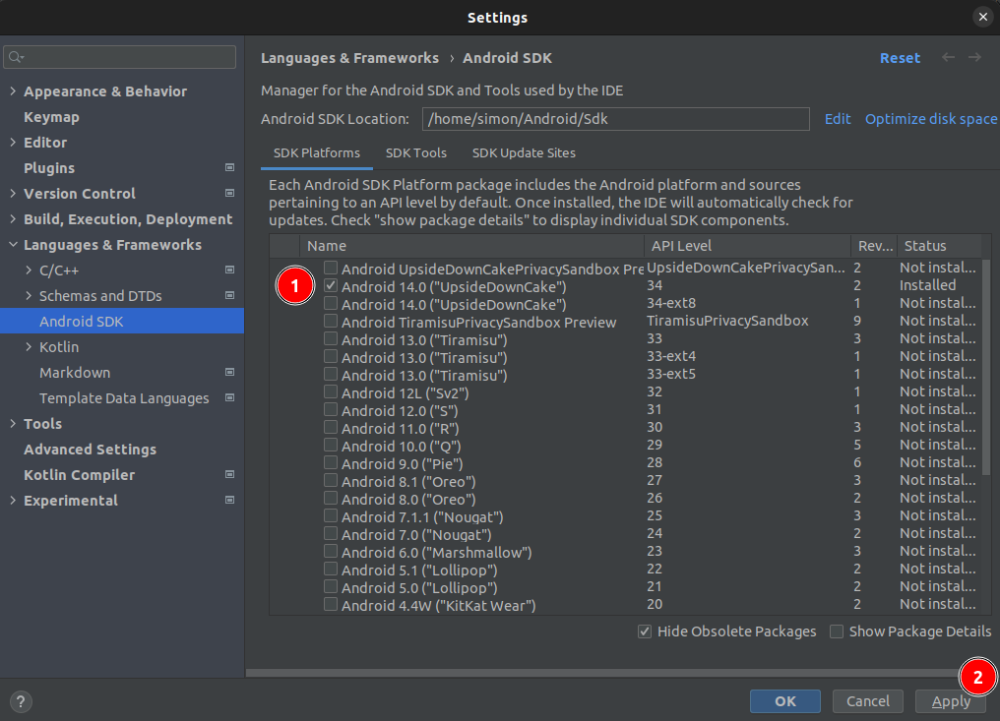
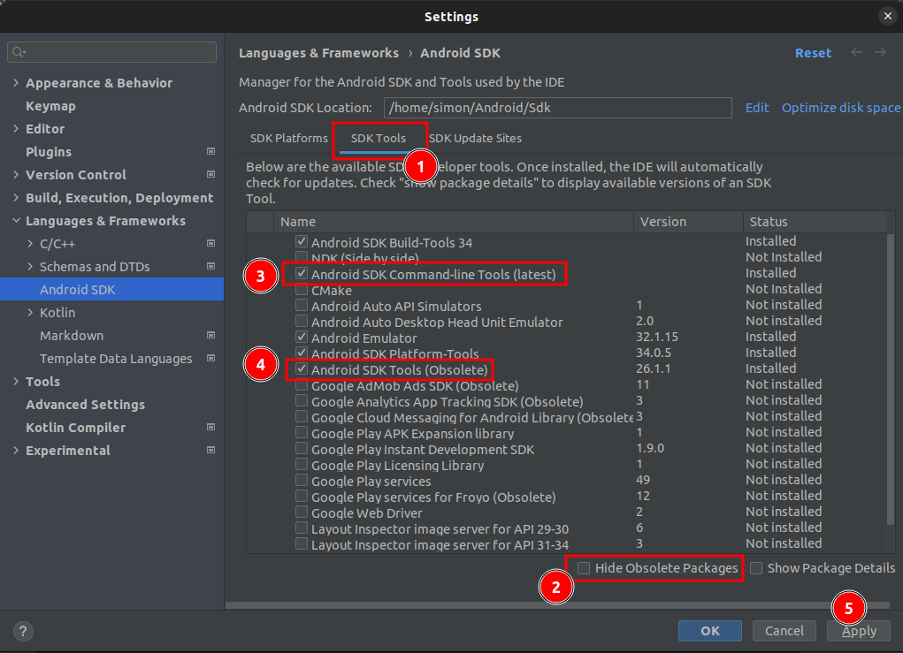
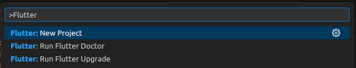

Flutter is a UI toolkit for building beautiful, natively compiled applications for mobile, web, and desktop from a single codebase.
Today I'd like to share how to install Flutter on Ubuntu.

## Download Flutter SDK

Find the latest version of Flutter SDK here: https://docs.flutter.dev/release/archive?tab=linux#stable-channel-linux

After downloading the archive, extract it to a location of your choice, e.g., `~/flutter`.

Then add the `flutter/bin` directory to your `PATH` variable, e.g., by adding the following line to your `~/.bashrc` file:

```bash
PATH="$PATH:`pwd`/flutter/bin"
```

Once you've done that, you can run the following command to verify that Flutter is installed correctly:

```bash
flutter doctor -v
```

`flutter doctor -v` will check your environment and display a report of the status of your Flutter installation.

It will also give guidance on how to install or configure any missing dependencies.

## Install dependencies

Some packages need to be installed before you can run Flutter on Linux.

```bash
sudo apt install clang cmake ninja-build pkg-config libgtk-3-dev

# or ussing Nala

sudo nala install clang cmake ninja-build pkg-config libgtk-3-dev
```

## Download Android Studio

Download Android Studio from here: https://developer.android.com/studio and extract it to a location of your choice, e.g., `~/android-studio`.


Start the installation and follow the instructions.

```bash
cd ~/android-studio/bin
./studio.sh
```

After starting Android Studio, you'll be asked to install the Android SDK and have to configure and/or install different android related tools.

In Android Studio navigate to File > Settings > Languages & Frameworks > Android SDK and install the Android SDK, if not done already in the start wizard.



After the desired SDK platforms have been installed,  you can install the SDK tools.



Remember to untick the "Hide Obsolete Packages" checkbox to see all available SDK tools and install the highlighted tools.

## Configure Android Environment Variables and Path

Add the following lines to your `~/.bashrc` file:

```bash
export ANDROID_HOME=~/Android/Sdk
export PATH=$PATH:$ANDROID_HOME/tools:$ANDROID_HOME/tools/bin:$ANDROID_HOME/platform-tools
```

## Android Licenses

Flutter needs some Android licenses to be accepted before you can run it.

```bash
flutter doctor --android-licenses
```

## Run Flutter Doctor

Now you can run `flutter doctor -v` again to verify that everything is installed correctly.

```bash
flutter doctor -v
```

The output should look similar to this:

```bash
[✓] Flutter (Channel stable, 3.16.0, on Ubuntu 22.04.3 LTS 6.1.0-1026-oem, locale en_US.UTF-8)
    • Flutter version 3.16.0 on channel stable at /home/simon/flutter
    • Upstream repository https://github.com/flutter/flutter.git
    • Framework revision db7ef5bf9f (11 days ago), 2023-11-15 11:25:44 -0800
    • Engine revision 74d16627b9
    • Dart version 3.2.0
    • DevTools version 2.28.2

[✓] Android toolchain - develop for Android devices (Android SDK version 34.0.0)
    • Android SDK at /home/simon/Android/Sdk
    • Platform android-34, build-tools 34.0.0
    • ANDROID_HOME = /home/simon/Android/Sdk
    • Java binary at: /home/simon/android-studio/jbr/bin/java
    • Java version OpenJDK Runtime Environment (build 17.0.6+0-17.0.6b829.9-10027231)
    • All Android licenses accepted.

[✓] Chrome - develop for the web
    • Chrome at google-chrome

[✓] Linux toolchain - develop for Linux desktop
    • Ubuntu clang version 14.0.0-1ubuntu1.1
    • cmake version 3.22.1
    • ninja version 1.10.1
    • pkg-config version 0.29.2

[✓] Android Studio (version 2022.3)
    • Android Studio at /home/simon/android-studio
    • Flutter plugin can be installed from:
      🔨 https://plugins.jetbrains.com/plugin/9212-flutter
    • Dart plugin can be installed from:
      🔨 https://plugins.jetbrains.com/plugin/6351-dart
    • Java version OpenJDK Runtime Environment (build 17.0.6+0-17.0.6b829.9-10027231)

[✓] IntelliJ IDEA Community Edition (version 2023.2)
    • IntelliJ at /snap/intellij-idea-community/467
    • Flutter plugin can be installed from:
      🔨 https://plugins.jetbrains.com/plugin/9212-flutter
    • Dart plugin can be installed from:
      🔨 https://plugins.jetbrains.com/plugin/6351-dart

[✓] VS Code (version 1.84.2)
    • VS Code at /usr/share/code
    • Flutter extension can be installed from:
      🔨 https://marketplace.visualstudio.com/items?itemName=Dart-Code.flutter

[✓] Connected device (2 available)
    • Linux (desktop) • linux  • linux-x64      • Ubuntu 22.04.3 LTS 6.1.0-1026-oem
    • Chrome (web)    • chrome • web-javascript • Google Chrome 119.0.6045.159

[✓] Network resources
    • All expected network resources are available.

• No issues found!
```

## Setup vscode for Flutter

Install the following extensions in VS Code:

- Dart - https://marketplace.visualstudio.com/items?itemName=Dart-Code.dart-code
- Flutter - https://marketplace.visualstudio.com/items?itemName=Dart-Code.flutter
- Bloc - https://marketplace.visualstudio.com/items?itemName=FelixAngelov.bloc

## Create a Flutter App

Now you are ready to go to create your first Flutter App.

Just hit [CTRL + SHIFT + P] and type `Flutter: New Project` and follow the instructions.



Happy Fluttering! 🎉

## Sources

- https://flutter.dev/docs/get-started/install/linux
- https://developer.android.com/tools
- https://developer.android.com/studio
