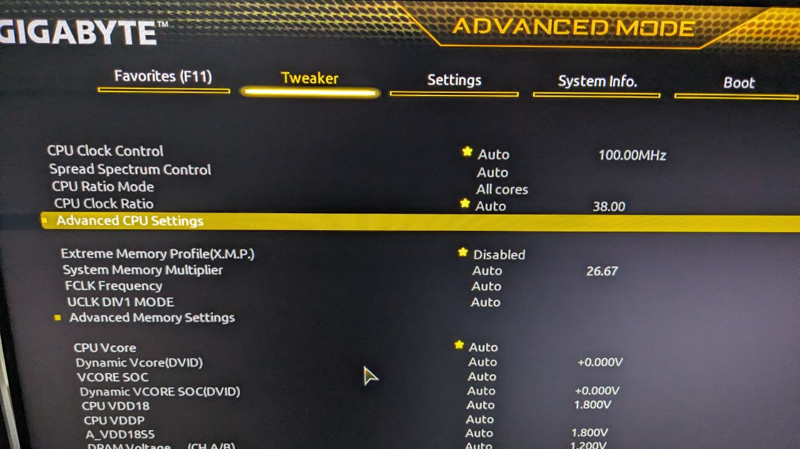
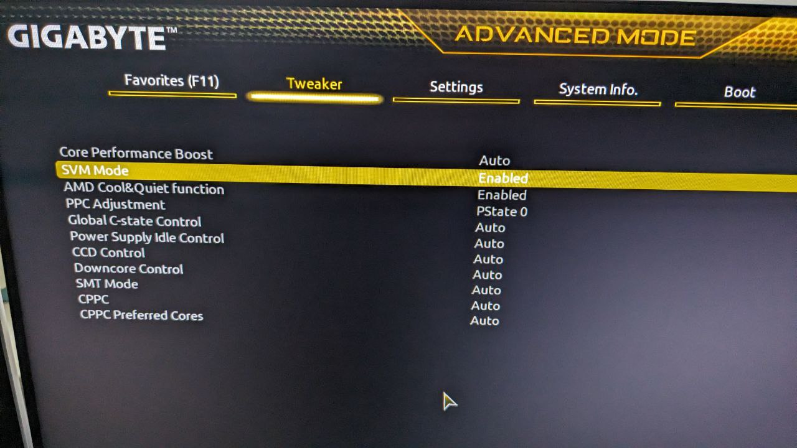

Flutter is a UI toolkit for building beautiful, natively compiled applications for mobile, web, and desktop from a single codebase.
Today I'd like to share how to install Flutter on Ubuntu.

## Download Flutter SDK

Find the latest version of Flutter SDK here: https://docs.flutter.dev/release/archive?tab=linux#stable-channel-linux

After downloading the archive, extract it to a location of your choice, e.g., `~/flutter`.

Then add the `flutter/bin` directory to your `PATH` variable, e.g., by adding the following line to your `~/.bashrc` file:

```bash
PATH="$PATH:`pwd`/flutter/bin"
```

Once you've done that, you can run the following command to verify that Flutter is installed correctly:

```bash
flutter doctor -v
```

`flutter doctor -v` will check your environment and display a report of the status of your Flutter installation.

It will also give guidance on how to install or configure any missing dependencies.

## Install dependencies

Some packages need to be installed before you can run Flutter on Linux.

```bash
# using apt
sudo apt install clang cmake ninja-build pkg-config libgtk-3-dev libsecret-1-dev libsecret-tools libsecret-1-0 libgstreamer1.0-dev libgstreamer-plugins-base1.0-dev liblzma-dev

# or ussing Nala
sudo nala install clang cmake ninja-build pkg-config libgtk-3-dev libsecret-1-dev libsecret-tools libsecret-1-0 libgstreamer1.0-dev libgstreamer-plugins-base1.0-dev liblzma-dev
```

## Install audio player dependencies

If you want to use the audio player package, you need to install the following packages:

```bash
# using apt
sudo apt install libgstreamer1.0-dev libgstreamer-plugins-base1.0-dev gstreamer1.0-plugins-good gstreamer1.0-plugins-bad libunwind-dev

# or using Nala
sudo nala install libgstreamer1.0-dev libgstreamer-plugins-base1.0-dev gstreamer1.0-plugins-good gstreamer1.0-plugins-bad libunwind-dev
```

Also see https://pub.dev/packages/audioplayers_linux

## Download Android Studio

Download Android Studio from here: https://developer.android.com/studio and extract it to a location of your choice, e.g., `~/android-studio`.


Start the installation and follow the instructions.

```bash
cd ~/android-studio/bin
./studio.sh
```

After starting Android Studio, you'll be asked to install the Android SDK and have to configure and/or install different android related tools.

In Android Studio navigate to File > Settings > Languages & Frameworks > Android SDK and install the Android SDK, if not done already in the start wizard.


After the desired SDK platforms have been installed,  you can install the SDK tools.


Remember to untick the "Hide Obsolete Packages" checkbox to see all available SDK tools and install the highlighted tools.

## Configure Android Environment Variables and Path

Add the following lines to your `~/.bashrc` file:

```bash
export ANDROID_HOME=~/Android/Sdk
export PATH=$PATH:$ANDROID_HOME/tools:$ANDROID_HOME/tools/bin:$ANDROID_HOME/platform-tools
```

## Android Licenses

Flutter needs some Android licenses to be accepted before you can run it.

```bash
flutter doctor --android-licenses
```

## Run Flutter Doctor

Now you can run `flutter doctor -v` again to verify that everything is installed correctly.

```bash
flutter doctor -v
```

The output should look similar to this:

```bash
[✓] Flutter (Channel stable, 3.16.0, on Ubuntu 22.04.3 LTS 6.1.0-1026-oem, locale en_US.UTF-8)
    • Flutter version 3.16.0 on channel stable at /home/simon/flutter
    • Upstream repository https://github.com/flutter/flutter.git
    • Framework revision db7ef5bf9f (11 days ago), 2023-11-15 11:25:44 -0800
    • Engine revision 74d16627b9
    • Dart version 3.2.0
    • DevTools version 2.28.2

[✓] Android toolchain - develop for Android devices (Android SDK version 34.0.0)
    • Android SDK at /home/simon/Android/Sdk
    • Platform android-34, build-tools 34.0.0
    • ANDROID_HOME = /home/simon/Android/Sdk
    • Java binary at: /home/simon/android-studio/jbr/bin/java
    • Java version OpenJDK Runtime Environment (build 17.0.6+0-17.0.6b829.9-10027231)
    • All Android licenses accepted.

[✓] Chrome - develop for the web
    • Chrome at google-chrome

[✓] Linux toolchain - develop for Linux desktop
    • Ubuntu clang version 14.0.0-1ubuntu1.1
    • cmake version 3.22.1
    • ninja version 1.10.1
    • pkg-config version 0.29.2

[✓] Android Studio (version 2022.3)
    • Android Studio at /home/simon/android-studio
    • Flutter plugin can be installed from:
      🔨 https://plugins.jetbrains.com/plugin/9212-flutter
    • Dart plugin can be installed from:
      🔨 https://plugins.jetbrains.com/plugin/6351-dart
    • Java version OpenJDK Runtime Environment (build 17.0.6+0-17.0.6b829.9-10027231)

[✓] IntelliJ IDEA Community Edition (version 2023.2)
    • IntelliJ at /snap/intellij-idea-community/467
    • Flutter plugin can be installed from:
      🔨 https://plugins.jetbrains.com/plugin/9212-flutter
    • Dart plugin can be installed from:
      🔨 https://plugins.jetbrains.com/plugin/6351-dart

[✓] VS Code (version 1.84.2)
    • VS Code at /usr/share/code
    • Flutter extension can be installed from:
      🔨 https://marketplace.visualstudio.com/items?itemName=Dart-Code.flutter

[✓] Connected device (2 available)
    • Linux (desktop) • linux  • linux-x64      • Ubuntu 22.04.3 LTS 6.1.0-1026-oem
    • Chrome (web)    • chrome • web-javascript • Google Chrome 119.0.6045.159

[✓] Network resources
    • All expected network resources are available.

• No issues found!
```

## Setup vscode for Flutter

Install the following extensions in VS Code:

- Dart - https://marketplace.visualstudio.com/items?itemName=Dart-Code.dart-code
- Flutter - https://marketplace.visualstudio.com/items?itemName=Dart-Code.flutter
- Bloc - https://marketplace.visualstudio.com/items?itemName=FelixAngelov.bloc

## Setup Android Emulator (optional)

If you want to run your Flutter app on an Android Emulator, you need to install the Android Emulator.
By default the Pixel 3a emulator is installed, which can be used to run your Flutter app.

### Enable virtualization in BIOS

Before you can use the Android Emulator, you need to enable virtualization in your BIOS and then install KVM (see next step).

How to enable virtualization is described here: https://bce.berkeley.edu/enabling-virtualization-in-your-pc-bios.html
Basically it depends on your hardware and BIOS version.

For me it were the following steps:

1. Reboot your computer
2. Press [F2] to enter BIOS
3. Navigate to "Tweaker" > "Advanced CPU Settings"

4. Enable "SVM Mode"

5. Save and exit BIOS

### Install KVM

For the Android Emulator to run, you need to install KVM (Kernel-based Virtual Machine).

```bash
# using apt
sudo apt -y install bridge-utils cpu-checker libvirt-clients libvirt-daemon qemu qemu-kvm

# or using Nala
sudo nala install bridge-utils cpu-checker libvirt-clients libvirt-daemon qemu qemu-kvm
```

After that you need to add a user to kvm:

```bash
sudo adduser $USER kvm
```

You can check if KVM is installed correctly by running the following command:

```bash
kvm-ok
```

The output should look similar to this:

```bash
INFO: /dev/kvm exists
KVM acceleration can be used
```

### Create an Android Emulator

Within Adnroid Studio navigate to Tools > Device Manager and start the Pixel 3a emulator, which is installed by default.

Or you can create a new emulator by clicking on "Create Virtual Device..." and follow the instructions.

You can lookup which devices and SDKs are supported here:

https://docs.flutter.dev/reference/supported-platforms

## Create a Flutter App

Now you are ready to go to create your first Flutter App.

Just hit [CTRL + SHIFT + P] and type `Flutter: New Project` and follow the instructions.


Happy Fluttering! 🎉

## Troubleshooting

While troubleshooting, you should run `flutter clean` and `flutter pub get` before trying the next steps.

### Linux desktop

Sometimes your flutter project won't run on Linux desktop, because of missing dependencies.

You can find out which dependencies are missing by running the app in verbose mode adding the `-v` flag:

```bash
flutter run -v -d linux
```

## Sources

- https://flutter.dev/docs/get-started/install/linux
- https://developer.android.com/tools
- https://developer.android.com/studio
- https://ubuntu.com/blog/kvm-hyphervisor
- https://bce.berkeley.edu/enabling-virtualization-in-your-pc-bios.html
- https://docs.flutter.dev/reference/supported-platforms
