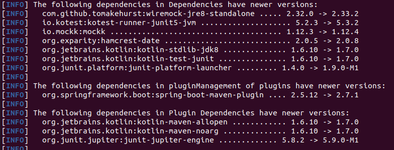
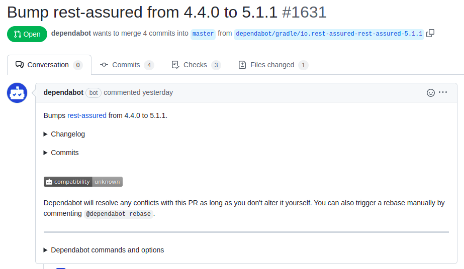

## Keeping your dependencies up to date

While JVM based libraries (Java, Kotlin, Scale etc.) are quite stable compared to some NPM packages in the JavaScript world, it is still desired to keep your dependencies up to date, to get all the benefits of the new versions and avoid running into technical debts due to this.

Here I'd like to present different ways to track the versions of your dependencies.

### Maven Dependency Updates

Maven comes with a general plugin for dependency updates out of the box: https://www.mojohaus.org/versions-maven-plugin/examples/display-dependency-updates.html

```bash
./mvnw versions:display-dependency-updates
```

Invoking this command will then list all dependency updates of your Maven project in the terminal.

The output can then look similar to this depending on your dependencies in the project:



### Ben Manes Dependency Updates Gradle Plugin

When you're using Gradle the `com.github.ben-manes.versions` (https://plugins.gradle.org/plugin/com.github.ben-manes.versions) is really helpful.
It can be configured like this in your `build.gradle.kts` file:

```kotlin [build.gradle.kts]
import com.github.benmanes.gradle.versions.updates.DependencyUpdatesTask

plugins {
    // ... all your other Gradle plugins

    id("com.github.ben-manes.versions") version "0.48.0"
}

tasks.withType<DependencyUpdatesTask> {
    rejectVersionIf {
        isNonStable(candidate.version)
    }
}

fun isNonStable(version: String): Boolean {
    val stableKeyword = listOf("RELEASE", "FINAL", "GA").any { version.uppercase().contains(it) }
    val regex = "^[0-9,.v-]+(-r)?$".toRegex()
    val isStable = stableKeyword || regex.matches(version)
    return isStable.not()
}
```

1. Add the `com.github.ben-manes.versions` Gradle plugin
2. Adjust the `DependencyUpdatesTask` to only allow stable releases to be considered
3. Use `isNonStable` function to check whether a stable version is being used

Once the `com.github.ben-manes.versions` has been configured the `dependencyUpdates` task can be run like this `./gradlew dU` or `./gradlew dependencyUpdates`.

For a quarkus project the output can look similar to this:

```bash
> Task :dependencyUpdates

------------------------------------------------------------
: Project Dependency Updates (report to plain text file)
------------------------------------------------------------

The following dependencies are using the latest milestone version:
 - com.github.ben-manes.versions:com.github.ben-manes.versions.gradle.plugin:0.42.0
 - io.mockk:mockk:1.12.4
 - io.quarkus:io.quarkus.gradle.plugin:2.10.1.Final
 - io.quarkus:quarkus-arc:2.10.1.Final
 - io.quarkus:quarkus-arc-deployment:2.10.1.Final
 - io.quarkus:quarkus-config-yaml:2.10.1.Final
 - io.quarkus:quarkus-config-yaml-deployment:2.10.1.Final
 - io.quarkus:quarkus-core-deployment:2.10.1.Final
 - io.quarkus:quarkus-jacoco:2.10.1.Final
 - io.quarkus:quarkus-jacoco-deployment:2.10.1.Final
 - io.quarkus:quarkus-jsonp-deployment:2.10.1.Final
 - io.quarkus:quarkus-junit5:2.10.1.Final
 - io.quarkus:quarkus-kotlin:2.10.1.Final
 - io.quarkus:quarkus-kotlin-deployment:2.10.1.Final
 - io.quarkus:quarkus-logging-json:2.10.1.Final
 - io.quarkus:quarkus-logging-json-deployment:2.10.1.Final
 - io.quarkus:quarkus-micrometer:2.10.1.Final
 - io.quarkus:quarkus-micrometer-deployment:2.10.1.Final
 - io.quarkus:quarkus-micrometer-registry-prometheus:2.10.1.Final
 - io.quarkus:quarkus-micrometer-registry-prometheus-deployment:2.10.1.Final
 - io.quarkus:quarkus-mongodb-panache-kotlin:2.10.1.Final
 - io.quarkus:quarkus-mongodb-panache-kotlin-deployment:2.10.1.Final
 - io.quarkus:quarkus-mutiny-deployment:2.10.1.Final
 - io.quarkus:quarkus-netty-deployment:2.10.1.Final
 - io.quarkus:quarkus-oidc:2.10.1.Final
 - io.quarkus:quarkus-oidc-deployment:2.10.1.Final
 - io.quarkus:quarkus-rest-client:2.10.1.Final
 - io.quarkus:quarkus-rest-client-deployment:2.10.1.Final
 - io.quarkus:quarkus-rest-client-jackson:2.10.1.Final
 - io.quarkus:quarkus-rest-client-jackson-deployment:2.10.1.Final
 - io.quarkus:quarkus-rest-client-mutiny:2.10.1.Final
 - io.quarkus:quarkus-rest-client-mutiny-deployment:2.10.1.Final
 - io.quarkus:quarkus-resteasy-reactive:2.10.1.Final
 - io.quarkus:quarkus-resteasy-reactive-common-deployment:2.10.1.Final
 - io.quarkus:quarkus-resteasy-reactive-deployment:2.10.1.Final
 - io.quarkus:quarkus-resteasy-reactive-jackson:2.10.1.Final
 - io.quarkus:quarkus-resteasy-reactive-jackson-deployment:2.10.1.Final
 - io.quarkus:quarkus-resteasy-reactive-kotlin-deployment:2.10.1.Final
 - io.quarkus:quarkus-smallrye-context-propagation-deployment:2.10.1.Final
 - io.quarkus:quarkus-smallrye-fault-tolerance:2.10.1.Final
 - io.quarkus:quarkus-smallrye-fault-tolerance-deployment:2.10.1.Final
 - io.quarkus:quarkus-vertx-deployment:2.10.1.Final
 - io.quarkus.platform:quarkus-bom:2.10.1.Final
 - io.swagger:swagger-annotations:1.6.6
 - org.jetbrains.kotlin:kotlin-allopen:1.7.0
 - org.jetbrains.kotlin:kotlin-scripting-compiler-embeddable:1.7.0
 - org.jetbrains.kotlin.jvm:org.jetbrains.kotlin.jvm.gradle.plugin:1.7.0
 - org.jetbrains.kotlin.plugin.allopen:org.jetbrains.kotlin.plugin.allopen.gradle.plugin:1.7.0
 - org.jlleitschuh.gradle.ktlint:org.jlleitschuh.gradle.ktlint.gradle.plugin:10.3.0
 - org.openapi.generator:org.openapi.generator.gradle.plugin:6.0.0

The following dependencies have later milestone versions:
 - com.pinterest:ktlint [0.45.2 -> 0.46.1]
     https://github.com/pinterest/ktlint
 - io.kotest:kotest-assertions-core-jvm [5.3.0 -> 5.3.2]
     https://github.com/kotest/kotest
 - io.kotest:kotest-framework-api [5.3.0 -> 5.3.2]
     https://github.com/kotest/kotest
 - io.kotest:kotest-runner-junit5-jvm [5.3.0 -> 5.3.2]
     https://github.com/kotest/kotest
 - io.rest-assured:rest-assured [4.5.1 -> 5.1.1]
     http://code.google.com/p/rest-assured
 - org.jetbrains.kotlin:kotlin-stdlib-jdk8 [1.6.21 -> 1.7.0]
     https://kotlinlang.org/
 - org.openapitools:jackson-databind-nullable [0.2.2 -> 0.2.3]
     https://github.com/OpenAPITools/jackson-databind-nullable

Failed to determine the latest version for the following dependencies (use --info for details):
 - org.jetbrains.kotlin:kotlin-stdlib-jdk8
     1.7.0

Gradle release-candidate updates:
 - Gradle: [7.4.2 -> 7.5-rc-3]

Generated report file build/dependencyUpdates/report.txt

```

### GitHub's Dependabot

In case you're using GitHub for your projects the easiest way to keep your dependencies up to date is using `Dependabot` (https://github.com/dependabot)

The `Dependabot` will automatically create Pull Requests for your repository to update your dependencies.



Dependabot can be configured with a `dependabot.yml` within a `.github` folder inside your GitHub Repository.

For a Gradle project the `dependabot.yml` can look similar to this:

```yaml
# To get started with Dependabot version updates, you'll need to specify which
# package ecosystems to update and where the package manifests are located.
# Please see the documentation for all configuration options:
# https://help.github.com/github/administering-a-repository/configuration-options-for-dependency-updates
version: 2
registries:
  maven-artifactory-release:
    type: maven-repository
    url: https://your-companies-artifactory/artifactory/libs-release
    username: ${{ secrets.ARTIFACTORY_USERNAME }}
    password: ${{ secrets.ARTIFACTORY_APIKEY }}
  maven-artifactory-snapshots:
    type: maven-repository
    url: https://your-companies-artifactory/artifactory/libs-snapshot
    username: ${{ secrets.ARTIFACTORY_USERNAME }}
    password: ${{ secrets.ARTIFACTORY_APIKEY }}
updates:
  - package-ecosystem: "gradle" # See documentation for possible values
    registries:
      - maven-artifactory-release
      - maven-artifactory-snapshots
    directory: "/" # Location of package manifests
    schedule:
      interval: "daily"
    # Allow up to 10 open pull requests for pip dependencies
    open-pull-requests-limit: 10
```

In case you use Maven as build tool, you can simply change the `package-ecosystem` property to `maven` and then `Depandabot` will update your `pom.xml` files for you.
