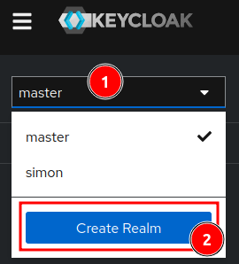
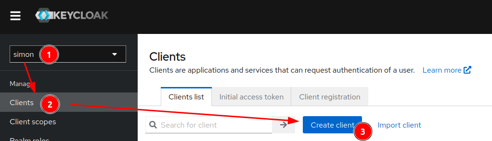
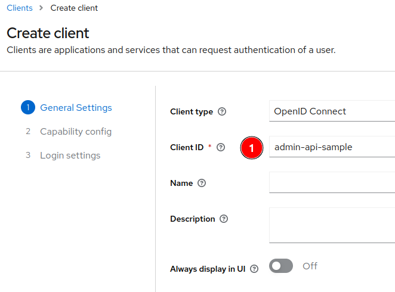
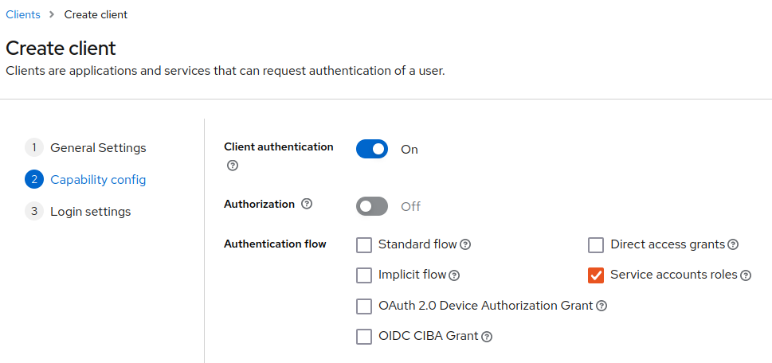
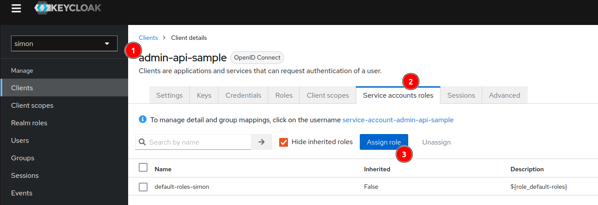
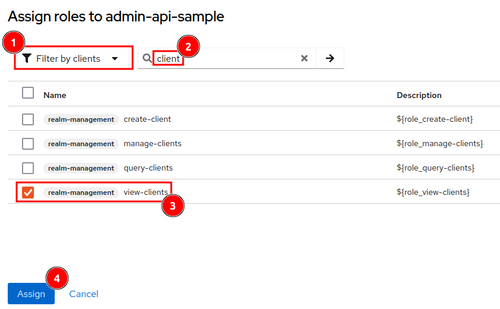
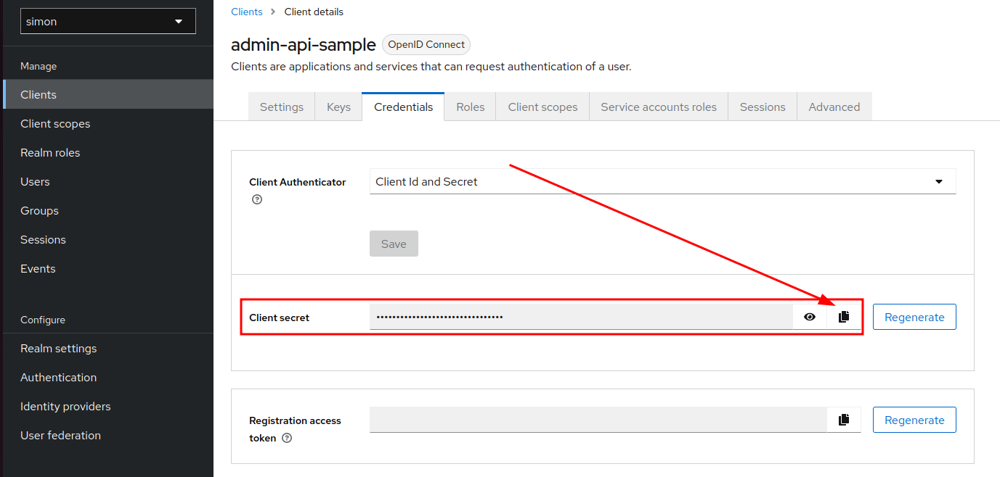

In this tutorial we will learn how to use the Keycloak admin API to create a service account and how to use it to access the admin API.

## Prerequisites

In order to follow this tutorial Docker and docker-compose need to be installed.

Also see [docker and docker compose](https://simonscholz.github.io/tutorials/ubuntu-dev-setup#docker-docker-compose).

## Start Keycloak using docker-compose

Please create a `docker-compose.yaml` file with the following content:

```yaml [docker-compose.yaml]
version: "3.7"

services:
  keycloak:
    image: "quay.io/keycloak/keycloak:22.0"
    container_name: quarkus-keycloak
    restart: "no"
    ports:
      - "8180:8080" # Changing port because 8080 is often occupied
    environment:
      - KEYCLOAK_ADMIN=admin
      - KEYCLOAK_ADMIN_PASSWORD=admin
    command:
      - start-dev
```

Then start Keycloak with:

```bash
docker-compose up

# or dependending on your docker-compose version
docker compose up
```

After Keycloak has started, you can access the admin console at http://localhost:8180/admin/master/console/ and login with the credentials `admin` and `admin`.

Note: Running `docker-compose down` will shut down the Keycloak container again.

## Create a sample realm

In the admin console, click on the realm dropdown menu and click on `Create realm`.



Then enter a realm name, e.g., `Simon` and click on `Create`.

## Create a client with service account roles

In order to access the Keycloak admin API, you need to create a client with `service account roles` authentication flow.
Therefore you need to login to the admin console and navigate to the `Simon` realm and then to `Clients` and click on `Create client`.



Then you need to enter a client ID, e.g., `admin-api-sample` and click on `Next`.



After clicking `Next` you will be in the Capability config section, where the authentication and desired flows are setup.

Here we need to enable Client authentication and only select `Service accounts roles` and click on `Next`.



The last `Login settings` section can be left as is and you can click on `Save`.

## Set up the service account roles

In the clients list there should now be a new client called `admin-api-sample`. Click on it and navigate to the `Service Account Roles` tab.



Here you can add the roles that the service account should have.
In this example we will add the `view-clients` role by clicking on `Assign role`.



Be sure the use `Filter by clients` in the dropdown menu and then assign the role.

## Getting an access token to query the admin API

I usually use Postman to query the admin API, but you can use any tool you like, e.g., curl.

```bash
curl --location 'http://localhost:8180/realms/simon/protocol/openid-connect/token' \
--header 'Content-Type: application/x-www-form-urlencoded' \
--data-urlencode 'grant_type=client_credentials' \
--data-urlencode 'client_id=admin-api-sample' \
--data-urlencode 'client_secret={your-client-secret}' \
```

You can find the client secret in the `Credentials` tab of the `admin-api-sample` client.



If you have [jq installed](https://jqlang.github.io/jq/download/), you can also directly assign the access token to a variable in bash:

```bash
export ACCESS_TOKEN=$(curl --location 'http://localhost:8180/realms/simon/protocol/openid-connect/token' \
--header 'Content-Type: application/x-www-form-urlencoded' \
--data-urlencode 'grant_type=client_credentials' \
--data-urlencode 'client_id=admin-api-sample' \
--data-urlencode 'client_secret={your-client-secret}' | jq -r '.access_token')
```

## Calling the admin API

Now that we have an access token, we can use it to query the admin API.

```bash
curl --location 'http://localhost:8180/admin/realms/simon/clients' \
--header 'Authorization: Bearer '$ACCESS_TOKEN | jq
```

You can also remove the `| jq` part if jq is not installed and you will get the raw JSON response.

## Conclusion

With this tutorial you should be able to use the Keycloak admin API to create a service account and use it to query the admin API.

In many cases you will want to use the admin API to automate the creation of realms, clients, users, etc. and this tutorial should give you a good starting point.
You simply have to adjust the roles for the service accounts accordingly.

Also see [Keycloak Admin Rest API docs](https://www.keycloak.org/docs-api/22.0.5/rest-api/index.html)

## Sources

- https://www.keycloak.org/docs-api/22.0.5/rest-api/index.html
- https://simonscholz.github.io/tutorials/keycloak-realm-export-import
- https://www.keycloak.org/guides#getting-started
