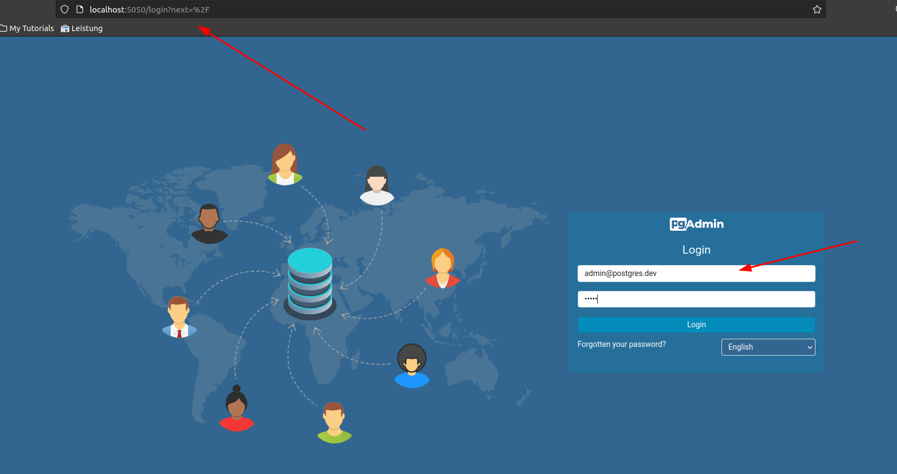
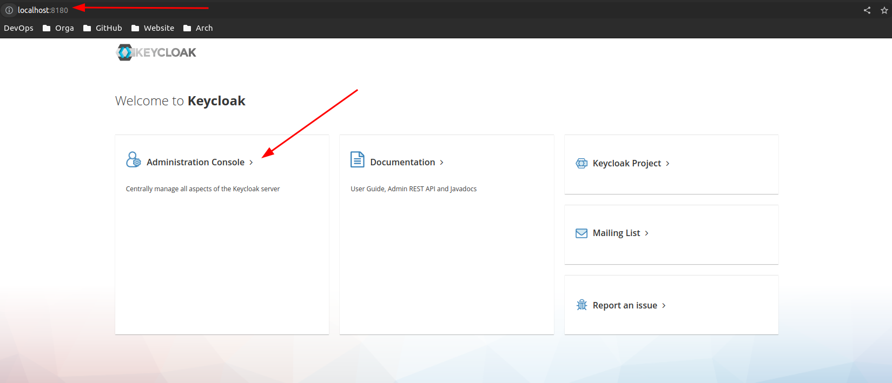
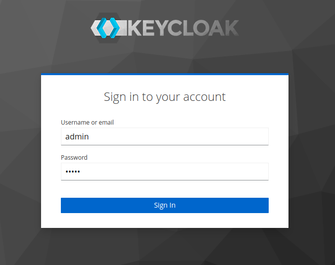
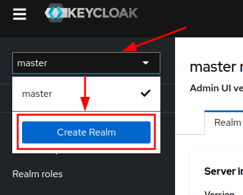

# Keycloak with Postgres

In https://simonscholz.github.io/tutorials/keycloak-realm-export-import I described how to load initial data for Keycloak using realm data export and import capabilities.
This can be really helpful for demonstration purposes and tutorials. ;-)
But in this tutorial I'd like to share some insights on setting up Keycloak with a Postgres database on your local machine using docker compose.
Having a Postgres instance as a persisted volume can be quite handy to store different Keycloak realms between sessions.

Besides the Postgres database also several other database technologies are supported, but Postgres is considered as so called "first class database" for Keycloak. Also see https://www.keycloak.org/2022/02/dbs.html

# Setting up Postgres and PGAdmin

In order to run Postgres and PGAdmin (Postgres database UI client) via docker compose the following can be done:

```yaml
---
version: "3.7"

services:
  postgres:
    container_name: keycloak-postgres
    image: "postgres:15.1"
    volumes:
      - ./dev-environment/docker-config/postgres/data:/var/lib/postgresql/data/
    environment:
      - POSTGRES_USER=keycloak
      - POSTGRES_PASSWORD=keycloak
    networks:
      - backend
    ports:
      - "5432:5432"
  pgadmin:
    container_name: keycloak-postgres-pgadmin
    image: "dpage/pgadmin4:6.17"
    environment:
      - PGADMIN_DEFAULT_EMAIL=admin@postgres.dev
      - PGADMIN_DEFAULT_PASSWORD=admin
    ports:
      - "5050:80"
    networks:
      - backend

networks:
  backend:
    name: backend
    driver: bridge

```

When saving this to a `docker-compose.yml` file and running `docker-compose up` a Postgres database and a PGAdmin UI client will be started.

Once the container are up and running PGAdmin can be used to browse the Postgres database.
Just go to http://localhost:5050 to login into PGAdmin using the above defined credentials with username `admin@postgres.dev` and `admin` as password.



# Starting Keycloak 20 and connect it to the Postgres database

Now we can configure to also start Keycloak once the Postgres DB is up and running.
To ensure this we make use of the depends_on directive like this:

```yml
---
version: "3.7"

services:
  keycloak:
    image: 'quay.io/keycloak/keycloak:20.0.1'
    container_name: keycloak-with-postgres
    depends_on:
      - "postgres" # the name of the service above
    restart: "no"
    ports:
      - '8180:8080' # Changing this port because 8080 is usually the default for the quarkus app
    environment:
      - KEYCLOAK_ADMIN=admin
      - KEYCLOAK_ADMIN_PASSWORD=admin
      - GET_HOSTS_FROM=dns
      - KC_DB=postgres
      - KC_DB_USERNAME=keycloak
      - KC_DB_PASSWORD=keycloak
      - KC_DB_URL=jdbc:postgresql://keycloak-postgres:5432/keycloak
      - KC_HOSTNAME=localhost
    command:
      - start-dev
    networks:
      - backend

networks:
  backend:
    name: backend
    driver: bridge

```

This samples uses the currently latest version (20.0.1) of Keycloak (dec 4th 2022), which is based on Quarkus instead of Wildfly.

`KEYCLOAK_ADMIN` and `KEYCLOAK_ADMIN_PASSWORD` will be the user name and password to get access to keycloak.
`GET_HOSTS_FROM` helps to find the Postgres in the later step.
`KC_DB=postgres` indicates that we want to use Postgres DB as data store for our running Keycloak instance.
Besides Postgres Keycloak is supporting several other data stores as well, but Postgres is the so called "first class database" for Keycloak. Also see https://www.keycloak.org/2022/02/dbs.html
`KC_DB_USERNAME` and `KC_DB_PASSWORD` are the username and password, which have been configured earlier for the Postgres container.
The `KC_DB_URL` needs to be a proper jdbc connection string to work in a proper manner for Keycloak: `jdbc:postgresql://keycloak-postgres:5432/keycloak`
`keycloak-postgres` in the jdbc connection string is the name of the postgres container, which can be referenced.

The meaning of the different environment variables can be found here: https://www.keycloak.org/server/containers

# Putting all together

The complete docker-compose.yaml file will look like this:

```yml
---
version: "3.7"

services:
  postgres:
    container_name: keycloak-postgres
    image: "postgres:15.1"
    volumes:
      - ./dev-environment/docker-config/postgres/data:/var/lib/postgresql/data/
    environment:
      - POSTGRES_USER=keycloak
      - POSTGRES_PASSWORD=keycloak
    networks:
      - backend
    ports:
      - "5432:5432"
  pgadmin:
    container_name: keycloak-postgres-pgadmin
    image: "dpage/pgadmin4:6.17"
    environment:
      - PGADMIN_DEFAULT_EMAIL=admin@postgres.dev
      - PGADMIN_DEFAULT_PASSWORD=admin
    ports:
      - "5050:80"
    networks:
      - backend
  keycloak:
    image: 'quay.io/keycloak/keycloak:20.0.1'
    container_name: keycloak-with-postgres
    depends_on:
      - "postgres" # the name of the service above
    restart: "no"
    ports:
      - '8180:8080' # Changing this port because 8080 is usually the default for the quarkus app
    environment:
      - KEYCLOAK_ADMIN=admin
      - KEYCLOAK_ADMIN_PASSWORD=admin
      - GET_HOSTS_FROM=dns
      - KC_DB=postgres
      - KC_DB_USERNAME=keycloak
      - KC_DB_PASSWORD=keycloak
      - KC_DB_URL=jdbc:postgresql://keycloak-postgres:5432/keycloak
      - KC_HOSTNAME=localhost
    command:
      - start-dev
    networks:
      - backend

networks:
  backend:
    name: backend
    driver: bridge

```

Going to http://localhost:8180/ will show the Keycloak home screen: 



You can click the `Administration Console` link on the left and login using `admin` as username and password:



Once logged in you should be able to see config of the master realm:


The first thing you'd probably might want to do is to create a dedicated realm for your application besides the master realm.
You can do so by clicking on the `master` realm and hit `Create Realm`:



# Sources

- https://www.keycloak.org/guides#getting-started
- https://www.keycloak.org/server/containers
- https://hub.docker.com/_/postgres
- https://www.pgadmin.org/docs/pgadmin4/latest/container_deployment.html