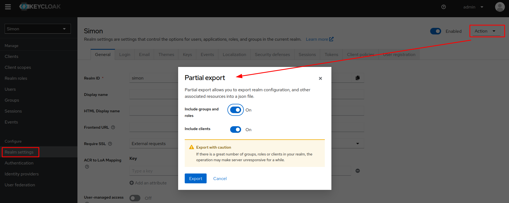
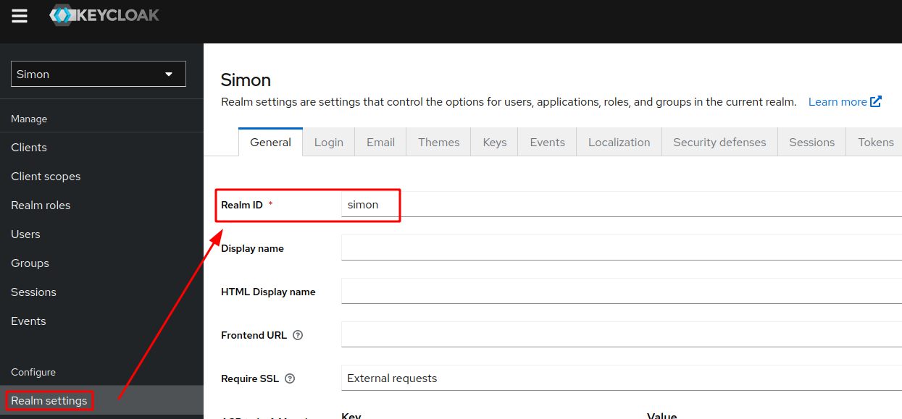
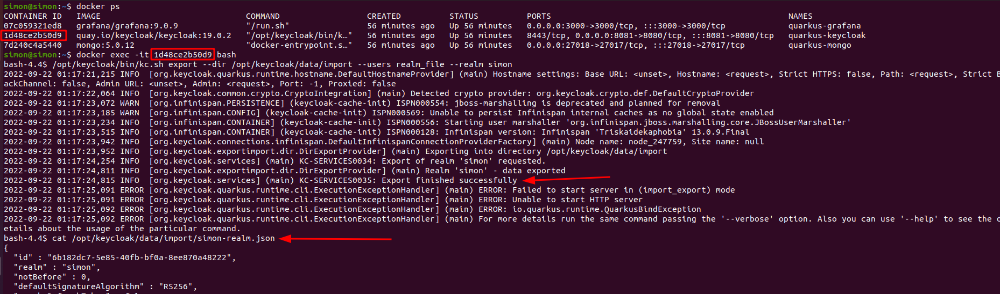
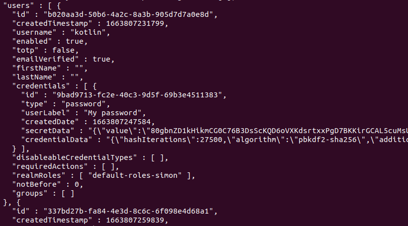

# Starting a keycloak 19 instance (based on quarkus)

The following docker compose file can be used to start a keycloak instance:

```yaml
version: '3.7'

services:
  keycloak:
    image: 'quay.io/keycloak/keycloak:19.0.2'
    container_name: quarkus-keycloak
    restart: 'no'
    ports:
      - '8081:8080' # Changing this port because 8080 is usually the default for the quarkus app
    environment:
      - KEYCLOAK_ADMIN=admin
      - KEYCLOAK_ADMIN_PASSWORD=admin
    command:
      - start-dev
      - --import-realm
```

When saving this as `docker-compose.yml` file and running `docker-compose up` withing the file's folder,
keycloak will be started on http://localhost:8081 and you can login with the `admin` user and `admin` password.

# Exporting a keycloak realm

A keycloak realm can easily be exported by using the user interface of keycloak,
**but** this won't contain the users and roles within that realm for security reasons.



When clicking the `Export` button you can have a look at the exported json and will find out that the users are missing.

# Exporting a keycloak realm including users and roles

To also get user and role information the keycloak CLI has to be used.

By using the `docker ps` command we can find out the container id and connect to the container by using `docker exec -it {your-containers-id} bash`.
Once the bash within the docker container is available the following command can be used to export the realm including users and roles:

```bash
/opt/keycloak/bin/kc.sh export --dir /opt/keycloak/data/import --users realm_file --realm {your-realms-id}
```

With `--dir` or `--file` you can specify the export folder or file.
`--users realm_file` will cause that the users will be put into the realm file.
`--realm {your-realms-id}` is used to specify which realm is supposed to be exported.

The id of the realm can be found here:



This is how it looks like on my machine:



To directly see the contents of the exported realm file you can invoke:

```bash
cat /opt/keycloak/data/import/{your-realm-id}-realm.json
```

When looking at the output of the cat command, you'll see the users array:



# Copy exported realm file to host

Using `cat` to view the contents of the realm file is nice, but here is the command to copy it over to your machine.

```bash
docker cp {your-containers-id}:/opt/keycloak/data/import/{your-realm-id}-realm.json /{your-desired-location-on-host}
```

# Import keycloak realm using docker compose

```yaml
version: '3.7'

services:
  keycloak:
    image: 'quay.io/keycloak/keycloak:19.0.2'
    container_name: quarkus-keycloak
    restart: 'no'
    ports:
      - '8081:8080' # Changing this port because 8080 is usually the default for the quarkus app
    environment:
      - KEYCLOAK_ADMIN=admin
      - KEYCLOAK_ADMIN_PASSWORD=admin
      - KEYCLOAK_IMPORT=./{your-realm-id}-realm.json
    command:
      - start-dev
      - --import-realm
```

Adding `- KEYCLOAK_IMPORT=./{your-realm-id}-realm.json` to the `docker-compose.yaml` from the previous section will now also import the realm,
which was exported earlier.

# Conclusion

Of course this should be done with caution and my only reason to export also the users is to have a sample realm file in place for local development.
My projects usually consist of a `docker-compose.yaml` file in the root of the project to easily ramp up services/technologies, which are used by the project, e.g., database, message broker, keycloak and more.

# Sources

- https://www.keycloak.org/guides#getting-started
- https://www.keycloak.org/server/importExport#_exporting_a_realm_to_a_directory
- https://www.redhat.com/sysadmin/compose-kubernetes-podman
- https://www.helikube.de/keycloak-18-export-and-import-feature/
