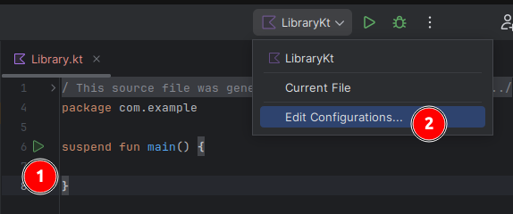
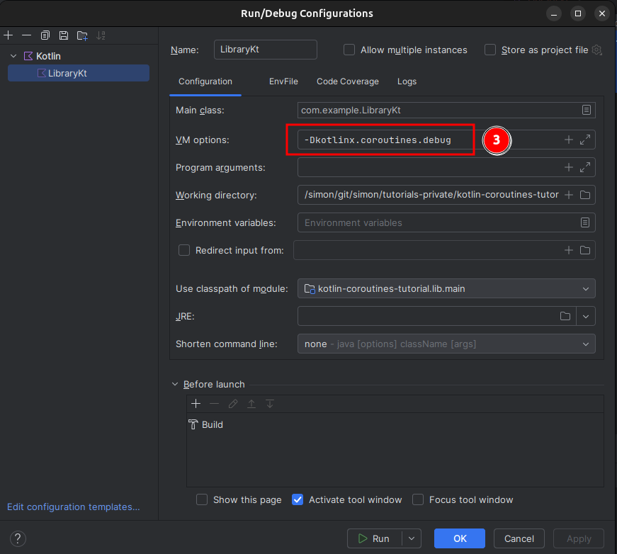
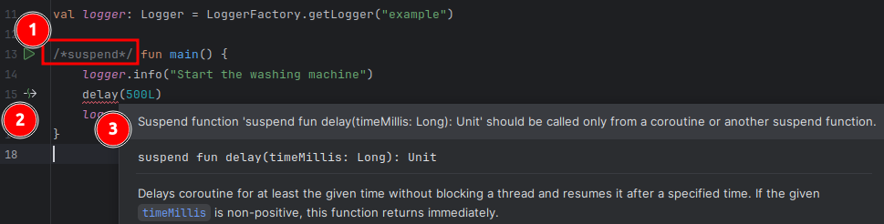

## General Kotlin Coroutines

Kotlin coroutines allow to write asynchronous/concurrent code in a sequential style.
So you can write concurrent code with a well known syntax, which is familiar to the majority of developers.
This simplicity let´s coroutines shine compared to many reactive programming libraries, e.g., RxJava, Project Reactor or Mutiny.

## Prerequisites

- Gradle
- Kotlin

## Creating a project and configure the IDE

```bash
mkdir kotlin-coroutines-tutorial
cd kotlin-coroutines-tutorial

gradle init \
    --type kotlin-library \
    --dsl kotlin \
    --test-framework junit-jupiter \
    --project-name kotlin-coroutines-tutorial \
    --package com.example \
    --no-split-project \
    --no-incubating \
    --java-version 21
```

Once the *kotlin-coroutines-tutorial* project is created you can open it in IntelliJ.
Then open the Library class and add a suspending main function:

```kotlin[Library.kt]
package com.example

suspend fun main() {

}
```

Then you can hit the "play button" (1) to implicitly create a launch configuration to be edited (2)



In the launch configuration the VM Option `-Dkotlinx.coroutines.debug` can be used to output additional coroutine meta data in the logs.



## Adding the necessary dependencies

Basically the following dependencies are needed:

- org.jetbrains.kotlinx:kotlinx-coroutines-core:1.9.0-RC
- org.slf4j:slf4j-api:2.0.13
- ch.qos.logback:logback-classic:1.5.6

In case the project has been created by the `gradle init` from above the `libs.versions.toml` file can be adjusted like this:

```toml [libs.versions.toml]
[versions]
kotlin-coroutines = "1.9.0-RC"
slf4j = "2.0.13"
logback = "1.5.6"

[libraries]
kotlin-coroutines = {module = "org.jetbrains.kotlinx:kotlinx-coroutines-core", version.ref = "kotlin-coroutines"}
slf4j = {module = "org.slf4j:slf4j-api", version.ref = "slf4j"}
logback = {module = "ch.qos.logback:logback-classic", version.ref = "logback"}
```

In the `build.gradle.kts` file these dependencies have to be added like this to the `dependencies` closure:

```kotlin [build.gradle.kts]
dependencies {
    implementation(libs.kotlin.coroutines)
    implementation(libs.slf4j)
    implementation(libs.logback)

    // ... other dependencies
}
```

Once these dependencies are added to the existing generated ones, we actually are prepared to get our hands dirty and code...

## Coroutine Examples

Launching a coroutine is as easy as this:

```kotlin[Library.kt]
package com.example

import kotlinx.coroutines.delay
import org.slf4j.Logger
import org.slf4j.LoggerFactory


val logger: Logger = LoggerFactory.getLogger("example")

suspend fun main() {
    logger.info("Start the washing machine")
    delay(500L)
    logger.info("Start the dish washer")
}
```

The `suspend`  modifier tells the kotlin compiler that this method allows to run concurrent coroutine code.

When we now run the main function having the `-Dkotlinx.coroutines.debug` mentioned earlier in place the console output should look similar to this:

```console[Console]
22:00:53.381 [main] INFO example -- Start the washing machine
22:00:53.900 [kotlinx.coroutines.DefaultExecutor] INFO example -- Start the dish washer
```

What we see here is that the second log entry is done by a `DefaultExecutor` unlike the first log entry, which simply used the main Thread.
So invoking a coroutine is capable to free the current Thread from the execution and may or may not continue on another "free" worker Thread.
Also see the official docs on how this [continuation process](https://kotlinlang.org/spec/asynchronous-programming-with-coroutines.html#kotlin.coroutines.continuationt) works.

If we would remove the `suspend`  modifier the Kotlin compiler would complain about the `delay` function being called outside of a coroutine scope.



1) Removed suspend keyword
2) Indicator for a suspend function call
3) Error due to trying to call a suspending function outside a coroutine scope

### Join tasks sequentially

```kotlin[Library.kt]
package com.example

import kotlinx.coroutines.coroutineScope
import kotlinx.coroutines.delay
import org.slf4j.Logger
import org.slf4j.LoggerFactory


val logger: Logger = LoggerFactory.getLogger("example")

suspend fun sequentialWashing() {
    coroutineScope {
        logger.info("Put cloth into the washing machine")
        delay(500L)
    }
    val washingProgram = coroutineScope {
        logger.info("Choose proper program")
        delay(500L)
        "60 degree"
    }
    coroutineScope {
        logger.info("Start the washing machine with $washingProgram program")
    }
}

suspend fun main() {
    sequentialWashing()
}
```

Basically everything that runs within the first `coroutineScope` has to finish until the next `coroutineScope` starts.
So this is similar to joining a Thread in order to work with the result of former executions.

Running this code will print:

```console[Console]
22:19:01.667 [main] INFO example -- Put cloth into the washing machine
22:19:02.182 [kotlinx.coroutines.DefaultExecutor] INFO example -- Choose proper program
22:19:02.684 [kotlinx.coroutines.DefaultExecutor] INFO example -- Start the washing machine with 60 degree program
```

### Run tasks concurrently

In cases where you do not need to wait for a former result and actually want to run the code concurrently you can do the following:

```kotlin[Library.kt]
package com.example

import kotlinx.coroutines.coroutineScope
import kotlinx.coroutines.delay
import kotlinx.coroutines.launch
import org.slf4j.Logger
import org.slf4j.LoggerFactory


val logger: Logger = LoggerFactory.getLogger("example")

suspend fun sequentialWashing() {
    coroutineScope {
        logger.info("Put cloth into the washing machine")
        delay(500L)
    }
    val washingProgram = coroutineScope {
        logger.info("Choose proper program")
        delay(500L)
        "60 degree"
    }
    coroutineScope {
        logger.info("Start the washing machine with $washingProgram program")
    }
}

suspend fun dishWasher() {
    logger.info("Start dish washer")
    delay(500L)
}


suspend fun main() {
    coroutineScope {
        launch{
            sequentialWashing()
        }
        launch{
            dishWasher()
        }
    }
}
```

In this case we´d want to run the washing machine and the disk washer in concurrently.
By using `launch` we´ll basically start a new coroutine,
which we can see in the output when running the application:

```console[Console]
22:29:12.590 [DefaultDispatcher-worker-2 @coroutine#2] INFO example -- Start dish washer
22:29:12.590 [DefaultDispatcher-worker-1 @coroutine#1] INFO example -- Put cloth into the washing machine
22:29:13.096 [DefaultDispatcher-worker-2 @coroutine#1] INFO example -- Choose proper program
22:29:13.598 [DefaultDispatcher-worker-2 @coroutine#1] INFO example -- Start the washing machine with 60 degree program
```

Thanks to the `-Dkotlinx.coroutines.debug` flag `@coroutine#1` and `@coroutine#2`  is also shown.

### Cancel or Join a coroutine

Using `launch` creates a new coroutine, but the `launch` closure itself returns an instance of `Job`, which can be joined or cancelled.

```kotlin[Library.kt]
// ... code from above

suspend fun main() {
    coroutineScope {
        val job = launch{
            sequentialWashing()
        }
        delay(500L)
        job.cancel()
        val job2 = launch{
            dishWasher()
        }
        job2.join()
    }
}
```

This code now resulted in putting the clothes in the washing machine and starting the dishwasher,
but choosing the program and starting the washing machine was not done.
Probably because it is already too late, looking at the timestamps of the logs ;)


```console[Console]
22:43:05.051 [DefaultDispatcher-worker-1 @coroutine#1] INFO example -- Put cloth into the washing machine
22:43:05.553 [DefaultDispatcher-worker-2 @coroutine#2] INFO example -- Start dish washer
```

### Using join or just another coroutineScope

Let´s get back to the washing machine example:

```kotlin[Library.kt]
package com.example

import kotlinx.coroutines.coroutineScope
import kotlinx.coroutines.delay
import kotlinx.coroutines.launch
import org.slf4j.Logger
import org.slf4j.LoggerFactory


val logger: Logger = LoggerFactory.getLogger("example")

suspend fun sequentialWashing() {
    coroutineScope {
        logger.info("Put cloth into the washing machine")
        delay(500L)
    }
    val washingProgram = coroutineScope {
        logger.info("Choose proper program")
        delay(500L)
        "60 degree"
    }
    coroutineScope {
        logger.info("Start the washing machine with $washingProgram program")
    }
}

suspend fun dryer() {
    logger.info("Put washed cloths into the dryer")
    delay(500L)
    logger.info("Start the dryer")
}

suspend fun main() {
    coroutineScope {
        val job = launch{
            sequentialWashing()
        }
        job.join()
        launch {
            dryer()
        }
    }
}
```

This code will wait until the washing is done and then handles the dryer.

But returning the `Job` instance and joining it can really clutter the code.

A more elegant way to ensure that certain coroutines are done in advance it so utilize the `coroutineScope`.
So the `main` function could also look like this and do the same as before:

```kotlin[Library.kt]
suspend fun main() {
    coroutineScope {
        coroutineScope {
            launch {
                sequentialWashing()
            }
        }
        launch {
            dryer()
        }
    }
}
```

Basically `coroutineScope` will ensure that any coroutine running within it is done before followup code is being executed.

### Using async to return a result

Besides `launch`, which returns an instance of `Job`, you can also use `async` to also return a computed value from the coroutine.

Many times that´s exactly what you want to do when calling a remote api and want to work with the response.

```kotlin[Library.kt]
package com.example

import kotlinx.coroutines.async
import kotlinx.coroutines.coroutineScope
import kotlinx.coroutines.delay
import org.slf4j.Logger
import org.slf4j.LoggerFactory


val logger: Logger = LoggerFactory.getLogger("example")

suspend fun callingTwoApisAndMerge() : List<String> =
   coroutineScope {
        val fuelPrice1 = async{
            logger.info("Getting fuel price")
            delay(500L)
            "1.56"
        }
        val fuelPrice2 = async{
            logger.info("Getting 2nd fuel price")
            delay(500L)
            "1.65"
        }
        listOf(fuelPrice1.await(), fuelPrice2.await())
    }

suspend fun main() {
    callingTwoApisAndMerge()
}
```

So both fuel prices will be fetched concurrently at the same time.
Calling `await()` on the `Deferred` instance returned by the `async` closure will wait until the coroutine is done.
So once both async executions are done a list of prices will be returned.

Note that you can also call `await()` on instances of `CompletableFuture` to also threat these as coroutines.

### Loop over a list and start a coroutine for every entry

```kotlin[Library.kt]
package com.example

import kotlinx.coroutines.async
import kotlinx.coroutines.coroutineScope
import kotlinx.coroutines.delay
import kotlinx.coroutines.launch
import org.slf4j.Logger
import org.slf4j.LoggerFactory


val logger: Logger = LoggerFactory.getLogger("example")

suspend fun callingTwoApisAndMerge() : List<String> =
   coroutineScope {
        val fuelPrice1 = async{
            logger.info("Getting fuel price")
            delay(500L)
            "1.56"
        }
        val fuelPrice2 = async{
            logger.info("Getting 2nd fuel price")
            delay(500L)
            "1.65"
        }
        listOf(fuelPrice1.await(), fuelPrice2.await())
    }

suspend fun updateFuelPrices(prices: List<String>, batchSize: Int = 10) {
    prices.chunked(batchSize).forEach { skuChunk ->
        coroutineScope {
            skuChunk.forEach {
                launch { // launch a new coroutine for every update
                    delay(500L)
                    logger.info("Updating prices in database or remote system")
                }
            }
        }
    }
}

suspend fun main() {
    val fetchedPrices = callingTwoApisAndMerge()
    updateFuelPrices(fetchedPrices)
}
```

Let´s have a closer look at the `updateFuelPrices` function.
Here we obtain the list of fuel prices and loop over the prices list.
The `chunked` function just ensures that the list will be iterated in chunks/batches to avoid running too many parallel coroutines at the same time,
which might overwhelm the database or remote system.

As you already know from previous sections `coroutineScope` will ensure that all chunks/batches are handled in sequence and `launch` will then spawn a new coroutine for every price update.

## Testing Coroutines

```kotlin[Library.kt]

```

## Compare to reactive libraries

```kotlin[Library.kt]

```

## Sources

- https://kotlinlang.org/docs/coroutines-guide.html
- https://www.youtube.com/watch?v=Wpco6IK1hmY

