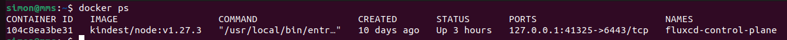

kind is a tool for running local Kubernetes clusters using Docker container “nodes”.
kind was primarily designed for testing Kubernetes itself, but may be used for local development or CI.

## Install kind

In order to run kind docker needs to be installed on your maschine.
Also see my docker tutorial for this purpose: https://simonscholz.github.io/tutorials/docker

On Ubuntu the installation of kind is as easy as:

```bash
[ $(uname -m) = x86_64 ] && curl -Lo ./kind https://kind.sigs.k8s.io/dl/v0.20.0/kind-linux-amd64

chmod +x ./kind

sudo mv ./kind /usr/local/bin/kind
```

## Install kubectl (optional)

```bash
curl -LO "https://dl.k8s.io/release/$(curl -L -s https://dl.k8s.io/release/stable.txt)/bin/linux/amd64/kubectl"

sudo install -o root -g root -m 0755 kubectl /usr/local/bin/kubectl

kubectl version
```

Also see https://kubernetes.io/docs/tasks/tools/install-kubectl-linux/

## Creating a local kind cluster

```bash
# Default cluster context name is `kind`.
kind create cluster
```

Using the `--name` param you can create a cluster with a dedicated name:

```bash
kind create cluster --name your-cluster-name
```

In order to see the created clusters you can run `kind get clusters`.

Since kind uses docker or podman under the hood, running `docker ps` should result into something similar to this:



## Deleting a local kind cluster

```bash
kind delete cluster
```

Using the `--name` param you can delete a cluster with a dedicated name:

```bash
kind delete cluster --name your-cluster-name
```

Run `kind get clusters` to see whether the cluster has been deleted properly.

## Deploy an image to the kind registry

Kind ships with its own container image registry so that you can directly push your container images locally to the kind registry.
This makes it easy for you to deploy your custom local images to your kind cluster.

So building your local docker image and then populating it for your local kind cluster would look like this:

```bash
# Building the docker image (-t is used to tag the image)
docker build -t my-awesome-app:1.0.0 .

# Load the docker image into your kind cluster
kind load docker-image my-awesome-app:1.0.0 --name your-cluster-name

# List the loaded image
docker exec -it your-cluster-name-control-plane crictl images
```

Running `kubectl get nodes` will show you the name of the node, which is `your-cluster-name-control-plane` in the example above.
If you haven't specified a cluster name this defaults to `kind-control-plane`.

## Sources

- https://kind.sigs.k8s.io/docs/user/quick-start/
- https://kubernetes.io/docs/tasks/tools/
- https://docs.docker.com/engine/reference/commandline/build/
