It is really helpful to automatically send messages to your messenger.
In terms of Microsoft Teams workflows can be created, which react upon a webhook.
This is the newer approach of sending messages compared to the [deprecated Microsoft 365 connectors](https://learn.microsoft.com/en-us/microsoftteams/platform/webhooks-and-connectors/how-to/connectors-using?tabs=cURL%2Ctext1#message-card-reference).
Since the [workflows](https://learn.microsoft.com/en-us/microsoftteams/platform/webhooks-and-connectors/how-to/connectors-using?tabs=cURL%2Ctext1#message-card-reference) for sending messages via webhook do not work out of the box right now, due to [this issue](https://techcommunity.microsoft.com/t5/teams-developer/error-while-running-teams-workflow-for-sending-message-to-a/m-p/4232037/highlight/true#M10695), I thought I write a tutorial on how to resolve this and about creative nice AdaptiveCards.

## Creating a Workflow

First choose a channel you´d want to create a workflow for:

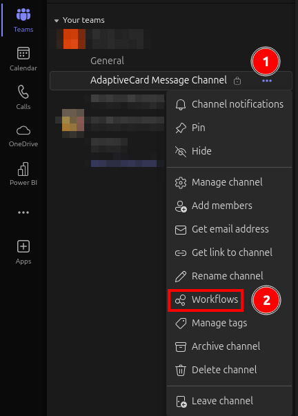

In the workflow creation dialog `Post to a channel when a webhook request is received` can be clicked.

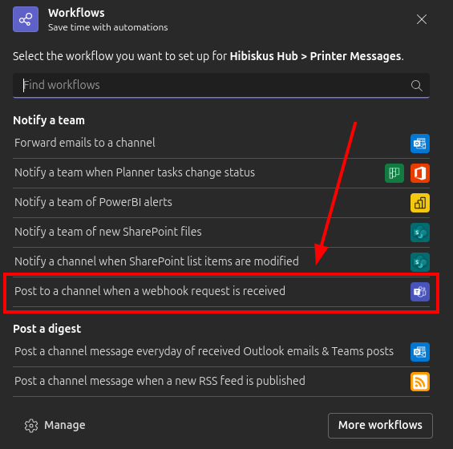

Then a name can be specified for the workflow:

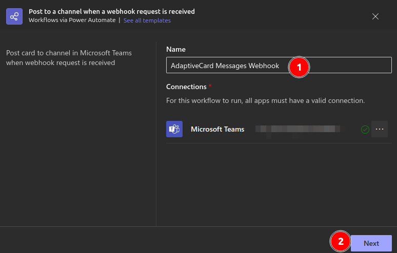

After hitting next the Microsoft Teams Team and Channel can be chosen, but usally is already preselected, since the context menu of the channel has been used to create the workflow.

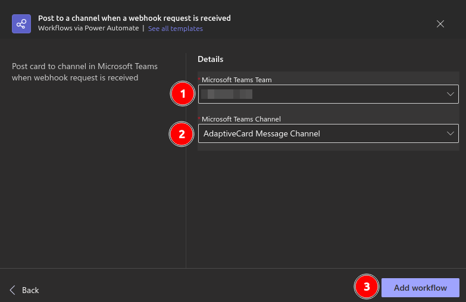

Then the workflow will be created and the workflow´s webhook url can be copied:

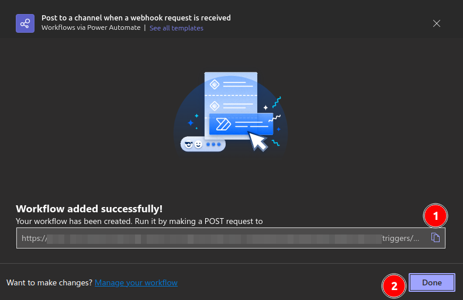

## Creating an AdaptiveCard

In general you can also just send plain text to a channel, but an AdaptiveCard gives you way more opportunities, e.g., title, sections and even action buttons.

By default the workflow also expects an AdaptiveCard as payload.

But it is really convenient that Microsoft came up with a designer for AdaptiveCards: https://adaptivecards.io/designer/

With this designer you can customize AdaptiveCards according to your needs.

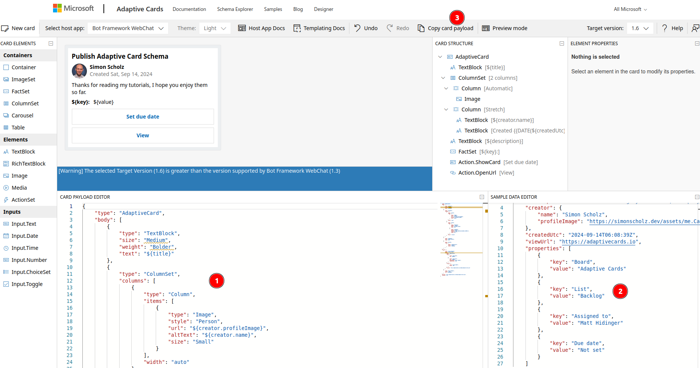

1. Here you can adjust how the card looks like
2. Here you can specify variables for the contents
3. Finally you´d want to copy the card´s payload

Note that you should turn the designer into `Preview Mode` to have the data being applied, when coping the card payload.

## Using the webhook to send a message

The copied webhook url from the former steps can now be hit by a POST reuqest with the copied payload of the `AdaptiveCard`.

I usually use Postman for this:

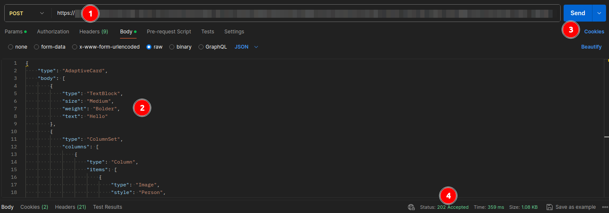

1. Paste the webhook url
2. Paste the AdaptiveCard payload
3. Hit the `Send` button
4. Getting a `202 Accepted` response

Alternatively curl can be used:

```bash
curl --location '{your-webhook-url}' \
--header 'Content-Type: application/json' \
--header 'Cookie: {your-optional-cookie}' \
--data '{
    "type": "AdaptiveCard",
    "body": [
        {
            "type": "TextBlock",
            "size": "Medium",
            "weight": "Bolder",
            "text": "Publish Adaptive Card"
        },
        {
            "type": "ColumnSet",
            "columns": [
                {
                    "type": "Column",
                    "items": [
                        {
                            "type": "Image",
                            "style": "Person",
                            "url": "https://pbs.twimg.com/profile_images/589879071020023809/SUKQxznj_400x400.jpg",
                            "altText": "Simon Scholz",
                            "size": "Small"
                        }
                    ],
                    "width": "auto"
                },
                {
                    "type": "Column",
                    "items": [
                        {
                            "type": "TextBlock",
                            "weight": "Bolder",
                            "text": "Simon Scholz",
                            "wrap": true
                        },
                        {
                            "type": "TextBlock",
                            "spacing": "None",
                            "text": "Created {{DATE(2024-09-14T06:08:39Z,SHORT)}}",
                            "isSubtle": true,
                            "wrap": true
                        }
                    ],
                    "width": "stretch"
                }
            ]
        },
        {
            "type": "TextBlock",
            "text": "Thanks for reading my tutorials, I hope you enjoy them so far.",
            "wrap": true
        },
        {
            "type": "FactSet",
            "facts": [
                {
                    "title": "Board:",
                    "value": "Adaptive Cards"
                },
                {
                    "title": "List:",
                    "value": "Backlog"
                },
                {
                    "title": "Assigned to:",
                    "value": "Simon Scholz"
                },
                {
                    "title": "Due date:",
                    "value": "Not set"
                }
            ]
        }
    ],
    "actions": [
        {
            "type": "Action.ShowCard",
            "title": "Set due date",
            "card": {
                "type": "AdaptiveCard",
                "body": [
                    {
                        "type": "Input.Date",
                        "id": "dueDate"
                    },
                    {
                        "type": "Input.Text",
                        "id": "comment",
                        "placeholder": "Add a comment",
                        "isMultiline": true
                    }
                ],
                "actions": [
                    {
                        "type": "Action.Submit",
                        "title": "OK"
                    }
                ],
                "$schema": "http://adaptivecards.io/schemas/adaptive-card.json"
            }
        },
        {
            "type": "Action.OpenUrl",
            "title": "View",
            "url": "https://adaptivecards.io"
        }
    ],
    "$schema": "http://adaptivecards.io/schemas/adaptive-card.json",
    "version": "1.6"
}'
```

## Check for Failed Workflow runs

As of now the following issues occur when trying to send a message using webhooks: https://techcommunity.microsoft.com/t5/teams-developer/error-while-running-teams-workflow-for-sending-message-to-a/m-p/4232037/highlight/true#M10695

This causes the workflow to fail even though the webhook call returns a 202 accepted, which actually just means that the request is received and will be processed further.

When you´d click on the workflow you can also see a 28-day run history of your workflow:

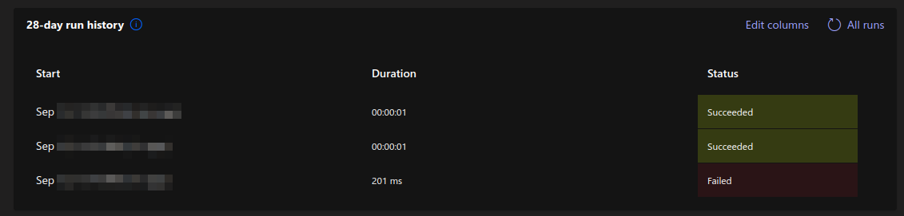

### Resolving failures

In order to resolve the issues mentioned [here](https://techcommunity.microsoft.com/t5/teams-developer/error-while-running-teams-workflow-for-sending-message-to-a/m-p/4232037/highlight/true#M10695), the workflow itself needs to be modified like this:

First you´d want to remove the `Send each adaptive card` step from the workflow.

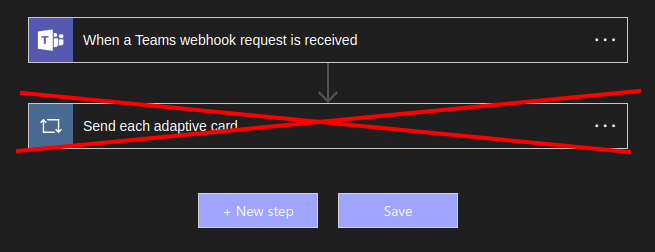

Then hit the `+ New step` button and choose the `Built-in` tab and the `Data-Operation`.

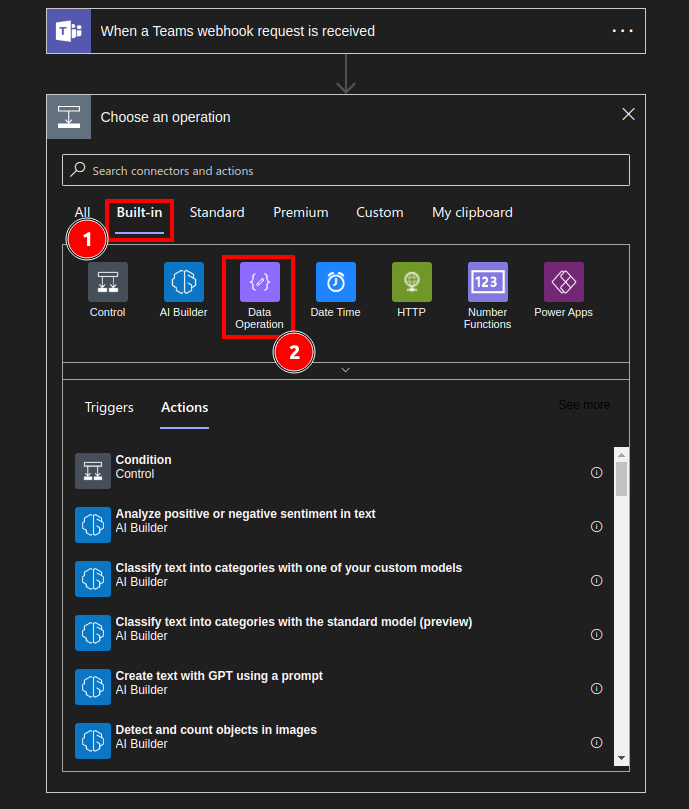

As `Data Operation` the `Compose` action needs to be chosen:

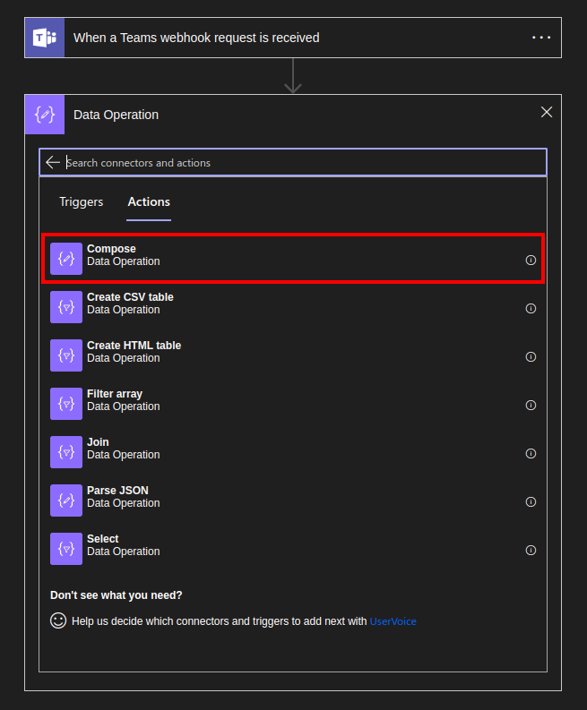

And the required `inputs` will be `Body`:

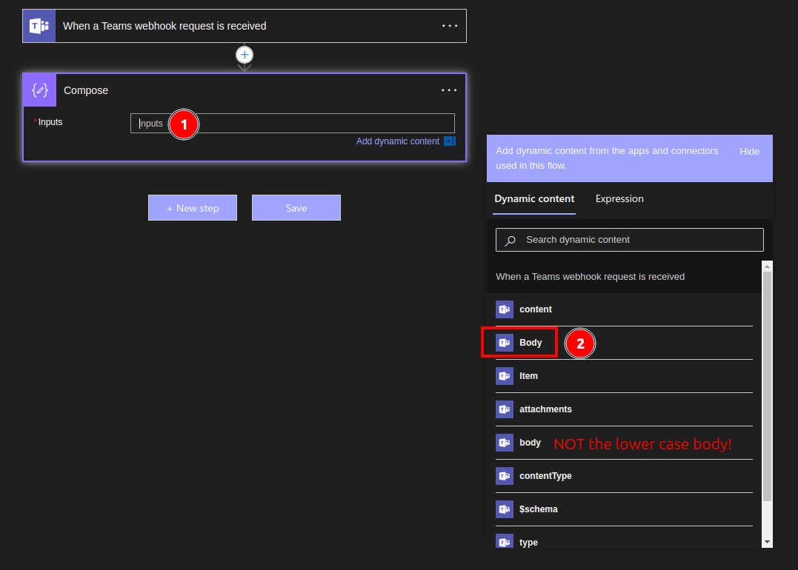

Then again hit the `+ New step` button and choose the `Standard` tab and choose `Microsoft Teams`.

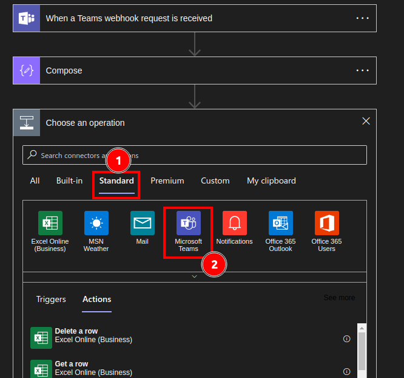

Once `Mircosoft Teams` is chosen you have several options, but I´d recomend `Post card in a chat or channel`

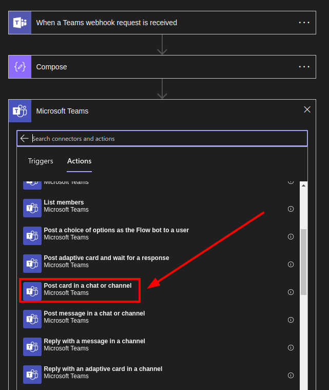

Now some properties have to be set for this action:

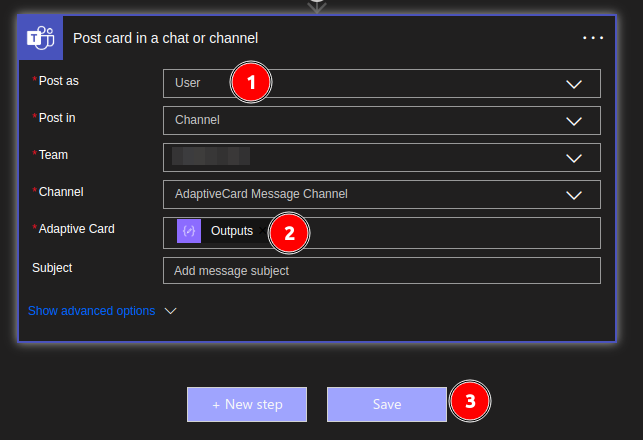

1. You can either choose user or flow bot, but be aware that user is needed for private chats, since the flow bot won´t have access to it.
2. The `Adaptive Card` must be the `Outputs` of the former `Compose` step
3. Finally hit save

Once this has been configured an adaptive card can be properly send to the respective channel using Postman or Curl as depicted in a former section.

## Resulting Message

Sending the message via Webhook should then look similar to this:

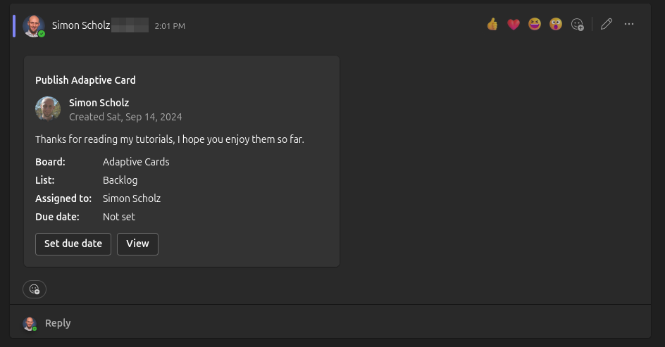

But feel free to utilize the [designer](https://adaptivecards.io/designer/) to craft your own.

## Sources

- https://adaptivecards.io/designer/
- https://techcommunity.microsoft.com/t5/teams-developer/error-while-running-teams-workflow-for-sending-message-to-a/m-p/4232037/highlight/true#M10695