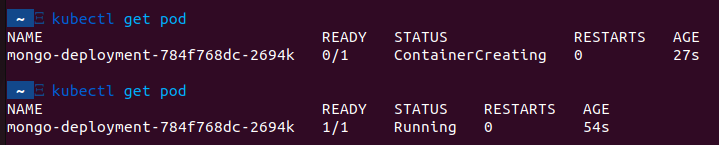

Minikube runs a Kubernetes (k8s) environment on your local machine.
I used to provide a `docker-compose.yaml` file for setting up my local dev environment, but I kind of like the approach to have a "real" k8s cluster in place to run the dependencies of my application on my local machine. So let's do so...

# Install Minikube

On Ubuntu the installation is as easy as:

```bash
curl -LO https://storage.googleapis.com/minikube/releases/latest/minikube_latest_amd64.deb
sudo dpkg -i minikube_latest_amd64.deb
```

In case you haven't already installed `kubectl` on your machine, it'll be present after installing `minikube`.

For detailed information please look here: https://minikube.sigs.k8s.io/docs/start/

# Resetting everything when you got stuck

In case you messed up your minikube cluster you can simply delete everything and start from scratch by running:

```bash
minikube delete --all
```

# Creating a MongoDB deployment

A MongoDB deployment can be created by running `kubectl create deployment mongo-deployment --image=mongo`.

Once this is done running `kubectl get pod` will result into something similar to this:



The `kubectl create deployment` command has a lot of options and what we've run above will simply create a configuration file for a mongo deployment with default values.

You can view and edit this deployment file using:

```bash
kubectl edit deployment {your-desired-deployment-name}

# e.g.

kubectl edit deployment mongo-deployment
```

Instead of passing all kinds of options to the `kubectl create` command, you can also create those kubernetes configuration files and apply them using `kubectl apply -f {file-name}`

# Getting insights into the running pods

There are several ways to get insights about a pod.

## See the logs of a pod

You can monitor the logs of the running pod by running:

```bash
kubectl logs {your-desired-pods-name}

# e.g.

kubectl logs mongo-deployment-784f768dc-2694k
```

## Describe the pod

Besides looking at the logs of a pod you can also see how the pod is currently setup within our cluster:

```bash
kubectl describe pod {your-desired-pods-name}

# e.g.

kubectl describe pod mongo-deployment-784f768dc-2694k
```

Running `kubectl describe pod` will resulting into something similar like this:

```yaml
Name:             mongo-deployment-784f768dc-2694k
Namespace:        default
Priority:         0
Service Account:  default
Node:             minikube/192.168.49.2
Start Time:       Thu, 27 Oct 2022 21:30:19 +0200
Labels:           app=mongo-deployment
                  pod-template-hash=784f768dc
Annotations:      <none>
Status:           Running
IP:               172.17.0.3
IPs:
  IP:           172.17.0.3
Controlled By:  ReplicaSet/mongo-deployment-784f768dc
Containers:
  mongo:
    Container ID:   docker://0a245e7f0661f2bc5acccb2a83912e8bebe019895de9a828efaf7e89a2767f5a
    Image:          mongo
    Image ID:       docker-pullable://mongo@sha256:3b9bfc35335710340afe1e98c870491b2a969fd93b62505b4617eab73d97cec6
    Port:           <none>
    Host Port:      <none>
    State:          Running
      Started:      Thu, 27 Oct 2022 21:31:11 +0200
    Ready:          True
    Restart Count:  0
    Environment:    <none>
    Mounts:
      /var/run/secrets/kubernetes.io/serviceaccount from kube-api-access-gb9zk (ro)
Conditions:
  Type              Status
  Initialized       True 
  Ready             True 
  ContainersReady   True 
  PodScheduled      True 
Volumes:
  kube-api-access-gb9zk:
    Type:                    Projected (a volume that contains injected data from multiple sources)
    TokenExpirationSeconds:  3607
    ConfigMapName:           kube-root-ca.crt
    ConfigMapOptional:       <nil>
    DownwardAPI:             true
QoS Class:                   BestEffort
Node-Selectors:              <none>
Tolerations:                 node.kubernetes.io/not-ready:NoExecute op=Exists for 300s
                             node.kubernetes.io/unreachable:NoExecute op=Exists for 300s
Events:
  Type    Reason     Age    From               Message
  ----    ------     ----   ----               -------
  Normal  Scheduled  7m19s  default-scheduler  Successfully assigned default/mongo-deployment-784f768dc-2694k to minikube
  Normal  Pulling    7m19s  kubelet            Pulling image "mongo"
  Normal  Pulled     6m28s  kubelet            Successfully pulled image "mongo" in 51.042556324s
  Normal  Created    6m27s  kubelet            Created container mongo
  Normal  Started    6m27s  kubelet            Started container mongo
```

## Access the pod

To run commands using bash directly on a certain pod you can run:

```bash
kubectl exec -it {your-desired-pods-name} -- bin/bash

# e.g.

kubectl exec -it mongo-deployment-784f768dc-2694k -- bin/bash
```

`-it` stands for interactive terminal.
