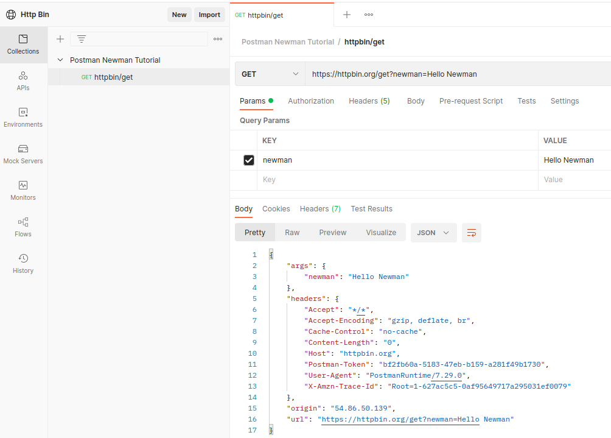
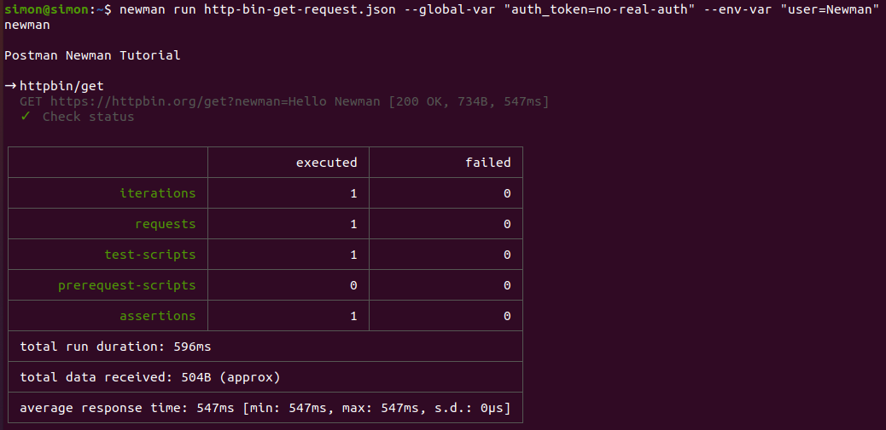
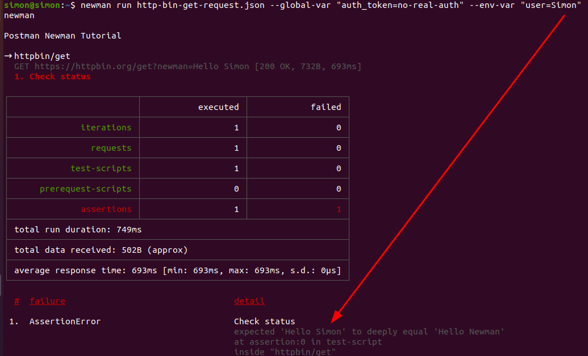
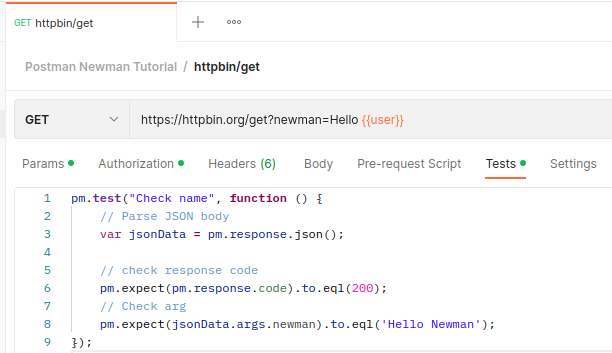
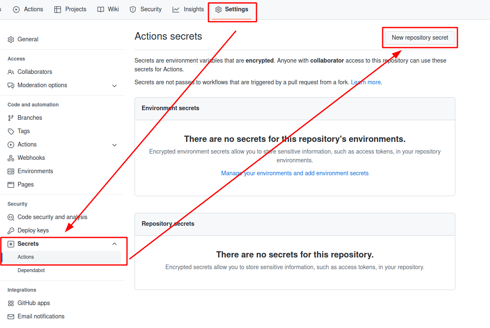
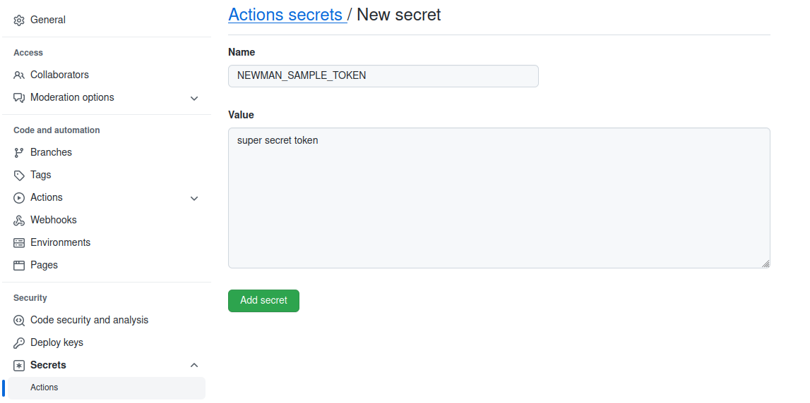
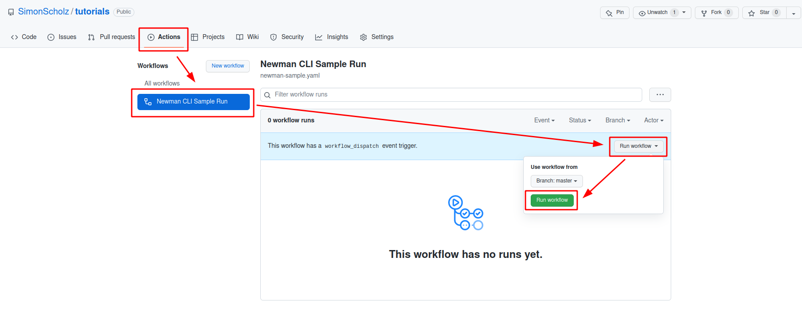
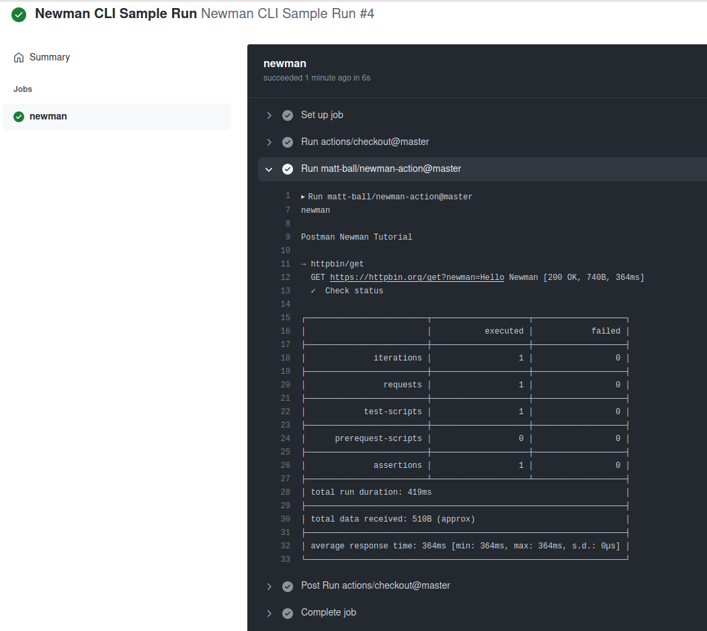
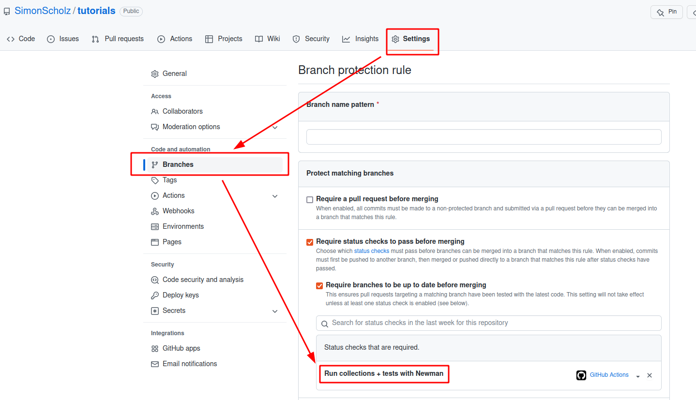

Postman (https://www.postman.com/) is a great tool with a user interface for testing your REST apis.
For further information about Postman in general and its usage also see https://simonscholz.github.io/tutorials/postman

In this tutorial we want to concentrate on automating the calls towards your REST api by running your Postman collections automatically with the newman CLI and GitHub actions.

Smoke testing your APIs by using this setup in an automated fashion helps to spot issue early, that's why I tend to run such smoke tests in a scheduled interval, but also as part of my build/release pipelines.

Since many companies usually share the Postman collections for their APIs in a git repository it is not much effort to utilize this for smoke tests.
And a nice side effect is that the shared Postman collections are more likely to be kept up to date, since the action will fail in case the API is updated in a non downward compatible way.

## Setup

### Installing Postman

Go to https://www.postman.com/downloads/ and download the latest version of Postman and then install it on your machine.

NOTE: You may also want to use the online version of Postman, which can be used directly in your browser.

### Installing Newman CLI (optional)

```bash
npm install -g newman
```

Also see https://learning.postman.com/docs/running-collections/using-newman-cli/newman-options/ for all newman options.

### Create a new GitHub repository

To run GitHub actions you need a GitHub account and a GitHub repository.
You may either create a new one or use an already existing one.

## Creating a postman collection

To make it easy we'll utilize https://httpbin.org/ to create a simple get request within postman.



The following json can be imported into your Postman instance or workspace:

```json
{
  "info": {
    "_postman_id": "85a61698-50ea-42ac-822d-93cf95046eef",
    "name": "Postman Newman Tutorial",
    "schema": "https://schema.getpostman.com/json/collection/v2.1.0/collection.json",
    "_exporter_id": "11499128"
  },
  "item": [
    {
      "name": "httpbin/get",
      "event": [
        {
          "listen": "test",
          "script": {
            "exec": [
              "pm.test(\"Check name\", function () {",
              "    // Parse JSON body",
              "    var jsonData = pm.response.json();",
              "",
              "    // check response code",
              "    pm.expect(pm.response.code).to.eql(200);",
              "    // Check arg",
              "    pm.expect(jsonData.args.newman).to.eql('Hello Newman');",
              "});",
              ""
            ],
            "type": "text/javascript"
          }
        }
      ],
      "request": {
        "auth": {
          "type": "bearer",
          "bearer": [
            {
              "key": "token",
              "value": "{{auth_token}}",
              "type": "string"
            }
          ]
        },
        "method": "GET",
        "header": [],
        "url": {
          "raw": "https://httpbin.org/get?newman=Hello {{user}}",
          "protocol": "https",
          "host": ["httpbin", "org"],
          "path": ["get"],
          "query": [
            {
              "key": "newman",
              "value": "Hello {{user}}"
            }
          ]
        }
      },
      "response": []
    }
  ],
  "event": [
    {
      "listen": "prerequest",
      "script": {
        "type": "text/javascript",
        "exec": [""]
      }
    },
    {
      "listen": "test",
      "script": {
        "type": "text/javascript",
        "exec": [""]
      }
    }
  ],
  "variable": [
    {
      "key": "user",
      "value": "Newman",
      "type": "string"
    }
  ]
}
```

The sample get request can also be found here: https://www.postman.com/simonscholz/workspace/http-bin/overview

## Running the collection with Newman CLI

When you store the json from the former section to a file, e.g., `http-bin-get-request.json`, you can also run this collection using newman.

```bash
newman run http-bin-get-request.json --global-var "auth_token=no-real-auth" --env-var "user=Newman"
```

With `--global-var` global variables can be specified and `--env-var` will introduce new environment variables.

All Newman command line options can be found here: https://github.com/postmanlabs/newman#command-line-options



Also note that there also is a test in the Postman collection. In case a different user name than "Newman" is chosen it will fail.

```bash
newman run http-bin-get-request.json --global-var "auth_token=no-real-auth" --env-var "user=Simon"
```



The reason for this is that the Test checks the json response:



Of course this check is only done for demonstration purposes. You should **not** check potentially changing data in your smoke tests.
Sometimes it is even enough to simply check for the 2xx response code for smoke testing purposes.

## Running the Newman CLI as GitHub action

There is already a "Newman Action" in place on the marketplace: https://github.com/marketplace/actions/newman-action

To create a GitHub action it needs to be configured with a yaml file, which is usually located in a `.github/workflows/` folder within your git repository.

```yaml
---
name: Newman CLI Sample Run
on:
  workflow_dispatch:

jobs:
  newman:
    name: Run collections + tests with Newman
    runs-on: ubuntu-latest
    steps:
      - uses: actions/checkout@master
      - uses: matt-ball/newman-action@master
        with:
          collection: postman/http-bin-get-request.json
          envVar: '[{ "key": "user", "value": "Newman" }]'
          globalVar: '[{ "key": "auth_token", "value": "${{ secrets.NEWMAN_SAMPLE_TOKEN }}"}]'
```

To provide the secret for the `auth_token` you can go to the "Settings" of your repository and add it in the secrets section:



Remember to use the proper secret name `NEWMAN_SAMPLE_TOKEN` from the yaml above.



Once the yaml has been added to the respective git repository the action can be found and run in the "Actions" tab:



Once you've run the GitHub action it should look similar to this:



NOTE: In case the test of the Postman collection fails also the whole GitHub action run will fail.

## Obtaining an access token from an OAuth server and pass it to the newman run

Let's take the example from before,
but now obtain the `auth_token` from an OAuth server using [curl](https://curl.se/) and [jq](https://github.com/stedolan/jq).

```yaml
---
name: Newman CLI Sample Run
on:
  workflow_dispatch:

jobs:
  newman:
    name: Run collections + tests with Newman
    runs-on: ubuntu-latest
    steps:
      - uses: actions/checkout@master

	  - name: Fetch access_token
	  	id: fetch_access_token
        run: |
          curl 'http://your.keycloak.server/auth/realms/YOUR_REALM_NAME/protocol/openid-connect/token' \
          -d 'client_id=${{ secrets.CLIENT_ID }}' -d 'grant_type=client_credentials' \
		      -d 'username=${{ secrets.USER_NAME }}' -d 'password=${{ secrets.PASSWORD }}' \
          --header 'Cache-Control: no-cache' | echo "access_token=$(jq -r '.access_token')" >> $GITHUB_OUTPUT

      - uses: matt-ball/newman-action@master
        with:
          collection: postman/http-bin-get-request.json
          envVar: '[{ "key": "user", "value": "Newman" }]'
          globalVar: '[{ "key": "auth_token", "value": "${{ steps.fetch_access_token.outputs.access_token }}"}]'
```

- The `Fetch access_token` step runs a [curl](https://curl.se/) command towards a Keycloak server and pipes the response to [jq](https://github.com/stedolan/jq)
- [jq](https://github.com/stedolan/jq) will then obtain the `access_token` from the piped curl response and [sets it as output](https://docs.github.com/en/actions/using-workflows/workflow-commands-for-github-actions#setting-an-output-parameter).
- This `access_token` can then finally be obtained by using `${{ steps.parse_auth_response.outputs.access_token }}`

## Add successful newman run as requirement before merging PRs

In your GitHub action CI/CD pipeline you can also add the new man job in order to check if your application is up and running.
This of course only works, if all PRs are also deployed to a test environment.



GitHub jobs are usually run in parallel, so in case the CI/CD pipeline is not done yet it does not make sense to already fire the requests towards the API.
To overcome this you can use the `delayRequest` property.

## Using Newman in CI/CD pipeline to test your API

An example of a complete CI/CD pipeline could look like this:

```yaml
---
name: CI/CD Pipeline
on:
  workflow_dispatch:
  push:
    branches:
      - main
      - master

jobs:
 buildArtifacts:
    name: 🛠️ application 📦️
    runs-on: ubuntu-latest

    steps:
      - name: Checkout
        uses: actions/checkout@v2

      - name: Set up JDK
        uses: actions/setup-java@v2
        with:
          java-version: '17'
          distribution: 'temurin'

      - name: Setup Gradle
        uses: gradle/gradle-build-action@v2

      - name: Build and run tests and package application
        run: ./gradlew buildAndDeployApplication
  newman:
    name: Run collections + tests with Newman
    runs-on: ubuntu-latest
    steps:
      - uses: actions/checkout@master
      - uses: matt-ball/newman-action@master
        with:
          collection: postman/sophisticated-postman-collection-with-plenty-of-tests.json
          envVar: '[{ "key": "user", "value": "Newman" }]'
          globalVar: '[{ "key": "auth_token", "value": "${{ secrets.NEWMAN_SAMPLE_TOKEN }}"}]'
          delayRequest: 300000 # 5 minutes - assuming that the application is up and running after 5 minutes
```

This is just a small example how it could look like, assuming that the deployment of the application also takes place within the Gradle build. Of course the postman collection should be way bigger then and consist of way more tests.
Also the `delayRequest` property needs to be adjusted depending on how long it takes to have the application up an running.

## Run the request on a regular basis for smoke testing

```yaml
---
name: CI/CD Pipeline
on:
  workflow_dispatch:
  push:
    branches:
      - main
      - master
  schedule:
    - cron: "0 */2 * * *" # run the action every 2 hours
```

Besides running the action manually (workflow_dispatch) and on push to certain branches, a GitHub action also provides the capability to `schedule` the action run.

## Sources

- https://github.com/postmanlabs/newman
- https://github.com/marketplace/actions/newman-action
- https://www.postman.com/
- https://postman-quick-reference-guide.readthedocs.io/en/latest/
- https://httpbin.org/
- https://docs.github.com/en/actions/using-workflows/workflow-commands-for-github-actions
