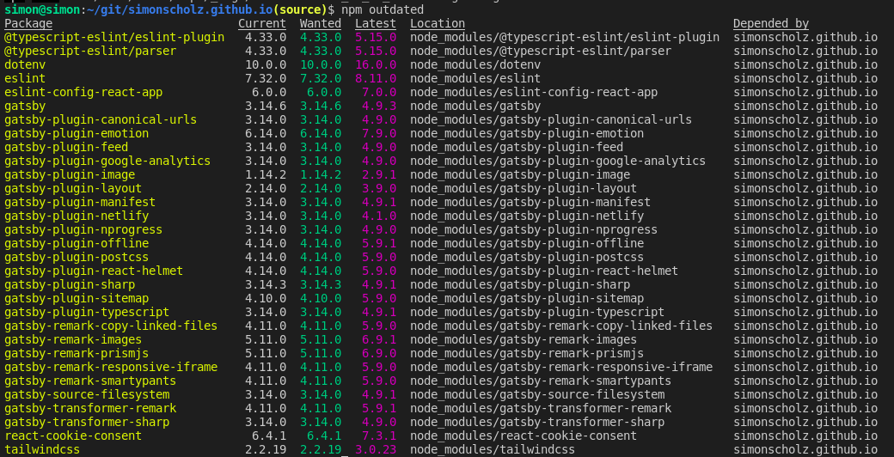

Node and NPM are usually used for project written in JavaScript or TypeScript (which is transpiled to JavaScript).
In the JavaScript universe the updates come quite often and should be applied as soon as possible to avoid security issues and technical dept.

## Install and Update Node + NPM using NVM

nvm is a version manager for node.js, designed to be installed per-user, and invoked per-shell. nvm works on any POSIX-compliant shell (sh, dash, ksh, zsh, bash), in particular on these platforms: unix, macOS, and windows WSL.

The easiest way to install nvw is by using the command line:

```shell
curl -o- https://raw.githubusercontent.com/nvm-sh/nvm/v0.39.1/install.sh | bash
```

More information about NVM can be found here: https://github.com/nvm-sh/nvm#intro

Once NVM is successfully installed the latest version of node and npm can be installed like this:

```shell
nvm install node
```

You can then check if node and npm is installed properly by checking the versions.

```shell
node --version

npm --version
```

For the usage of nvm within the Fishshell also see this: https://simonscholz.github.io/tutorials/fishshell#the-nvm-plugin

## Updating project dependencies

Before updating the dependencies you can check for outdated dependencies by using

```shell
npm outdated
```

This will then indicate which packages should be updated.



This screenshot shows that the current and wanted versions are currently the same.
But only because I ran a `npm update` in advance.

Running `npm update` will update the versions to the ones mentioned in the _Wanted_ column.

## npm update vs npm install

The command `npm install` will download all dependencies of the project to a _node_modules_ folder and will create a _package-lock.json_ file.

Once this is done the exact version numbers are "locked" by the _package-lock.json_ file.
Subsequent `npm install` calls won't do anything unless the _node_modules_ folder and _package-lock.json_ file is deleted.
Or an `npm update` has been triggered, which updates the dependencies and the _package-lock.json_ file.

## Semantic versioning and ^ or ~

Semantic versioning is using 3 version numbers separated by a dot.

Major.Minor.Patch, e.g., 1.2.3

- Patch - Only consists of internal changes, e.g., bug fixes
- Minor - Introduces new apis/features/improvements, which can be used by clients of the dependency
- Major - Introduces breaking changes - therefore not downward compatible in most cases

Also see https://semver.org/ for more details on semantic versioning.

In order to avoid breaking the project it is usually more safe to stick to the same major version, but update minor and patch versions of the dependencies.
The dependencies inside the _package.json_ file often start with a ^ or ~.

- ^ : minor and patch version are allowed to be updated by `npm update`
- ~ : only patch version is allowed to be updated by `npm update`

## Update all dependencies to their latest version

This includes updating to a new major version, e.g., 1.2.3 to 2.3.4.

In order to archive this the `npm-check-updates` package has to be installed globally.

```shell
npm install -g npm-check-updates
```

Then you can run the `npm-check-updates` tool to update your package.json file's latest versions including major version updates.

```shell
ncu -u
```

Once the _package.json_ file is updated you can run `npm update` or `npm install` according to your needs.

| CAUTION: Updating all dependencies to the latest version will most likely break your project. Major version updates usually introduce breaking changes, which need to be adapted manually. Often bigger frameworks offer detailed migration guides for major version updates. |
| ----------------------------------------------------------------------------------------------------------------------------------------------------------------------------------------------------------------------------------------------------------------------------- |

## Automate dependency updates using dependabot

In case the project is located on GitHub a tool called dependabot can be used to watch the dependencies and
automatically create pull requests, which update the dependencies.

This can be archived by adding a _dependabot.yml_ file to a _.github_ folder in the root directory.

The contents can look like this:

```yaml
# To get started with Dependabot version updates, you'll need to specify which
# package ecosystems to update and where the package manifests are located.
# Please see the documentation for all configuration options:
# https://help.github.com/github/administering-a-repository/configuration-options-for-dependency-updates
version: 2
updates:
  - package-ecosystem: "npm" # See documentation for possible values
    directory: "/" # Location of package manifests
    schedule:
      interval: "weekly"
```

This can also be adjusted according to your needs, e.g., whether it should include major version updates or not for dependency update pull requests.

## Sources

- https://github.com/nvm-sh/nvm#intro
- https://nodejs.dev/learn/update-all-the-nodejs-dependencies-to-their-latest-version
- https://semver.org/
- https://help.github.com/github/administering-a-repository/configuration-options-for-dependency-updates
