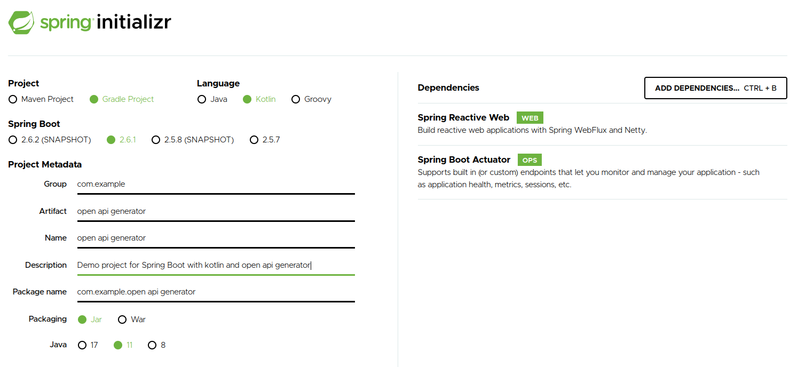
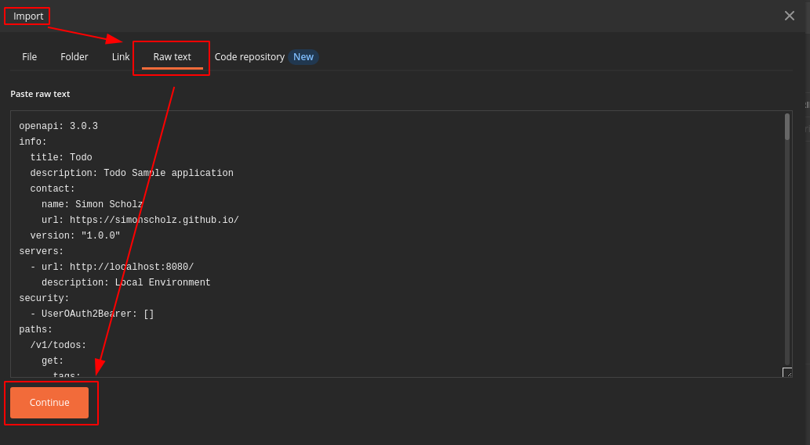
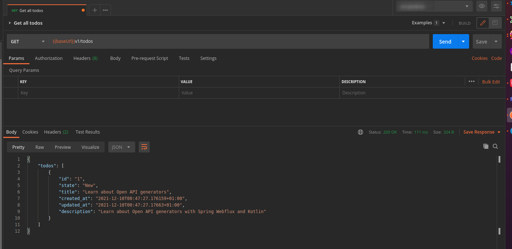

## OpenApi with Gradle for Spring Webflux applications using Kotlin

This tutorial will explain how to generate code based on an Open API specification (https://www.openapis.org/) for a Spring Webflux application, which is using the Kotlin language with reactive coroutine support.

This sample project will be using the [Gradle Open API generator plugin](https://plugins.gradle.org/plugin/org.openapi.generator), but there is also an [Apache Maven Open API generator plugin](https://github.com/OpenAPITools/openapi-generator/blob/master/modules/openapi-generator-maven-plugin/README.md) available in case you prefer Maven over Gradle.

The Open API generator supports a huge amount of languages and generator types.
So the Gradle build script can also be used to generate DTOs and APIs for other languages or frameworks.

Also see https://openapi-generator.tech/

### Create OpenAPI specification

```yaml
openapi: 3.0.3
info:
  title: Todo
  description: Todo Sample application
  contact:
    name: Simon Scholz
    url: https://simonscholz.dev/
  version: "1.0.0"
servers:
  - url: http://localhost:8080/
    description: Local Environment
security:
  - UserOAuth2Bearer: []
paths:
  /v1/todos:
    get:
      tags:
        - Todo
      summary: Get all todos
      description: |
        Get all todos of a logged in user
      externalDocs:
        url: "https://simonscholz.dev/"
      operationId: getAllTodos
      parameters:
        - $ref: "#/components/parameters/header.Locale"
      responses:
        200:
          description: Todos as list
          content:
            application/json:
              schema:
                $ref: "#/components/schemas/TodoResponse"
    post:
      tags:
        - Todo
      summary: Create a new todo
      operationId: createTodo
      parameters:
        - $ref: "#/components/parameters/header.Locale"
      requestBody:
        content:
          application/json:
            schema:
              $ref: "#/components/schemas/TodoRequest"
      responses:
        201:
          description: The created Todo
          content:
            application/json:
              schema:
                $ref: "#/components/schemas/Todo"
components:
  schemas:
    Todo:
      type: object
      required:
        - id
        - state
        - title
        - created_at
        - updated_at
      properties:
        id:
          type: string
          description: Id of the Todo.
          format: UUID
        state:
          type: string
          x-extensible-enum:
            - NEW
            - IN_PROGRESS
            - COMPLETED
            - CANCELED
        title:
          type: string
          description: Title of the Todo.
        description:
          type: string
          description: Description of the Todo.
        created_at:
          type: string
          description: Time of the creation of a Todo.
          format: date-time
        updated_at:
          type: string
          description: The last update date for the Todo.
          format: date-time
    TodoResponse:
      required:
        - todos
      type: object
      properties:
        todos:
          type: array
          items:
            $ref: "#/components/schemas/Todo"
      description: Contains the Todos as a list
    TodoRequest:
      required:
        - state
        - title
      type: object
      properties:
        state:
          type: string
          x-extensible-enum:
            - NEW
            - IN_PROGRESS
            - COMPLETED
            - CANCELED
        title:
          type: string
          description: Title of the Todo.
        description:
          type: string
          description: Description of the Todo.
      description: Create a new todo

  parameters:
    header.Locale:
      name: locale
      in: header
      description: The language used by the client.
      required: true
      schema:
        type: string
        x-extensible-enum:
          - de_DE
          - en_EN

  securitySchemes:
    UserOAuth2Bearer:
      type: apiKey
      description: The token of the user passed as Bearer header
      name: Authorization
      in: header
```

This Open API specification can be pasted into https://editor.swagger.io/, which will render a nice html representation of the specification.
This is then also way easier to read than the plain yaml file.

### Generate Spring Project

Now go to https://start.spring.io/ and generate a simple project using the following dependencies:

- Spring Reactive Web
- Spring Actuator



### Add the todo api specification to the project

Create a `todo-api-v1.yaml` file inside the project in an `/api/server/` folder within the project.

### Adjust Gradle build file for API generation

The `build.gradle.kts` file within the generated project needs to be adjusted to the following:

```kotlin
import org.jetbrains.kotlin.gradle.tasks.KotlinCompile
import org.openapitools.generator.gradle.plugin.tasks.GenerateTask

plugins {
	id("org.springframework.boot") version "2.6.1"
	id("io.spring.dependency-management") version "1.0.11.RELEASE"
	kotlin("jvm") version "1.6.0"
	kotlin("plugin.spring") version "1.6.0"

	id("org.openapi.generator") version "5.3.0"
}

group = "com.example"
version = "0.0.1-SNAPSHOT"
java.sourceCompatibility = JavaVersion.VERSION_11

repositories {
	mavenCentral()
}

dependencies {
	implementation("org.springframework.boot:spring-boot-starter-actuator")
	implementation("org.springframework.boot:spring-boot-starter-webflux")
	implementation("com.fasterxml.jackson.module:jackson-module-kotlin")
	implementation("io.projectreactor.kotlin:reactor-kotlin-extensions")
	implementation("org.jetbrains.kotlin:kotlin-reflect")
	implementation("org.jetbrains.kotlin:kotlin-stdlib-jdk8")
	implementation("org.jetbrains.kotlinx:kotlinx-coroutines-reactor")
	testImplementation("org.springframework.boot:spring-boot-starter-test")
	testImplementation("io.projectreactor:reactor-test")
}

tasks.withType<KotlinCompile> {
	kotlinOptions {
		freeCompilerArgs = listOf("-Xjsr305=strict")
		jvmTarget = "11"
	}
}

tasks.withType<Test> {
	useJUnitPlatform()
}

fun generateOpenApiSpec(
	taskName: String,
	spec: String,
	pkg: String,
) = tasks.register<GenerateTask>(taskName) {
	group = "Open API Source Code Generation"
	description = "Generates kotlin classes from an Open API specification"

	verbose.set(false)
	generatorName.set("kotlin-spring")
	inputSpec.set(spec)
	outputDir.set("$buildDir/generated")
	packageName.set(pkg)
	modelPackage.set(pkg)
	modelNameSuffix.set("DTO")
	generateModelTests.set(false)
	generateApiTests.set(false)
	configOptions.set(
		mapOf(
			"serializationLibrary" to "jackson",
			"enumPropertyNaming" to "UPPERCASE",
			"dateLibrary" to "java8",
			"bigDecimalAsString" to "true",
			"hideGenerationTimestamp" to "true",
			"useBeanValidation" to "false",
			"performBeanValidation" to "false",
			"openApiNullable" to "false",
			"reactive" to "true",
			"interfaceOnly" to "true",
		)
	)
}

generateOpenApiSpec(
	taskName = "generateTodoApi",
	spec = "$rootDir/api/server/todo-api-v1.yaml",
	pkg = "io.github.simonscholz.todo.dto.v1",
)

tasks.compileKotlin.configure {
	dependsOn(
		tasks.getByName("generateTodoApi"),
	)
}

sourceSets {
	main {
		java {
			srcDir("$buildDir/generated/src/main/kotlin")
		}
	}
}
```

Things which are added to the original generated Spring project:

1.  `import org.openapitools.generator.gradle.plugin.tasks.GenerateTask`
2.  Usage of the `id("org.openapi.generator") version "5.3.0"` plugin
3.  Creating the function `generateOpenApiSpec`
4.  Calling the `generateOpenApiSpec` function with proper input params
5.  Adding the `generateTodoApi` to the regular build process
6.  Add the generated resources to as sourceSets to make use of the generated classes in the codebase

Additional Settings for the Open API generator config for the "spring-kotlin" generator can be found here: https://openapi-generator.tech/docs/generators/kotlin-spring/

### Make use of the generated classes

Now we want to create a `TodoController`, which implements the generated controller interface:

```kotlin
package com.example.open.api.generator

import io.github.simonscholz.todo.dto.v1.TodoDTO
import io.github.simonscholz.todo.dto.v1.TodoRequestDTO
import io.github.simonscholz.todo.dto.v1.TodoResponseDTO
import io.github.simonscholz.todo.dto.v1.apis.V1Api
import org.springframework.http.ResponseEntity
import org.springframework.web.bind.annotation.RestController
import java.time.OffsetDateTime

@RestController
class TodoController : V1Api {

    override suspend fun createTodo(locale: String, todoRequestDTO: TodoRequestDTO?): ResponseEntity<TodoDTO> {
        // create Todo and save it to database...
        val createdTodo = TodoDTO(
            id = "1",
            state = "New",
            title = "Learn about Open API generators",
            createdAt = OffsetDateTime.now(),
            updatedAt = OffsetDateTime.now(),
            description = "Learn about Open API generators with Spring Webflux and Kotlin",
        )
        return ResponseEntity.ok(createdTodo)
    }

    override suspend fun getAllTodos(locale: String): ResponseEntity<TodoResponseDTO> {
        val createdTodo = TodoDTO(
            id = "1",
            state = "New",
            title = "Learn about Open API generators",
            createdAt = OffsetDateTime.now(),
            updatedAt = OffsetDateTime.now(),
            description = "Learn about Open API generators with Spring Webflux and Kotlin",
        )
        val todoResponseDTO = TodoResponseDTO(listOf(createdTodo))
        return ResponseEntity.ok(todoResponseDTO)
    }
}
```

Now we can start the application and do a request towards the application.

For example by using Postman (https://www.postman.com/product/rest-client/), which is capable of importing the open api specification.



Once the open api spec is imported the requests can be sent:



## Sources

- https://plugins.gradle.org/plugin/org.openapi.generator
- https://swagger.io/specification/#schema
- https://github.com/OpenAPITools/openapi-generator/blob/master/modules/openapi-generator-maven-plugin/README.md
- https://openapi-generator.tech/
- https://openapi-generator.tech/docs/generators/spring
- https://openapi-generator.tech/docs/generators/java
- https://github.com/reactor/BlockHound
