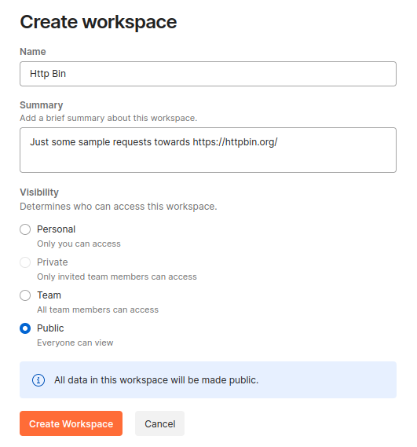
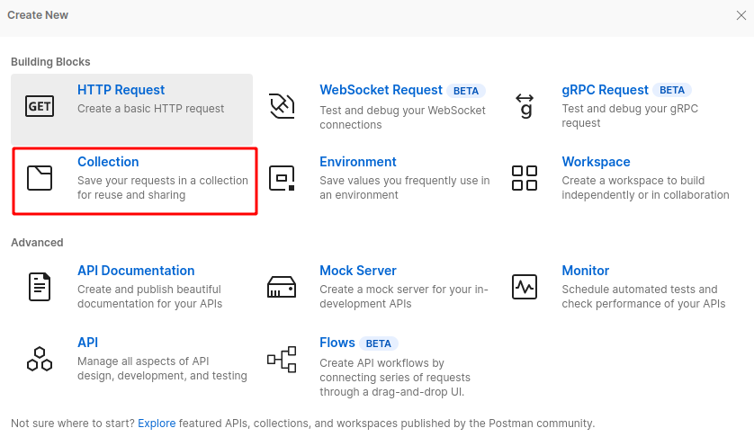
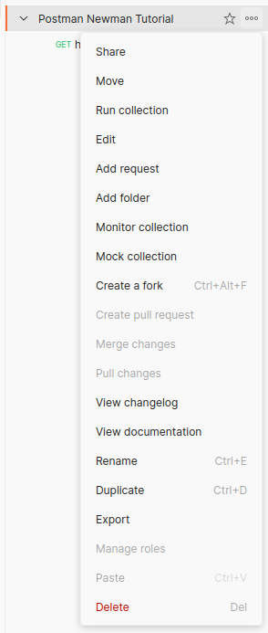

Postman (https://www.postman.com/) is a great tool with a user interface for testing your REST APIs.
It uses so called "Collections", which usually consist of several API requests.
These collections can also be exported and imported and even different formats are supported, e.g., postman json files, but also OpenAPI specifications can be imported.
Since most APIs have generic data, which is usually the same among different requests, e.g., auth tokens, you can specify environment variables, which can be referenced in the requests.

The easiest way to work with postman is by using the browser version -> https://web.postman.co , but you can also download a local client [here](https://www.postman.com/downloads/).
The local client of course is also the only option to test APIs on your local machine, since the browser version does not have access to your localhost.

## Creating a workspace with collections

Creating a workspace can be done here: https://web.postman.co/workspace/create

This workspace can actually be found here: https://www.postman.com/simonscholz/workspace/http-bin and is used in this tutorial: https://simonscholz.dev/tutorials/newman-postman

Once the workspace has been created you can hit the `new` button and create a `collection` to group certain requests and share them easily.

There are quite some operations you can do with a collection.

Many operations are pretty self explanatory, therefore let's focus on the most important ones.

### Add a new request

## Environment variables

## Global variables

## Importing and exporting meta data

## Writing tests

## Dynamically set variables

## Using the newman CLI

Also see my other tutorial about running postman collections automatically with newman CLI and GitHub actions: https://simonscholz.dev/tutorials/newman-postman
This can be useful in particular if you want to run smoke tests on a regular basis.

## Sources

- https://www.postman.com/
- https://postman-quick-reference-guide.readthedocs.io/en/latest/
