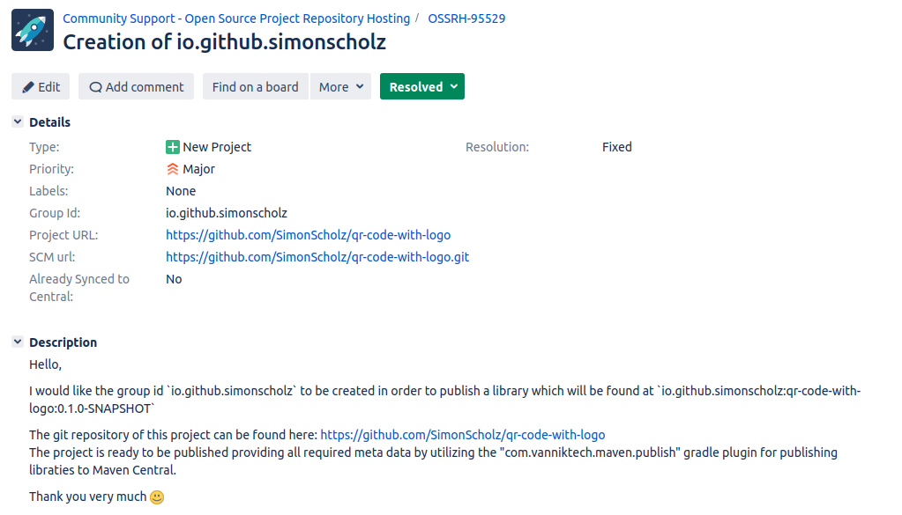
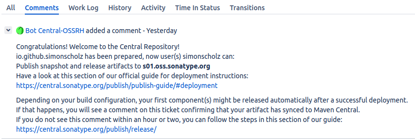
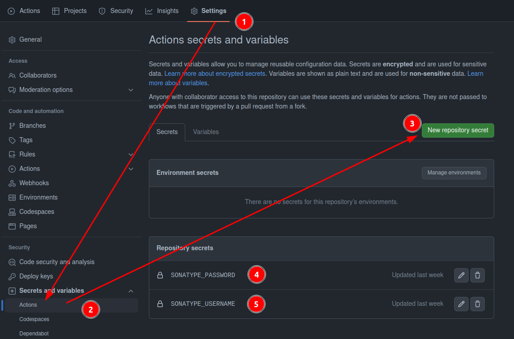
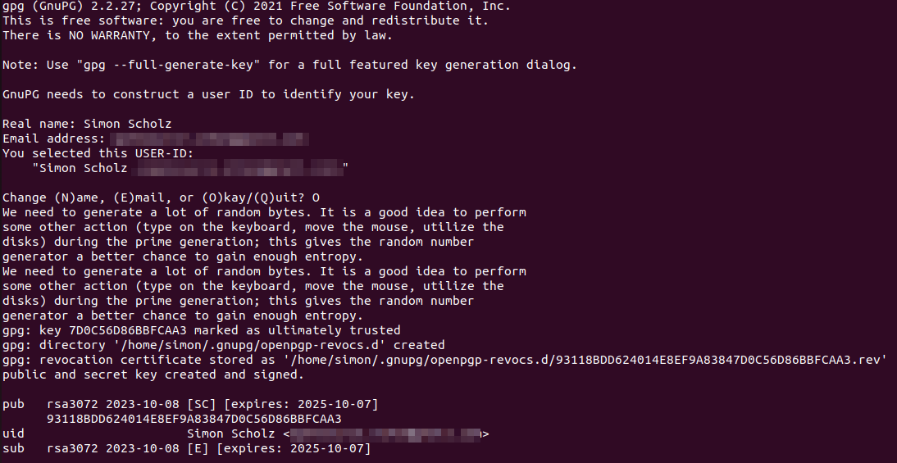
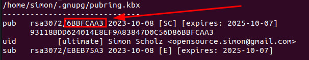
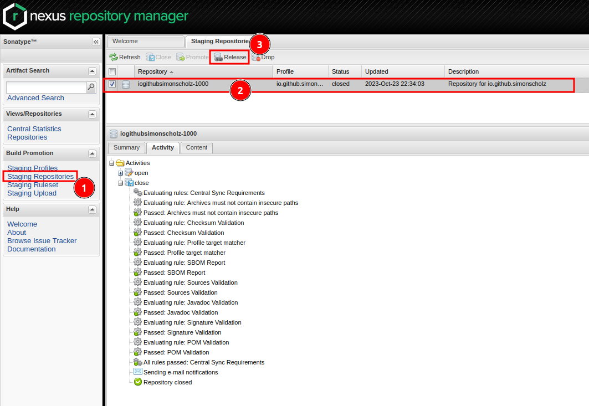

When you want to publish a library to Maven Central you have to follow a few steps. This tutorial will guide you through the process of creating a library using Gradle, register at Maven Central and publish it to Maven Central using GitHub Actions.

## Prerequisites

- Gradle installed on your local machine. You can download it from [here](https://gradle.org/install/) or use [SDKMan](https://simonscholz.dev/tutorials/ubuntu-dev-setup#sdkman) for this.
- A GitHub repository where you'll host your library.
- A Sonatype OSS account (required for publishing to Maven Central).
- A GPG key for signing your artifacts.

## Create a library using Gradle (optional)

If you already have a library you can skip this step.

Create a new Gradle library project using the following command:

```bash
gradle init --type kotlin-library
```

Besides kotlin-library you can also use various other types, which you can find here: [supported gradle build types](https://docs.gradle.org/current/userguide/build_init_plugin.html#supported_gradle_build_types)

## Publishing your library on GitHub

In order to publish to maven central you need to publish your library in public, e.g., on [GitHub](https://github.com), [GitLab](https://about.gitlab.com/), [Sourceforge](https://sourceforge.net/) or others.
I'd recommend using GitHub for this, since we'll also use GitHub Actions to publish the library to Maven Central.

When creating the repository on GitHub, make sure to add a `README` file and pick a proper `License` (e.g., Apache 2.0).

## Using the com.vanniktech.maven.publish plugin

### Add the plugin

To publish your library to Maven Central you can use the [com.vanniktech.maven.publish](https://github.com/vanniktech/gradle-maven-publish-plugin) plugin. This plugin will take care of all the necessary steps to publish your library to Maven Central.

The `build.gradle.kts` file should besides everything else contain this:

```kotlin [build.gradle.kts]
plugins {
    // other plugins

    id("com.vanniktech.maven.publish") version "0.32.0"
    id("org.jetbrains.dokka") version "2.0.0"
}
```

Adding `org.jetbrains.dokka` is used to generate the kdoc for a `kotlin-library`. Without it the kdoc in the library will not be part of the generated javadoc.

### Configure the plugin

```kotlin [build.gradle.kts]
import com.vanniktech.maven.publish.SonatypeHost

mavenPublishing {
    publishToMavenCentral(SonatypeHost.S01)

    signAllPublications()
}
```

`SonatypeHost.S01` is used here, since all new projects are forced to use this host.

Maven Central requires that all non `-SNAPSHOT` artifacts are signed. Therefore we need to sign all publications.

It is also required to add certain meta data, which can either be specified within the `build.gradle.kts` file or `gradle.properties` like this:

```properties [gradle.properties]
GROUP=io.github.simonscholz
POM_ARTIFACT_ID=qr-code-with-logo
VERSION_NAME=0.4.0-SNAPSHOT

POM_NAME=QR Code with logo
POM_DESCRIPTION=Customizable qr code generatation with different colors and shapes and logos using awt
POM_INCEPTION_YEAR=2023
POM_URL=https://github.com/simonscholz/qr-code-with-logo/

POM_LICENSE_NAME=The Apache Software License, Version 2.0
POM_LICENSE_URL=https://www.apache.org/licenses/LICENSE-2.0.txt
POM_LICENSE_DIST=repo

POM_SCM_URL=https://github.com/SimonScholz/qr-code-with-logo
POM_SCM_CONNECTION=scm:git:git://github.com/simonscholz/qr-code-with-logo.git
POM_SCM_DEV_CONNECTION=scm:git:ssh://git@github.com/simonscholz/qr-code-with-logo.git

POM_DEVELOPER_ID=simonscholz
POM_DEVELOPER_NAME=Simon Scholz
POM_DEVELOPER_URL=https://github.com/simonscholz/
```

Make sure to replace the values with your own values.

## Sign up at Sonatype JIRA

Sign up at [Sonatype JIRA](https://issues.sonatype.org/secure/Signup!default.jspa).

The credentials you use here will be used later on to sign in at [S1 Sonatype OSS](https://s01.oss.sonatype.org/).

## Create an issue at Sonatype JIRA

Then you can create an issue at [Sonatype JIRA](https://issues.sonatype.org/secure/CreateIssue.jspa?issuetype=21&pid=10134) to get your project whitelisted.

Here you have different options:

- Register your own domain as groupId
- Use the groupId `io.github.<your-github-username>`
- And other options

Here is a screenshot of the issue I created for myself using the groupId `io.github.simonscholz`:



In order to prove that you're the owner of this GitHub account you'll be asked to create a git repositoy with the name of the Jira issue.
So in my case I created a repository called `OSSRH-95529` directly after ticket creation to speed up the process.

A few minutes later the `Bot Central-OSSRH` commented the following on my issue:



## Publish a SNAPSHOT of your library to Maven Central

Now you can already publish SNAPSHOTs of your library to Maven Central.
In order to do so the version of the library needs to end with `-SNAPSHOT`.
Also see the `VERSION_NAME` property, which equals `0.1.0-SNAPSHOT` above in the `gradle.properties` file. 

Just add the credentials into your `~/.gradle/gradle.properties` file:

```properties [~/.gradle/gradle.properties]
mavenCentralUsername=username
mavenCentralPassword=the_password
```

Do **not** put these credentials into the `gradle.properties` file located in the project folder, since this file will be committed to your repository and therefore the credentials will be public.

Then in your project folder you can run:

```bash
./gradlew publishAllPublicationsToMavenCentral
```

Besides using `gradle.properties` you can also use environment variables:

```bash
export mavenCentralUsername=username
export mavenCentralPassword=the_password

./gradlew publishAllPublicationsToMavenCentral
```

This approach will also be used later on in the GitHub Actions workflow.

### Using the snapshot from maven central

In order to use the snapshot from maven central you need to add the following to your `build.gradle.kts` file:

```kotlin [build.gradle.kts]
repositories {
    mavenCentral()
    maven(
        url = "https://s01.oss.sonatype.org/content/repositories/snapshots/"
    )
}
```

`https://s01.oss.sonatype.org/content/repositories/snapshots/` is the URL of the snapshot repository.
Also see https://central.sonatype.org/publish/publish-guide/#accessing-repositories

### Publishing the SNAPSHOT using a GitHub Action

In order to build and publish the SNAPSHOT using a GitHub Action you can use the following workflow.
This workflow will be triggered on every push and pull request, but the publish step will only be executed when the push is on the `main` branch.

```yaml [.github/workflows/CI.yml]
name: CI

on: [push, pull_request]

jobs:
  jvm:
    runs-on: ubuntu-latest
    steps:
      - uses: actions/checkout@v4

      - uses: gradle/wrapper-validation-action@v1

      - uses: actions/setup-java@v3
        with:
          distribution: 'temurin'
          java-version: 21

      - uses: gradle/gradle-build-action@v2.9.0

      - name: Build
        run: ./gradlew build

  publish:
    runs-on: ubuntu-latest
    if: github.repository == 'SimonScholz/qr-code-with-logo' && github.ref == 'refs/heads/main'
    needs:
      - jvm
    steps:
      - uses: actions/checkout@v4

      - uses: actions/setup-java@v3
        with:
          distribution: 'temurin'
          java-version: 21

      - uses: gradle/gradle-build-action@v2.9.0

      - name: Publish Artifacts
        run: ./gradlew publishAllPublicationsToMavenCentral
        env:
          ORG_GRADLE_PROJECT_mavenCentralUsername: ${{ secrets.SONATYPE_USERNAME }}
          ORG_GRADLE_PROJECT_mavenCentralPassword: ${{ secrets.SONATYPE_PASSWORD }}
```

Note that you need to add the `mavenCentralUsername` and `mavenCentralPassword` as secrets to your repository.
In order to do that you need to go to your repository on GitHub, then click on `Settings` and then on `Secrets and variables` and finally on `Actions`.



## Create a GPG key

We'll now walk through the whole process creating a GPG key, but you can also have a look at the [GPG documentation on central.sonatype.org](https://central.sonatype.org/publish/requirements/gpg/#releasing-to-central)

### Install GnuPG

You'll not have many users of your library if you only provide snapshots. Therefore you'll need to publish releases of your library to Maven Central, which requires you to sign your artifacts.

First of all GnuPG needs to be installed: [https://gnupg.org/download/](https://gnupg.org/download/index.html#sec-1-2)

Verify installation of gpg:

```bash
gpg --version

# Should produce a similar output:
gpg (GnuPG) 2.2.27
libgcrypt 1.9.4
Copyright (C) 2021 Free Software Foundation, Inc.
License GNU GPL-3.0-or-later <https://gnu.org/licenses/gpl.html>
This is free software: you are free to change and redistribute it.
There is NO WARRANTY, to the extent permitted by law.

Home: /home/simon/.gnupg
Supported algorithms:
Pubkey: RSA, ELG, DSA, ECDH, ECDSA, EDDSA
Cipher: IDEA, 3DES, CAST5, BLOWFISH, AES, AES192, AES256, TWOFISH,
        CAMELLIA128, CAMELLIA192, CAMELLIA256
Hash: SHA1, RIPEMD160, SHA256, SHA384, SHA512, SHA224
Compression: Uncompressed, ZIP, ZLIB, BZIP2
```

### Generating gpg key

You'll be prompted to enter your real name, your email address and a passphrase, when generating a key:

```bash
gpg --gen-key
```

The output will look similar to this:



Make sure to keep your passphrase and private key protected!

Run `gpg --list-keys` to show your GPG keys.

### Distribute the public key

Other people and maven central itself need your public key to verify your signed files.
Therefore you have to distribute your public key to a key server:

```bash
gpg --keyserver ${target-key-server} --send-keys ${keyid-of-public-gpg-key}

# e.g.

gpg --keyserver keyserver.ubuntu.com --send-keys 93118BDD624014E8EF9A83847D0C56D86BBFCAA3
```

You can then search your key on http://keyserver.ubuntu.com/ and see that it is available there.

For more information see [distributing your public key](https://central.sonatype.org/publish/requirements/gpg/#distributing-your-public-key) in the official sonatype docs.

### Creating a secring.gpg file (optional)

Please have a look at the `~/.gnupg` folder and check if there is a `secring.gpg` file.
In case there already is a `secring.gpg` file you can skip this step.

If you only find a `pubring.kbx` file, then you need to export your private key:

```bash
gpg --export-secret-keys > ~/.gnupg/secring.gpg
```

This secring.gpg file can now be used in the following steps.

### Adjust ~/.gradle/gradle.properties

Add the following to your `~/.gradle/gradle.properties` file:

```properties [~/.gradle/gradle.properties]
mavenCentralUsername=${username}
mavenCentralPassword=${password}

# must be the short key id format
signing.keyId=6BBFCAA3
signing.password=${passphrase}
# must be the absolute path to the secring.gpg file, ~/.gnupg/secring.gpg won't work
signing.secretKeyRingFile=/home/simon/.gnupg/secring.gpg
```

Adjust the values for username, password, keyId, passphrase and the path to the secring.gpg file accordingly.

To get the short key id use the following command:

```bash
gpg --list-keys --keyid-format short
```



With this setup you can now run `./gradlew publishAllPublicationsToMavenCentral` to publish your signed library to Maven Central.

### Export the private key

For the GitHub Actions workflow we need to export the private key and use it in the workflow by utilizing action secrets, since there won't and shouldn't be a `secring.gpg` file available on GitHub.

With the `secring.gpg` in place you can export your private key and show it in the terminal.
This can later be used in a GitHub Actions workflow:

```bash
gpg --export-secret-keys --armor ${key-id} ${path-to-secring.gpg} | grep -v '\-\-' | grep -v '^=.' | tr -d '\n'

# e.g.

gpg --export-secret-keys --armor 93118BDD624014E8EF9A83847D0C56D86BBFCAA3 ~/.gnupg/secring.gpg | grep -v '\-\-' | grep -v '^=.' | tr -d '\n'
```

When running this command you'll be prompted to enter your passphrase, which you specified earlier during the key generation.

Warning: Make sure to keep your private key protected! With the command above you'll print your private key to the terminal.

## Adjust the GitHub Action to publish gpg signed artifacts

Now that we have the private key we can adjust the GitHub Action workflow to use it.

```yaml [.github/workflows/CI.yml]
name: CI

on: [push, pull_request]

jobs:
  jvm:
    runs-on: ubuntu-latest
    steps:
      - uses: actions/checkout@v4

      - uses: gradle/wrapper-validation-action@v1

      - uses: actions/setup-java@v3
        with:
          distribution: 'temurin'
          java-version: 21

      - uses: gradle/gradle-build-action@v2.9.0

      - name: Build
        run: ./gradlew build

  publish:
    runs-on: ubuntu-latest
    if: github.repository == 'SimonScholz/qr-code-with-logo' && github.ref == 'refs/heads/main'
    needs:
      - jvm
    steps:
      - uses: actions/checkout@v4

      - uses: actions/setup-java@v3
        with:
          distribution: 'temurin'
          java-version: 21

      - uses: gradle/gradle-build-action@v2.9.0

      - name: Publish Artifacts
        run: ./gradlew publishAllPublicationsToMavenCentral
        env:
          ORG_GRADLE_PROJECT_mavenCentralUsername: ${{ secrets.SONATYPE_USERNAME }}
          ORG_GRADLE_PROJECT_mavenCentralPassword: ${{ secrets.SONATYPE_PASSWORD }}
          ORG_GRADLE_PROJECT_signingInMemoryKey: ${{ secrets.SIGNING_IN_MEMORY_KEY }}
          ORG_GRADLE_PROJECT_signingInMemoryKeyId: ${{ secrets.SIGNING_KEY_ID }}
          ORG_GRADLE_PROJECT_signingInMemoryKeyPassword: ${{ secrets.SIGNING_PASSWORD }}
```

Note that the `signingInMemoryKey`, `signingInMemoryKeyId` and `signingInMemoryKeyPassword` must be added as secret environment variables.
Remember that the `signingInMemoryKeyId` must be the short key id format.

## Create a real release

So far we only published SNAPSHOTs of our library to Maven Central, but since we now also have accoplished the signing of our artifacts we can also publish real releases.

### Adjust the version

First of all we need to adjust the version of our library by removing the `-SNAPSHOT` suffix in the `gradle.properties` file.

```properties [gradle.properties]
GROUP=io.github.simonscholz
POM_ARTIFACT_ID=qr-code-with-logo
VERSION_NAME=0.4.0

... other properties
```

### Create the release

After removing `-SNAPSHOT` from the version, you can now run `./gradlew publishAllPublicationsToMavenCentral --no-configuration-cache` to prepare a release for Maven Central.

Once this is done you can either run `./gradlew closeAndReleaseRepository` or do it manually on [S1 Sonatype OSS](https://s01.oss.sonatype.org/#stagingRepositories) by clicking on `Close` and then on `Release`.



Or to do everything in one shot the formerly created `mavenPublishing` block can be extended like this:

```kotlin [build.gradle.kts]
import com.vanniktech.maven.publish.SonatypeHost

mavenPublishing {
  publishToMavenCentral(SonatypeHost.S01, true)
}
```

Also see [vanniktech - publish releases](https://vanniktech.github.io/gradle-maven-publish-plugin/central/#publishing-releases)

### Using a GitHub Action to publish releases

In order to publish releases using a GitHub Action you can use the following workflow.

```yaml [.github/workflows/release.yml]
name: Release

on:
  release:
    types: [ published ]

jobs:
  publish-release:
    runs-on: ubuntu-latest
    if: github.repository == 'SimonScholz/qr-code-with-logo'
    steps:
      - uses: actions/checkout@v4

      - uses: actions/setup-java@v3
        with:
          distribution: 'temurin'
          java-version: 21

      - uses: gradle/gradle-build-action@v2.9.0

      - name: Publish Artifacts
        run: ./gradlew publishAllPublicationsToMavenCentral --no-configuration-cache
        env:
          ORG_GRADLE_PROJECT_mavenCentralUsername: ${{ secrets.SONATYPE_USERNAME }}
          ORG_GRADLE_PROJECT_mavenCentralPassword: ${{ secrets.SONATYPE_PASSWORD }}
          ORG_GRADLE_PROJECT_signingInMemoryKey: ${{ secrets.SIGNING_IN_MEMORY_KEY }}
          ORG_GRADLE_PROJECT_signingInMemoryKeyId: ${{ secrets.SIGNING_KEY_ID }}
          ORG_GRADLE_PROJECT_signingInMemoryKeyPassword: ${{ secrets.SIGNING_PASSWORD }}
```

For a completely headless release the complete publising should be enabled by passing `true` as second param to the `publishToMavenCentral` function as described in the previous section.

```kotlin [build.gradle.kts]
import com.vanniktech.maven.publish.SonatypeHost

mavenPublishing {
  publishToMavenCentral(SonatypeHost.S01, true)
}
```

Then the version without `-SNAPSHOT` suffix in the `gradle.properties` file must be pushed to the main branch and a release must be created on GitHub.
This will trigger the `release.yml` workflow, which will then publish the release to Maven Central.

## Sources 

- https://github.com/vanniktech/gradle-maven-publish-plugin
- https://github.com/SimonScholz/qr-code-with-logo
- https://central.sonatype.org/publish/publish-guide/
- https://docs.gradle.org/current/userguide/signing_plugin.html
