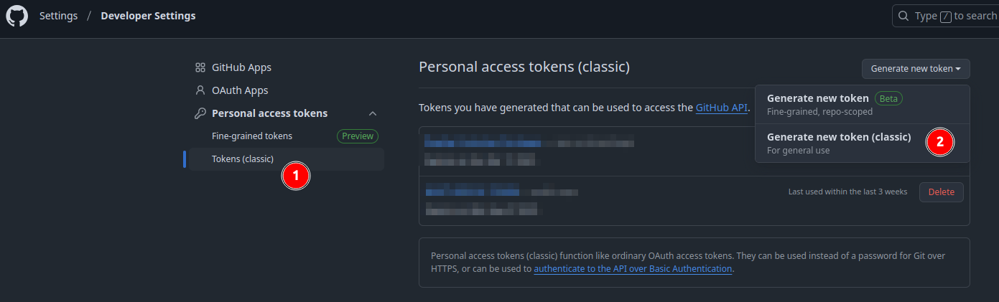
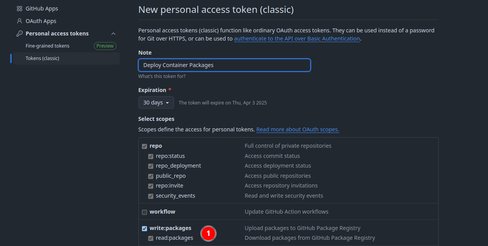

Tools like Docker, Podman or Kubernetes make it easy to run your applications anywhere in a reproducible fashion.

The easiest way to host your container images is by using a container registry, for example ghcr.io from GitHub.
The benefit of using ghcr.io aka GitHub Packages is that they are private by default, are well integrated with GitHub Actions CI/CD and they are for free.
Of course there are far more container registries out there, but GitHub Packages fits my needs.

## Prerequisites

* Quarkus application
  * quarkus-container-image-jib dependency
* Java / Kotlin
* Gradle
* GitHub Account for GitHub Container Registry or other registry (Optional)

## Creating a sample Quarkus project

The easiest way to create a Quarkus project locally is using the [Quarkus CLI](https://quarkus.io/guides/cli-tooling#project-creation), which I'd usually install using [SDKMan!](https://simonscholz.dev/tutorials/ubuntu-dev-setup#sdkman).

```bash
quarkus create app dev.simonscholz:container-registry --dry-run --gradle-kotlin-dsl --kotlin --extensions=container-image-jib,quarkus-config-yaml
```

Alternatively you also can go to https://code.quarkus.io/ to create a new Quarkus project.

Feel free to add any extension you'd like.

## Adding container-image-jib to existing project (optional)

If you already have a Quarkus Project at hand you simply need to add the `io.quarkus:quarkus-container-image-jib` dependency.

```bash
quarkus ext add io.quarkus:quarkus-container-image-jib
```

## Creating a PAT (GitHub Personal Access Token)

In order to be able to push to the GitHub Container registry from your local machine a PAT (GitHub Personal Access Token) is required.

You can create one my logging in into GitHub and navigating to the [Token Settings](https://github.com/settings/tokens).



1. Select `Tokens (classic)`
2. Click on `Generate new token (classic)



1. The only necessary permission/scope to tick is `write:packages`.

Then click on the `Generate token` button at the bottom and copy it, since you won't see it anymore after leaving the page.

## Configure the application

For the username and PAT an `.env` file in the project root is really helpful.
Please ensure that this `.env` file will not be pushed to a remote github repository by adding it to your `.gitignore` file.

```bash[.env]
CONTAINER_REGISTRY_USERNAME=your-username
CONTAINER_REGISTRY_PASSWORD=the-PAT-you-created-before
```

In case `quarkus-config-yaml` also has been added the config can look like this:

```yml[application.yml]
quarkus:
  application:
    name: your-application
  container-image:
    name: your-application
    registry: ghcr.io // 1
    username: ${CONTAINER_REGISTRY_USERNAME} // 2
    password: ${CONTAINER_REGISTRY_PASSWORD} // 3
    group: ${CONTAINER_REGISTRY_USERNAME} // 4
    tag: latest
    build: true
    push: false // 5
    builder: jib
```

1. Container image registry to push to, e.g., ghcr.io for GitHub Packages
2. Username to login into the registry from .env file
3. Password or PAT from .env file
4. The group in the container registry, can be your organization or username (here it is the same as the username from .env)
5. Avoid pushing the container image on during build, if set to true a simple `quarkus build` or `./gradlew build` will automatically push the image to the registry

Since the `push` property is set to `false` the push property can be set in your terminal/command line:

```bash
# Using quarkus cli
quarkus build -Dquarkus.container-image.push=true

# Using gradle
./gradlew build -Dquarkus.container-image.push=true

# Using maven
./mvnw install -Dquarkus.container-image.push=true
```

By default the container image artifact will be private.

The container image can then be found here: https://github.com/your-org-or-user-name?tab=packages

## Sources

- https://quarkus.io/guides/container-image
- https://quarkus.io/guides/cli-tooling
- https://docs.github.com/en/packages/working-with-a-github-packages-registry/working-with-the-container-registry
