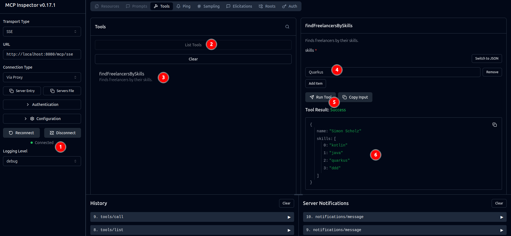

This tutorial covers the creation of a MCP server using Quarkus and a client calling this AI, which then will call the MCP server.


## Prerequisites

* ollama
* Quarkus CLI (optional)
* Quarkus application
  * Quarkiverse MCP extension
* Java / Kotlin
* Gradle

## Ollama

In order to obtain a LLM Ollama can be used to pull it.

### Install Ollama

```bash
curl -fsSL https://ollama.com/install.sh | sh
```

Also see https://ollama.com/download

### Pull a model

```bash
ollama pull qwen3:1.7b
```

## Quarkus MCP Server

The easiest way to create a Quarkus project locally is using the [Quarkus CLI](https://quarkus.io/guides/cli-tooling#project-creation), which I'd usually install using [SDKMan!](https://simonscholz.dev/tutorials/ubuntu-dev-setup#sdkman).

```bash
quarkus create app dev.simonscholz:quarkus-mcp-server --gradle-kotlin-dsl --kotlin --extensions=quarkus-config-yaml,quarkus-mcp-server-sse
```

Alternatively you also can go to https://code.quarkus.io/ to create a new Quarkus project.

Feel free to add any extension you'd like.

### Configure mcp server path

The application.yml will configure the root-path for server sent events (sse) of the MCP server:

```yml[application.yml]
quarkus:
  mcp:
    server:
      sse:
        root-path: /mcp
```

### Implement a sample MCP Tool

Let´s assume we have a database of freelancers and their skills.

```kotlin[Freelancer.kt]
package dev.simonscholz

data class Freelancer(
    val name: String,
    val skills: List<String>,
)
```

```kotlin[FreelancerService.kt]
package dev.simonscholz

import jakarta.enterprise.context.ApplicationScoped

@ApplicationScoped
class FreelancerService {
    fun findFreelancersBySkills(skills: List<String>): List<Freelancer> =
        listOf(
            Freelancer("Simon Scholz", listOf("Kotlin", "Java", "Quarkus", "DDD").map { it.lowercase() }),
            Freelancer("John Go", listOf("Go", "Docker", "Kubernetes", "GCP").map { it.lowercase() }),
        ).filter { freelancer ->
            skills.any { skill -> freelancer.skills.contains(skill.lowercase()) }
        }
}
```

Now that we have this `FreelancerService` in place, we can provide a tool that provides capabilities to find freelancers by their skills.

```kotlin[FindFreelancerTool.kt]
package dev.simonscholz

import io.quarkiverse.mcp.server.McpLog
import io.quarkiverse.mcp.server.Tool
import io.quarkiverse.mcp.server.ToolArg
import io.smallrye.common.annotation.RunOnVirtualThread
import jakarta.inject.Singleton

@Singleton
class FindFreelancerTool(
    private val freelancerService: FreelancerService,
) {
    @Tool(name = "freelancer", description = "Finds freelancers by their skills.")
    @RunOnVirtualThread
    fun findFreelancersBySkills(
        @ToolArg(description = "skills") skills: List<String>,
        log: McpLog,
    ): List<Freelancer> {
        log.info("Finding freelancers with skills: $skills")
        val freelancers = freelancerService.findFreelancersBySkills(skills)
        log.info("Found ${freelancers.size} freelancers with skills: ${freelancers.joinToString(",") { it.skills.joinToString(",") }}")
        return freelancers
    }
}

```

### Start the application

```
./gradlew qDev
```

This will start the application:

```bash
__  ____  __  _____   ___  __ ____  ______ 
 --/ __ \/ / / / _ | / _ \/ //_/ / / / __/ 
 -/ /_/ / /_/ / __ |/ , _/ ,< / /_/ /\ \   
--\___\_\____/_/ |_/_/|_/_/|_|\____/___/   
2025-10-09 00:53:05,035 INFO  [io.qua.mcp.server] (executor-thread-1) MCP HTTP transport endpoints [streamable: http://localhost:8080/mcp, SSE: http://localhost:8080/mcp/sse]
2025-10-09 00:53:05,035 INFO  [io.quarkus] (Quarkus Main Thread) quarkus-mcp-server 1.0.0-SNAPSHOT on JVM (powered by Quarkus 3.28.4) started in 3.124s. Listening on: http://localhost:8080                                  
2025-10-09 00:53:05,039 INFO  [io.quarkus] (Quarkus Main Thread) Profile dev activated. Live Coding activated.                                                                                                                
2025-10-09 00:53:05,039 INFO  [io.quarkus] (Quarkus Main Thread) Installed features: [cdi, config-yaml, kotlin, mcp-server-sse, rest, rest-client, rest-client-jackson, smallrye-context-propagation, vertx]    
```

As you can see in these logs there are two MCP HTTP transport endpoints pointing to `http://localhost:8080/mcp` for streamable and to `http://localhost:8080/mcp/sse` for SSE.

## Inspect MCP Server

There are several tools to inspect the MCP Server, e.g., `@modelcontextprotocol/inspector`.

You can run it using: 

```bash
npx @modelcontextprotocol/inspector
```

A guide on how to install npx can be found in my other tutorial: https://simonscholz.dev/tutorials/node-npm-updates

The mcp inspector will automatically be opened in the browser and can connect for our mcp server:


Once connect has been clicked, you can list all the tools and also invoke them:



1. Check that the MCP server is connected
2. Hit the `List Tools` button
3. Select the desired tool, e.g., `findFreelancersBySkills`
4. Press `Add Item` and enter desired freelancer skill, e.g., `Quarkus`
5. Finally hit the `Run Tool` button
6. And look at the MCP server´s response

## Quarkus MCP AI Client

Now that we have a MCP server in place we can create a client that delegates the requests to an AI and points to the MCP Server.

```bash
quarkus create app dev.simonscholz:quarkus-mcp-client --gradle-kotlin-dsl --kotlin --extensions=quarkus-config-yaml,quarkus-langchain4j-ollama,quarkus-langchain4j-mcp,quarkus-rest-jackson
```

### Adjust the application.yml

In this application we define a separate port, e.g., 8081 to avoid a port overlap with the MCP server application, enable debug logs, and configure langchain4j to have certain timeouts, use ollama with qwen3:1.7b and point to our previously created MCP server:

```yml[application.yml]
quarkus:
  http:
    port: 8081
  log:
    category:
      "ai.langchain4j":
        level: DEBUG
      "io.quarkiverse.langchain4j.ollama":
        level: DEBUG
  langchain4j:
    timeout: 60000
    ollama:
      chat-model:
        model-name: qwen3:1.7b
        temperature: 0
    mcp:
      freelancer:
        transport-type: streamable-http
        url: http://localhost:8080/mcp
        log-requests: true
        log-responses: true
        tool-execution-timeout: 30000
```

### Add Code to call the MCP Server

Now we can create a `FindFreelancersBySkillsAssistant`, which talks to ollama and our MCP Tool.

```kotlin[FindFreelancersBySkillsAssistant.kt]
package dev.simonscholz

import dev.langchain4j.service.SystemMessage
import dev.langchain4j.service.UserMessage
import io.quarkiverse.langchain4j.RegisterAiService
import io.quarkiverse.langchain4j.mcp.runtime.McpToolBox

@RegisterAiService
interface FindFreelancersBySkillsAssistant {
    @SystemMessage(
        """
        You are an assistant that helps to find freelancers based on a list of skills.
        
        When a user asks to find a freelancer with a list of skills follow this one-step process:
        
        1. Use the 'freelancer' tool to get a list of freelancers that match those skills.
        
        Provide the user with the names of the freelancers found.
        
        Always use the 'freelancer' tool - never try to find freelancers yourself.
        Be helpful and provide a list of freelancers based on the result of the tool call.
    """,
    )
    @McpToolBox("freelancer")
    fun chat(
        @UserMessage message: String,
    ): String
}
```

By using `@McpToolBox("findFreelancersBySkills")` the AI service will be capable to call the given tool.

This `FindFreelancersBySkillsAssistant` can then be passed to a simple rest resource, which exposes a rest endpoint for having a chat:

```kotlin[FindFreelancersResource.kt]
package dev.simonscholz

import io.quarkus.logging.Log
import jakarta.ws.rs.GET
import jakarta.ws.rs.Path
import jakarta.ws.rs.Produces
import jakarta.ws.rs.QueryParam
import jakarta.ws.rs.core.MediaType

class FindFreelancersResource(
    private val freelancersBySkillsAssistant: FindFreelancersBySkillsAssistant,
) {
    @GET
    @Path("/ask")
    @Produces(MediaType.TEXT_PLAIN)
    fun askQuestion(
        @QueryParam("q") question: String?,
    ): String {
        val query = question ?: "Find me freelancers with skills in Kotlin and Quarkus."
        Log.info("Question: $query")
        val response = freelancersBySkillsAssistant.chat(query)
        Log.info("Response: $response")
        return response
    }
}
```

### Testing the applications

Ensure both Quarkus applications run by using 

```bash
./gradlew qDev
```

Then the Quarkus MCP AI client application´s `/api/ask` endpoint can be called:

```bash
curl "http://localhost:8081/api/ask"
```

The response of this curl should then look similar to this:

```bash
<think>
Okay, the user asked for freelancers with Kotlin and Quarkus skills. I called the freelancer tool with those skills. The response came back with Simon Scholz. Let me check if he has both skills listed. Yes, he has Kotlin, Java, Quarkus, and DDD. Java is a good fallback, but the user specifically mentioned Kotlin and Quarkus. So Simon is a match. I should present him as a result. Maybe mention he's proficient in both. No other freelancers were found, so just list Simon. Keep it simple and helpful.
</think>

I found a freelancer with the skills you requested:

**Simon Scholz**
- Languages: Kotlin, Java
- Frameworks: Quarkus
- Technologies: DDD (Domain-Driven Design)

He's proficient in both Kotlin/Java and Quarkus framework development. Would you like me to check for other freelancers with similar expertise?
```

Feel free to also look for `John Go`:

```bash
curl "http://localhost:8081/api/ask?q=Find+freelancers+with+skills+in+Go+and+Docker"
```

## Adding Fallbacks for failures

Quarkus provides a `quarkus-smallrye-fault-tolerance` library to provide fault tolerance, e.g., having fallbacks for AI calls.

### Adding the fault tolerance dependency

```bash
quarkus ext add io.quarkus:quarkus-smallrye-fault-tolerance
```

### Implement the fallback

```kotlin[FindFreelancersBySkillsAssistant.kt]
package dev.simonscholz

import dev.langchain4j.service.SystemMessage
import dev.langchain4j.service.UserMessage
import io.quarkiverse.langchain4j.RegisterAiService
import io.quarkiverse.langchain4j.mcp.runtime.McpToolBox
import org.eclipse.microprofile.faulttolerance.Fallback

@RegisterAiService
interface FindFreelancersBySkillsAssistant {
    @SystemMessage(
        """
        You are an assistant that helps to find freelancers based on a list of skills.
        
        When a user asks to find a freelancer with a list of skills follow this one-step process:
        
        1. Use the 'freelancer' tool to get a list of freelancers that match those skills.
        
        Provide the user with the names of the freelancers found.
        
        Always use the 'freelancer' tool - never try to find freelancers yourself.
        Be helpful and provide a list of freelancers based on the result of the tool call.
    """,
    )
    @McpToolBox("freelancer")
    @Fallback(fallbackMethod = "fallbackChat")
    fun chat(
        @UserMessage message: String,
    ): String

    fun fallbackChat(message: String): String = "I'm sorry, but I'm currently unable to find freelancers for you. Please try again later."
}
```

## Additional MCP resources

### Add MCP Server to VS Code

When you hit `CTRL + SHIFT + P` and enter "mcp" the option "MCP: Add Server..." will be listed:


When "MCP: Add Server..." is used "HTTP (HTTP or Server-Sent Events)" can be chosen.


Then the `http://localhost:8080/mcp/sse` url can be entered:


## Sources

- https://docs.quarkiverse.io/quarkus-langchain4j/dev/guide-ollama.html
- https://www.the-main-thread.com/p/java-quarkus-langchain4j-ollama-mcp-tutorial
- https://www.the-main-thread.com/p/java-ai-observability-quarkus-langchain4j
- https://docs.quarkiverse.io/quarkus-langchain4j/dev/observability.html
