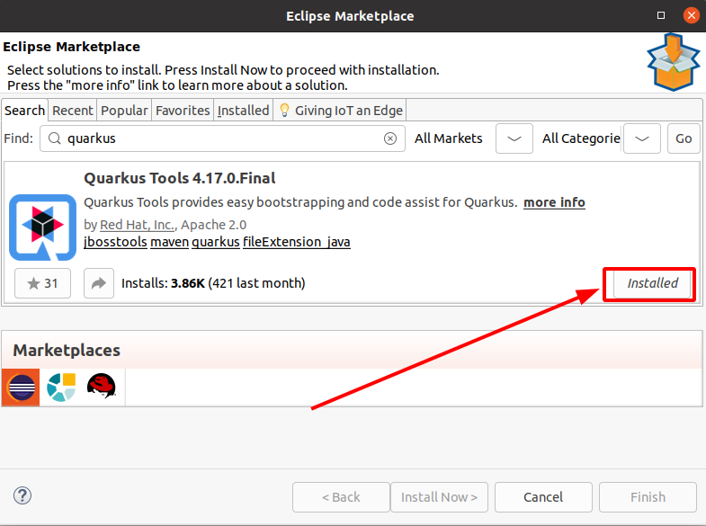
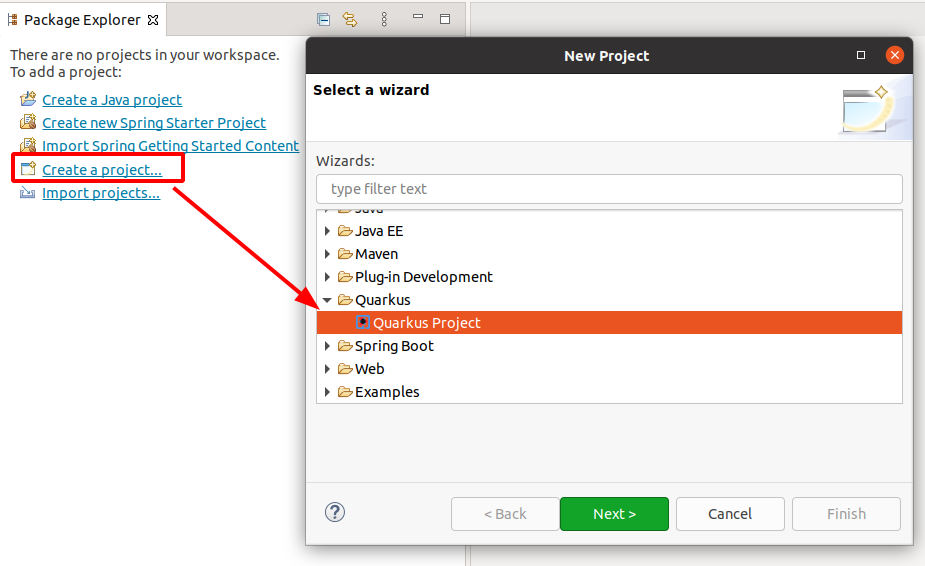
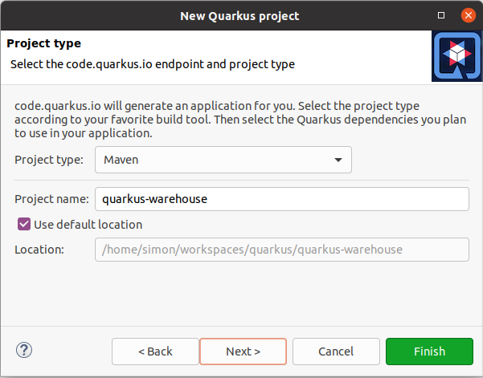
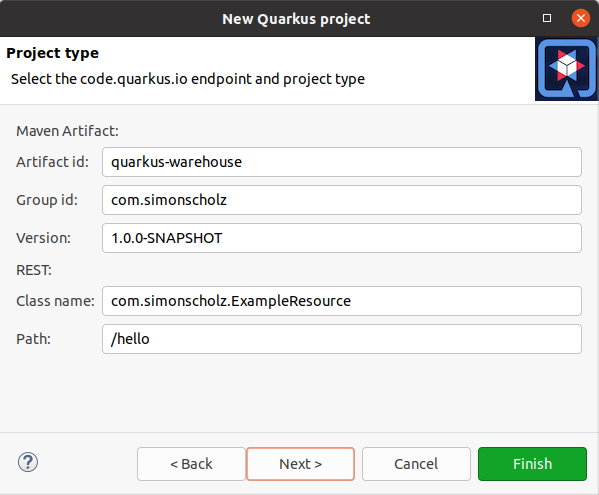
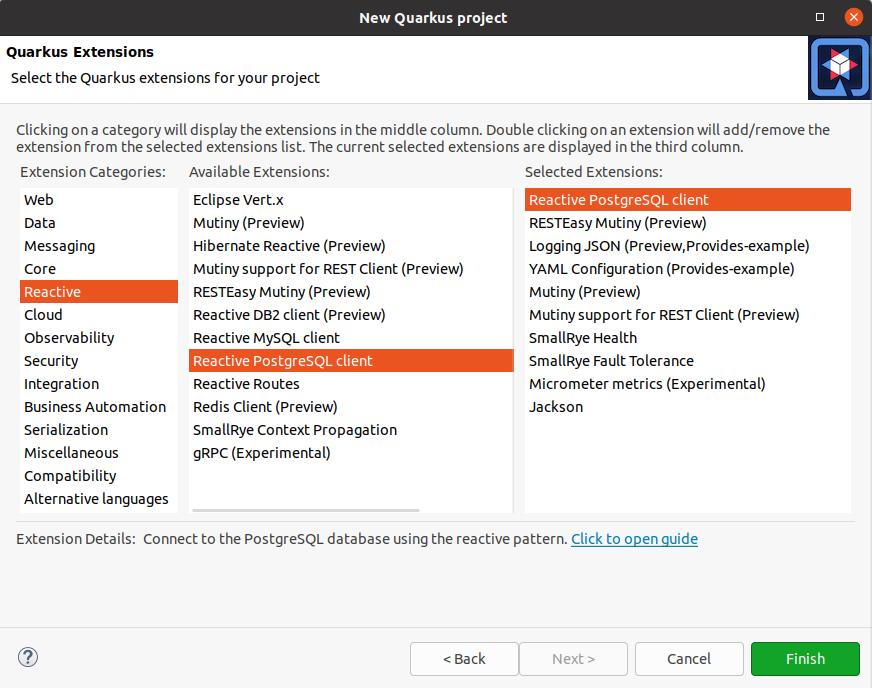

# Setup

Make sure that the maven tooling in your IDE is present and install Quarkus IDE extensions/tooling if appropriate.

For example the Eclipse IDE offers Quarkus Tools for this in its marketplace:

Once the tooling is installed Quarkus Project will appear in the New Project wizard.

On the next page choose Maven and call the project quarkus-warehouse.

Then choose the following quarkus extensions and press finish.

## Sources

- https://quarkus.io/blog/eclipse-got-quarkused/
