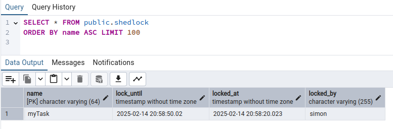
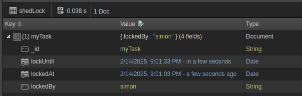

Shedlock can be used to have a distributed lock mechanism in Java/JVM applications.
This is really useful when having scheduled tasks run by an application/service, which usually have multiple instances running,
e.g., having multiple pods of a containerized application in a kubernetes cluster.

Many frameworks like Spring Boot or Quarkus have scheduled task running capabilities where you'd usually want to ensure that only one instance of the application/service runs a scheduled task at once.

There are many solutions out there for running a scheduled task only once, let's name a few:

* Reply on an external trigger, e.g., [Google Cloud Scheduler](https://cloud.google.com/scheduler/docs), which triggers only one instance from the outside
* Scheduling Frameworks, e.g., [Quarkus Quartz](https://quarkus.io/guides/quartz)
* Shedlock for distributed locking of code blocks like [Quarkus Scheduler](https://quarkus.io/guides/scheduler)
* Other alternatives

## Prerequisites

* Quarkus application
  * Quarkus Flyway
  * Quarkus JDBC Postgresql (or any other supported DB, e.g., Redis or MongoDB)
  * Quarkus Scheduler
* Shedlock
  * Core
  * CDI extension
  * JDBC provider (or other suitable provider, e.g., Regis or MongoDB)
* Java / Kotlin
* Gradle

## Download or clone the Quarkus ShedLock applications

The sample quarkus applications can be found here on [GitHub](https://github.com/SimonScholz/tutorials/tree/master/shedlock).

Feel free to clone the repository and look at the [shedlock-postgres](https://github.com/SimonScholz/tutorials/tree/master/shedlock/shedlock-postgres) 
or [shedlock-mongodb](https://github.com/SimonScholz/tutorials/tree/master/shedlock/shedlock-mongodb) examples.

Let's now walk through the code so that you can also adjust your own Quarkus application easily.

## Using Shedlock with Postgres

The important dependencies for this setup are the following:

```kotlin[build.gradle.kts]
    implementation("io.quarkus:quarkus-scheduler")
    implementation("net.javacrumbs.shedlock:shedlock-provider-jdbc:6.2.0")
    implementation("net.javacrumbs.shedlock:shedlock-cdi:6.2.0")
    implementation("io.quarkus:quarkus-flyway")
    implementation("io.quarkus:quarkus-jdbc-postgresql")
    implementation("org.flywaydb:flyway-database-postgresql")
```

So basically we're using the simple quarkus Scheduler to run periodic tasks and use shedlock
to create a lock to avoid parallel scheduler runs between different application/service instances.

The flyway and database part is used for persisting the lock state and distribute it to all instances.

### Add flyway migration for shedlock db table

Since this example is using postgresql we utilize flyway to create the shedlock database table.

Within the `src/main/resources/` folder there must be a `db/migration` folder where we put the sql files
to be applied to the postgresql database.

The sql file has to have a certain scheme for flyway to pick it up and therefore is called: `V1.0.0__shedlock.sql`

```sql[V1.0.0__shedlock.sql]
CREATE TABLE shedlock(
    name VARCHAR(64) NOT NULL,
    lock_until TIMESTAMP NOT NULL,
    locked_at TIMESTAMP NOT NULL,
    locked_by VARCHAR(255) NOT NULL,
    PRIMARY KEY (name)
);
```

### Configure the Quarkus Application

Now let's have a look at the `application.yml` or `application.properties` file in the `src/main/resources` folder.

```yml[application.yml]
quarkus:
  flyway:
    migrate-at-start: true // 1
  datasource:
    db-kind: postgresql // 2
    username: quarkus // 3
    password: quarkus // 4
    jdbc:
      url: jdbc:postgresql://localhost:6543/quarkus // 5
    devservices:
      enabled: true // 6
      port: 6543 // 7

shedlock:
  defaults:
    lock-at-most-for: PT20S // 8
```

1. Tells flyway to run the sql scripts in the `db/migration` folder, e.g., `V1.0.0__shedlock.sql`
2. Specify which database is used
3. default username when using [Quarkus Dev Services](https://quarkus.io/guides/dev-services)
4. default password when using [Quarkus Dev Services](https://quarkus.io/guides/dev-services)
5. jdbc url to connect to the database, uses custom port specified at point 7.
6. Enable datasource dev services, which will spin up a postgres database docker container for you.
7. Specify a different port, since you might already have an instance running on the default 5432 postgres port
8. Shedlock requires to specify a default `lock at most for` as a fallback in case you forget to specify a dedicated value for your particular lock

### Creating the actual scheduler class

Shedlock works with a so called `net.javacrumbs.shedlock.core.LockProvider` class, which has many different implementations.
These different `LockProvider` implementations are used to store the lock state "somewhere", in most cases a database.

We gonna make use of the `JdbcLockProvider` here to allow Shedlock the interaction with the postgres database.

```kotlin[ShedLockConfig.kt]
package dev.simonscholz

import jakarta.enterprise.inject.Produces
import jakarta.inject.Singleton
import net.javacrumbs.shedlock.core.LockProvider
import net.javacrumbs.shedlock.provider.jdbc.JdbcLockProvider
import javax.sql.DataSource

class ShedLockConfig {
    @Produces
    @Singleton
    fun lockProvider(dataSource: DataSource): LockProvider = JdbcLockProvider(dataSource)
}
```

The actual `Scheduler` class will then, besides the regular `io.quarkus.scheduler.Scheduled` annotation,
make use of the `net.javacrumbs.shedlock.cdi.SchedulerLock` annotation.

Please note that this is the [cdi implementation](https://github.com/lukas-krecan/ShedLock/blob/master/cdi/shedlock-cdi/src/main/java/net/javacrumbs/shedlock/cdi/SchedulerLock.java) of the `SchedulerLock` class,
because besides cdi Shedlock also supports many other `SchedulerLock` implementations,
e.g. for [Spring Boot](https://github.com/lukas-krecan/ShedLock/blob/master/spring/shedlock-spring/src/main/java/net/javacrumbs/shedlock/spring/annotation/SchedulerLock.java)
or [Micronout](https://github.com/lukas-krecan/ShedLock/blob/master/micronaut/shedlock-micronaut4/src/main/java/net/javacrumbs/shedlock/micronaut/SchedulerLock.java) and others.

```kotlin[Scheduler.kt]
package dev.simonscholz

import io.quarkus.scheduler.Scheduled
import io.quarkus.scheduler.ScheduledExecution
import net.javacrumbs.shedlock.cdi.SchedulerLock
import org.jboss.logging.Logger

class Scheduler(
    private val logger: Logger,
) {
    @Scheduled(every = "40s", concurrentExecution = Scheduled.ConcurrentExecution.SKIP) // 1
    @SchedulerLock(name = "myTask", lockAtLeastFor = "PT30S", lockAtMostFor = "PT50S") // 2
    fun myTask(scheduledExecution: ScheduledExecution) { // 3
        logger.info(
            """
            Running Scheduler Task.
            Firetime: ${scheduledExecution.fireTime}
            Scheduled Firetime: ${scheduledExecution.scheduledFireTime}
            Trigger: ${scheduledExecution.trigger}
            """,
        )
    }
}
```

1. The scheduler is supposed to run every 40s and should not run concurrently indicated by `Scheduled.ConcurrentExecution.SKIP` (only applies for the same JVM 😉)
2. Specify a name for the task, which will be stored in the database and specify for how long the lock should at least remain and at most
3. Quarkus optionally can pass an instance of `ScheduledExecution` into the scheduled method/function for further meta data.

Note that the `lockAtMostFor` config also has a default specified within the `application.yml`.

Now you can run `./gradlew qDev` to start the application in dev mode and look at the `logger` statements.



## Starting 2 instances

In order to validate that only one application is running the scheduled job let's spin up two instances
and look at the logs.

Open two terminals in the folder or using the terminal of your IDE.

```bash[Terminal 1]
./gradlew qDev
```

The quarkus http port defaults to `8080`.

In the second terminal we then start the second instance:

```bash[Terminal 2]
export QUARKUS_HTTP_PORT=8081 // 1
export QUARKUS_DATASOURCE_DEVSERVICES_ENABLED=false // 2

./gradlew qDev
```

1. Set different port for the second instance run
2. Prohibit that quarkus tries to start another dev container for postgres

When you do this you can see that only one scheduled job is run at a given time
and nothing is run in parallel.

## Using ShedLock with MongoDB

Now you can have a look at the `shedlock-mongodb` project in the [tutorials GitHub Repo](https://github.com/SimonScholz/tutorials).

### Adjust dependencies

In order to make use of MongoDB the `shedlock-provider-mongo` and `quarkus-mongodb-client` needs to be used.

```kotlin[build.gradle.kts]
    implementation("io.quarkus:quarkus-scheduler")
    implementation("net.javacrumbs.shedlock:shedlock-cdi:6.2.0")
    implementation("net.javacrumbs.shedlock:shedlock-provider-mongo:6.2.0")
    implementation("io.quarkus:quarkus-mongodb-client")
```

### Adjust application.yml

Instead of Configuring postgres, like in the sections before, we Configure the mongodb devservices.

```yml[application.yml]
quarkus:
  mongodb:
    devservices:
      enabled: true
      port: 27018

shedlock:
  defaults:
    lock-at-most-for: PT20S
```

The default port of mongo db is `27017`, but I changed it here on purpose to `27018` to overcome potential port conflicts.

### Adjust ShedLockConfig

```kotlin[ShedLockConfig.kt]
package dev.simonscholz

import com.mongodb.client.MongoClient
import jakarta.enterprise.inject.Produces
import jakarta.inject.Singleton
import net.javacrumbs.shedlock.core.LockProvider
import net.javacrumbs.shedlock.provider.mongo.MongoLockProvider

class ShedLockConfig {
    @Produces
    @Singleton
    fun lockProvider(mongo: MongoClient): LockProvider = MongoLockProvider(mongo.getDatabase("shedlock"))
}
```

Note that the mongo dev container is being used here and that you should definitely use your own database here,
which most likely is **NOT** called `shedlock`.

### The actual Scheduler

The actual scheduler remains the same like the one in the [postgres example above](#creating-the-actual-scheduler-class).

```kotlin
package dev.simonscholz

import io.quarkus.scheduler.Scheduled
import io.quarkus.scheduler.ScheduledExecution
import net.javacrumbs.shedlock.cdi.SchedulerLock
import org.jboss.logging.Logger

class Scheduler(
    private val logger: Logger,
) {
    @Scheduled(every = "40s", concurrentExecution = Scheduled.ConcurrentExecution.SKIP)
    @SchedulerLock(name = "myTask", lockAtLeastFor = "PT30S", lockAtMostFor = "PT50S")
    fun myTask(scheduledExecution: ScheduledExecution) {
        logger.info(
            """
            Running Scheduler Task.
            Firetime: ${scheduledExecution.fireTime}
            Scheduled Firetime: ${scheduledExecution.scheduledFireTime}
            Trigger: ${scheduledExecution.trigger}
            """,
        )
    }
}
```

### Run and see

The application can be run by `./gradlew qDev` and should log out the meta data about the scheduled job.

In NosqlBooster you can then see the `shedlock` collection:



## Sources

- https://quarkus.io/guides/scheduler
- https://quarkus.io/guides/quartz
- https://quarkus.io/guides/flyway
- https://quarkus.io/guides/databases-dev-services
- https://medium.com/tav-technologies/how-to-replace-quartz-with-shedlock-ae7c16951cf9
- https://github.com/quarkiverse/quarkus-shedlock
