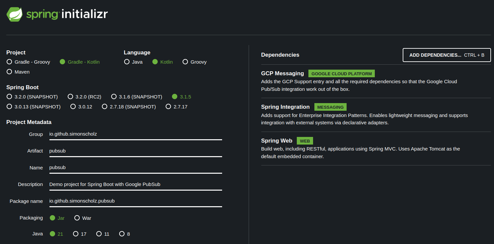

In this tutorial, we'll learn how to use the Google Cloud Pub/Sub with Spring Boot and Quarkus.

Google Cloud Pub/Sub is a fully-managed real-time messaging service that allows you to send and receive messages between independent applications. It is a scalable, durable, and highly available messaging service that can be used to decouple applications and components deployed on Google Cloud.

## Prerequisites

- JDK
- Kotlin
- Spring Boot
- Gradle or Maven
- Docker and Docker Compose
- An Integrated Development Environment (IDE) such as IntelliJ IDEA or Eclipse or VS Code

## Run the Google Cloud Pub/Sub Emulator

To run the Google Cloud Pub/Sub Emulator, you can use the following Docker Compose file:

```yaml [docker-compose.yml]
version: '3.9'

services:
  
  pubsub-emulator:
    image: gcr.io/google.com/cloudsdktool/cloud-sdk:453.0.0-emulators
    container_name: pubsub-emulator
    ports:
      - "8685:8685"
    volumes:
      - ./init-pubsub.sh:/init-pubsub.sh
    entrypoint: ["/init-pubsub.sh"]
    restart: always
```

The `init-pubsub.sh` script is used to start the emulator, create a topic and a subscription:

```bash [init-pubsub.sh]
#!/bin/sh

# Start the Pub/Sub emulator
gcloud beta emulators pubsub start --host-port 0.0.0.0:8685 --project=my-project-id &

# Wait for the emulator to start (adjust sleep time as needed)
sleep 5

# Create Pub/Sub topics
curl -s -X PUT 'http://0.0.0.0:8685/v1/projects/my-project-id/topics/my-topic'

# Create Pub/Sub subscriptions
curl -s -X PUT 'http://0.0.0.0:8685/v1/projects/my-project-id/subscriptions/my-topic-sub' \
    -H 'Content-Type: application/json' \
    --data '{"topic":"projects/my-project-id/topics/my-topic"}'

# Keep the script running to keep the container alive
tail -f /dev/null
```

## Publish to a Google Cloud Pub/Sub Topic

To publish to a Google Cloud Pub/Sub topic, you can use the following `curl` command:

```bash
curl -X POST "http://0.0.0.0:8685/v1/projects/my-project-id/topics/my-topic:publish" \
-H "Content-Type: application/json" \
-d '{
  "messages": [
    {
      "attributes": {
        "KEY": "VALUE",
        "anotherKey": "anotherValue"
      },
      "data": "MESSAGE_DATA"
    }
  ]
}'
```

Later, we'll use a Spring Boot application and a Quarkus application to publish to a Google Cloud Pub/Sub topic.

## Pull from a Google Cloud Pub/Sub Subscription

To pull from a Google Cloud Pub/Sub subscription, you can use the following `curl` command:

```bash
curl -X POST "http://0.0.0.0:8685/v1/projects/my-project-id/subscriptions/my-topic-sub:pull" \
-H "Content-Type: application/json" \
-d '{
  "returnImmediately": true,
  "maxMessages": 1
}'
```

Later, we'll use a Spring Boot application and a Quarkus application to pull from a Google Cloud Pub/Sub subscription.

## Create a Spring Boot Project

Start by creating a new Spring Boot project. You can use the Spring Initializer (https://start.spring.io/) or your IDE to generate a new project.



You just need to make sure to add the following dependencies:

```kotlin [build.gradle.kts]
implementation("com.google.cloud:spring-cloud-gcp-starter-pubsub")
implementation("org.springframework.integration:spring-integration-core")

// optional, but helpful to use rest to test publishing
implementation("org.springframework.boot:spring-boot-starter-web")
```

### Configure Application Properties

In the `application.properties` or `application.yml` file we'd define some properties, we want to read.

```yaml [application.yml]
---
spring:
  cloud:
    gcp:
      project-id: my-project-id
      pubsub:
        emulator-host: "localhost:8685"
```

### Subscribe to a Google Cloud Pub/Sub Topic

To subscribe to a Google Cloud Pub/Sub topic, we need to create a `@Configuration` like this:

```kotlin [PubSubConfiguration.kt]
package io.github.simonscholz.pubsub

import com.google.cloud.spring.pubsub.core.PubSubTemplate
import com.google.cloud.spring.pubsub.integration.AckMode
import com.google.cloud.spring.pubsub.integration.inbound.PubSubInboundChannelAdapter
import com.google.cloud.spring.pubsub.support.BasicAcknowledgeablePubsubMessage
import com.google.cloud.spring.pubsub.support.GcpPubSubHeaders
import org.slf4j.Logger
import org.slf4j.LoggerFactory
import org.springframework.beans.factory.annotation.Qualifier
import org.springframework.context.annotation.Bean
import org.springframework.context.annotation.Configuration
import org.springframework.integration.annotation.ServiceActivator
import org.springframework.integration.channel.DirectChannel
import org.springframework.messaging.MessageChannel
import org.springframework.messaging.MessageHandler


@Configuration
class PubSubConfig {

    private val LOGGER: Logger = LoggerFactory.getLogger(PubSubConfig::class.java)

    @Bean
    fun messageChannelAdapter(
        @Qualifier("pubsubInputChannel") inputChannel: MessageChannel,
        pubSubTemplate: PubSubTemplate,
    ): PubSubInboundChannelAdapter = PubSubInboundChannelAdapter(pubSubTemplate, "my-topic-sub").apply {
            outputChannel = inputChannel
            setAckMode(AckMode.MANUAL)
        }

    @Bean
    fun pubsubInputChannel(): MessageChannel = DirectChannel()

    @Bean
    @ServiceActivator(inputChannel = "pubsubInputChannel")
    fun messageReceiver(): MessageHandler =
        MessageHandler { message ->
            LOGGER.info("Message arrived! Payload: " + String((message.payload as ByteArray)))
            val originalMessage: BasicAcknowledgeablePubsubMessage? = message.headers.get(GcpPubSubHeaders.ORIGINAL_MESSAGE, BasicAcknowledgeablePubsubMessage::class.java)
            LOGGER.info(originalMessage?.pubsubMessage?.data?.toStringUtf8())
            originalMessage?.ack()
        }
}
```

Alternatively, you can use the `@ServiceActivator` annotation in a separate `@Component` to subscribe to a Google Cloud Pub/Sub topic:

```kotlin [Receiver.kt]
package io.github.simonscholz.pubsub

import org.slf4j.LoggerFactory
import org.springframework.integration.annotation.ServiceActivator
import org.springframework.stereotype.Component

@Component
class Receiver {

    @ServiceActivator(inputChannel = "pubsubInputChannel")
    fun messageReceiver(payload: String) {
        LOGGER.info("Message arrived! Payload: $payload")
    }

    companion object {
        private val LOGGER = LoggerFactory.getLogger(Receiver::class.java)
    }
}
```

To test the subscription, you can use the following `curl` command:

```bash
curl -X POST "http://0.0.0.0:8685/v1/projects/my-project-id/topics/my-topic:publish" \
-H "Content-Type: application/json" \
-d '{
  "messages": [
    {
      "attributes": {
        "KEY": "VALUE",
        "anotherKey": "anotherValue"
      },
      "data": "MESSAGE_DATA"
    }
  ]
}'
```

# Sources

- https://cloud.google.com/pubsub/docs/publisher#rest
- https://cloud.google.com/pubsub/docs/emulator
- https://cloud.google.com/pubsub/docs/reference/rest/v1/projects.topics
- https://cloud.google.com/pubsub/docs/reference/rest/v1/projects.subscriptions
- https://spring.io/guides/gs/messaging-gcp-pubsub/
- https://docs.quarkiverse.io/quarkus-google-cloud-services/main/pubsub.html
