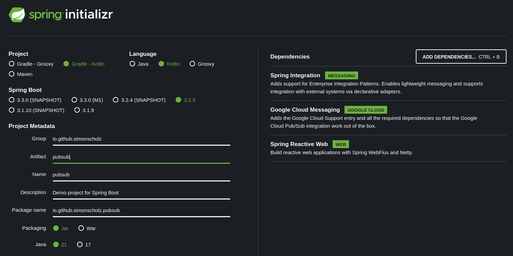

In this tutorial, we'll learn how to use the Google Cloud Pub/Sub with Spring Boot and Quarkus.

Google Cloud Pub/Sub is a fully-managed real-time messaging service that allows you to send and receive messages between independent applications. It is a scalable, durable, and highly available messaging service that can be used to decouple applications and components deployed on Google Cloud.

## Prerequisites

- JDK
- Kotlin
- Spring Boot
- Gradle or Maven
- Docker and Docker Compose
- An Integrated Development Environment (IDE) such as IntelliJ IDEA or Eclipse or VS Code

## Run the Google Cloud Pub/Sub Emulator

To run the Google Cloud Pub/Sub Emulator, you can use the following Docker Compose file:

```yaml [docker-compose.yml]
version: '3.9'

services:
  
  pubsub-emulator:
    image: gcr.io/google.com/cloudsdktool/cloud-sdk:466.0.0-emulators
    container_name: pubsub-emulator
    ports:
      - "8685:8685"
    volumes:
      - ./init-pubsub.sh:/init-pubsub.sh
    entrypoint: ["/init-pubsub.sh"]
    restart: always
```

The `init-pubsub.sh` script is used to start the emulator, create a topic and a subscription:

```bash [init-pubsub.sh]
#!/bin/sh

# Start the Pub/Sub emulator
gcloud beta emulators pubsub start --host-port 0.0.0.0:8685 --project=sample-project-id &

# Wait for the emulator to start (adjust sleep time as needed)
sleep 5

# Create Pub/Sub topics
curl -s -X PUT 'http://0.0.0.0:8685/v1/projects/sample-project-id/topics/user-created-topic'

curl -s -X PUT 'http://0.0.0.0:8685/v1/projects/sample-project-id/topics/user-created-json-topic'

# Create Pub/Sub subscriptions
curl -s -X PUT 'http://0.0.0.0:8685/v1/projects/sample-project-id/subscriptions/user-created-topic-sub' \
    -H 'Content-Type: application/json' \
    --data '{"topic":"projects/sample-project-id/topics/user-created-topic"}'

curl -s -X PUT 'http://0.0.0.0:8685/v1/projects/sample-project-id/subscriptions/user-created-json-topic-sub' \
    -H 'Content-Type: application/json' \
    --data '{"topic":"projects/sample-project-id/topics/user-created-json-topic"}'

# Keep the script running to keep the container alive
tail -f /dev/null
```

Make sure that the `init-pubsub.sh` script is executable:

```bash
chmod +x init-pubsub.sh
```

The `&` at the end of the emulator start command is used to run the emulator in the background. The `tail -f /dev/null` command is used to keep the container alive.

Check if topics and subscriptions were created successfully:

```bash
curl -X GET 'http://0.0.0.0:8685/v1/projects/sample-project-id/topics'

curl -X GET 'http://0.0.0.0:8685/v1/projects/sample-project-id/subscriptions'
```

## Publish to a Google Cloud Pub/Sub Topic

To publish to a Google Cloud Pub/Sub topic, you can use the following `curl` command:

```bash
curl -X POST "http://0.0.0.0:8685/v1/projects/sample-project-id/topics/user-created-topic:publish" \
-H "Content-Type: application/json" \
-d '{
  "messages": [
    {
      "attributes": {
        "DOMAIN_OBJECT_ID": "12345",
        "anotherKey": "anotherValue"
      }
    }
  ]
}'
```

Or using json data:

```bash
curl -X POST "http://0.0.0.0:8685/v1/projects/sample-project-id/topics/user-created-json-topic:publish" \
-H "Content-Type: application/json" \
-d '{
  "messages": [
    {
      "attributes": {
        "DOMAIN_OBJECT_ID": "12345",
        "anotherKey": "anotherValue"
      },
      "data": "eyJET01BSU5fT0JKRUNUX0lEIjogIjEyMzQ1IiwgIm5hbWUiOiAiSm9obiBEb2UifQ=="
    }
  ]
}'
```

The actual json data is `{"DOMAIN_OBJECT_ID": "12345", "name": "John Doe"}`, but it must be base64 encoded.
Also see [Publishing json message to PubSub](https://cloud.google.com/knowledge/kb/publishing-json-message-to-pub-sub-topic-fails-with-400-bad-request-error-000004171)

The first example does not use the `data` property, since it is optional. 
You'll have to use at least one property in `attributes` or `data` or both.

Later, we'll use a Spring Boot application and a Quarkus application to publish to a Google Cloud Pub/Sub topic.

## Pull from a Google Cloud Pub/Sub Subscription

To pull from a Google Cloud Pub/Sub subscription, you can use the following `curl` command:

```bash
curl -X POST "http://0.0.0.0:8685/v1/projects/sample-project-id/subscriptions/user-created-topic-sub:pull" \
-H "Content-Type: application/json" \
-d '{
  "maxMessages": 10
}'
```

Or from the `user-created-json-topic` subscription:

```bash
curl -X POST "http://0.0.0.0:8685/v1/projects/sample-project-id/subscriptions/user-created-json-topic:pull" \
-H "Content-Type: application/json" \
-d '{
  "maxMessages": 10
}'
```

When the message is only pulled, PubSub will keep the message, unless it is `acked`.
The return value of a pull should look similar to this:

```json
{
  "receivedMessages": [{
    "ackId": "projects/sample-project-id/subscriptions/user-created-topic-sub:1",
    "message": {
      "attributes": {
        "DOMAIN_OBJECT_ID": "12345",
        "anotherKey": "anotherValue"
      },
      "messageId": "1",
      "publishTime": "2023-11-07T23:04:40.028Z"
    }
  }]
}
```

You can acknowledge these messages by using the given `ackId` and calling the following:

```bash
curl -X POST "http://0.0.0.0:8685/v1/projects/sample-project-id/subscriptions/user-created-topic-sub:acknowledge" \
-H "Content-Type: application/json" \
-d '{
  "ackIds": [
    "projects/sample-project-id/subscriptions/user-created-topic-sub:1"
  ]
}'
```

Later, we'll use a Spring Boot application and a Quarkus application to pull from a Google Cloud Pub/Sub subscription.

## Create a Spring Boot Project

Start by creating a new Spring Boot project. You can use the Spring Initializer (https://start.spring.io/) or your IDE to generate a new project.



You just need to make sure to add the following dependencies:

```kotlin [build.gradle.kts]
implementation("org.springframework.boot:spring-boot-starter-integration")
implementation("com.google.cloud:spring-cloud-gcp-starter-pubsub")

// optional, but helpful to use rest to test publishing
implementation("org.springframework.boot:spring-boot-starter-webflux")
```

### Configure Application Properties

In the `application.properties` or `application.yml` file we need to configure the Google Cloud Pub/Sub project ID and the Google Cloud Pub/Sub emulator host:

```yaml [application.yml]
---
spring:
  cloud:
    gcp:
      project-id: sample-project-id
      pubsub:
        emulator-host: "localhost:8685"
```

### General GCP Configuration

To configure the Google Cloud project ID and credentials, we need to create a `@Configuration` like this:

```kotlin [GcpConfig.kt]
package io.github.simonscholz.pubsub

import com.google.api.gax.core.CredentialsProvider
import com.google.api.gax.core.NoCredentialsProvider
import com.google.cloud.spring.core.GcpProjectIdProvider
import org.springframework.beans.factory.annotation.Value
import org.springframework.context.annotation.Bean
import org.springframework.context.annotation.Configuration
import org.springframework.context.annotation.Profile

@Configuration
@Profile("local")
class GcpConfig {
    @Bean
    fun projectIdProvider(
        @Value("\${spring.cloud.gcp.project-id}") projectId: String?,
    ): GcpProjectIdProvider {
        return GcpProjectIdProvider { projectId }
    }

    @Bean
    fun credentialsProvider(): CredentialsProvider {
        return NoCredentialsProvider.create()
    }
}
```

Of course this only applies for the use of the Google Cloud Pub/Sub emulator.
If you want to use the Google Cloud Pub/Sub in production, you can configure the Google Cloud project ID and credentials differently.
On how to do this with secrets, environment variables and terraform see later sections of this tutorial.

### Subscribe to a Google Cloud Pub/Sub Topic

To subscribe to a Google Cloud Pub/Sub topic, we need to create a `@Configuration` like this:

```kotlin [PubSubConfig.kt]
package io.github.simonscholz.pubsub

import com.google.cloud.spring.pubsub.core.PubSubTemplate
import com.google.cloud.spring.pubsub.integration.AckMode
import com.google.cloud.spring.pubsub.integration.inbound.PubSubInboundChannelAdapter
import com.google.cloud.spring.pubsub.support.BasicAcknowledgeablePubsubMessage
import com.google.cloud.spring.pubsub.support.GcpPubSubHeaders
import org.slf4j.Logger
import org.slf4j.LoggerFactory
import org.springframework.beans.factory.annotation.Qualifier
import org.springframework.context.annotation.Bean
import org.springframework.context.annotation.Configuration
import org.springframework.integration.annotation.ServiceActivator
import org.springframework.integration.channel.DirectChannel
import org.springframework.messaging.MessageChannel
import org.springframework.messaging.MessageHandler


@Configuration
class PubSubConfig {

    @Bean
    fun messageChannelAdapter(
        @Qualifier("pubsubInputChannel") inputChannel: MessageChannel,
        pubSubTemplate: PubSubTemplate,
    ): PubSubInboundChannelAdapter =
        PubSubInboundChannelAdapter(pubSubTemplate, "user-created-json-topic-sub").apply {
            outputChannel = inputChannel
            setAckMode(AckMode.MANUAL)
        }

    @Bean
    fun pubsubInputChannel(): MessageChannel = DirectChannel()

    @Bean
    @ServiceActivator(inputChannel = "pubsubInputChannel")
    fun messageReceiver(): MessageHandler =
        MessageHandler { message ->
            LOGGER.info("Message arrived! Payload: ${String((message.payload as ByteArray))}")
            LOGGER.info("Headers: ${message.headers}")
            val originalMessage: BasicAcknowledgeablePubsubMessage? = message.headers.get(GcpPubSubHeaders.ORIGINAL_MESSAGE, BasicAcknowledgeablePubsubMessage::class.java)
            LOGGER.info("Data: ${originalMessage?.pubsubMessage?.data?.toStringUtf8()}")
            LOGGER.info("Attributes: ${originalMessage?.pubsubMessage?.attributesMap}")
            originalMessage?.ack()
        }

    companion object {
        private val LOGGER: Logger = LoggerFactory.getLogger(PubSubConfig::class.java)
    }
}
```

When having the `PubSubInboundChannelAdapter` bean and `MessageChannel` bean, the `@ServiceActivator` bean will be called when a message arrives.

There are many different ways to use a `@ServiceActivator`, the following examples will illustrate some of them.

### Using a MessageHandler bean

You can use a `MessageHandler` instance to subscribe to a Google Cloud Pub/Sub topic:

```kotlin [PubSubConfig.kt]
package io.github.simonscholz.pubsub

import com.google.cloud.spring.pubsub.core.PubSubTemplate
import com.google.cloud.spring.pubsub.integration.AckMode
import com.google.cloud.spring.pubsub.integration.inbound.PubSubInboundChannelAdapter
import com.google.cloud.spring.pubsub.support.BasicAcknowledgeablePubsubMessage
import com.google.cloud.spring.pubsub.support.GcpPubSubHeaders
import org.slf4j.Logger
import org.slf4j.LoggerFactory
import org.springframework.beans.factory.annotation.Qualifier
import org.springframework.context.annotation.Bean
import org.springframework.context.annotation.Configuration
import org.springframework.integration.annotation.ServiceActivator
import org.springframework.integration.channel.DirectChannel
import org.springframework.messaging.MessageChannel
import org.springframework.messaging.MessageHandler


@Configuration
class PubSubConfig {

    @Bean
    fun messageChannelAdapter(
        @Qualifier("pubsubInputChannel") inputChannel: MessageChannel,
        pubSubTemplate: PubSubTemplate,
    ): PubSubInboundChannelAdapter =
        PubSubInboundChannelAdapter(pubSubTemplate, "user-created-json-topic-sub").apply {
            outputChannel = inputChannel
            setAckMode(AckMode.MANUAL)
        }

    @Bean
    fun pubsubInputChannel(): MessageChannel = DirectChannel()

    @Bean
    @ServiceActivator(inputChannel = "pubsubInputChannel")
    fun messageReceiver(): MessageHandler =
        MessageHandler { message ->
            LOGGER.info("Message arrived! Payload: ${String((message.payload as ByteArray))}")
            LOGGER.info("Headers: ${message.headers}")
            val originalMessage: BasicAcknowledgeablePubsubMessage? = message.headers.get(GcpPubSubHeaders.ORIGINAL_MESSAGE, BasicAcknowledgeablePubsubMessage::class.java)
            LOGGER.info("Data: ${originalMessage?.pubsubMessage?.data?.toStringUtf8()}")
            LOGGER.info("Attributes: ${originalMessage?.pubsubMessage?.attributesMap}")
            originalMessage?.ack()
        }

    companion object {
        private val LOGGER: Logger = LoggerFactory.getLogger(PubSubConfig::class.java)
    }
}
```

### Using a `@ServiceActivator` with `@Payload` and `@Header` annotations

You can use a `@ServiceActivator` with `@Payload` and `@Header` annotations to subscribe to a Google Cloud Pub/Sub topic:

```kotlin [Receiver.kt]
package io.github.simonscholz.pubsub

import com.google.cloud.spring.pubsub.support.BasicAcknowledgeablePubsubMessage
import com.google.cloud.spring.pubsub.support.GcpPubSubHeaders
import org.slf4j.LoggerFactory
import org.springframework.integration.annotation.ServiceActivator
import org.springframework.messaging.handler.annotation.Header
import org.springframework.messaging.handler.annotation.Payload
import org.springframework.stereotype.Component

@Component
class Receiver {

    @ServiceActivator(inputChannel = "pubsubInputChannel")
    fun messageReceiver(
        @Header(GcpPubSubHeaders.ORIGINAL_MESSAGE) message: BasicAcknowledgeablePubsubMessage,
        @Header("DOMAIN_OBJECT_ID") domainObjectId: String,
        @Payload payload: String,
    ) {
        LOGGER.info("Message arrived! ORIGINAL_MESSAGE: $message")
        LOGGER.info("DOMAIN_OBJECT_ID: $domainObjectId")
        LOGGER.info("Payload: $payload")
        message.ack()
    }

    companion object {
        private val LOGGER = LoggerFactory.getLogger(Receiver::class.java)
    }
}
```

It is convenient to use the `@Header` and `@Payload` annotations to obtain the message payload and headers.
There this is my preferred way to use the `@ServiceActivator` annotation.

### Just obtain the message payload

You can even just obtain the message payload in the `@ServiceActivator` method:

```kotlin [Receiver.kt]
package io.github.simonscholz.pubsub

import org.slf4j.LoggerFactory
import org.springframework.integration.annotation.ServiceActivator
import org.springframework.stereotype.Component

@Component
class Receiver {

    @ServiceActivator(inputChannel = "pubsubInputChannel")
    fun messageReceiver(payload: String) {
        LOGGER.info("Message arrived! Payload: $payload")
    }

    companion object {
        private val LOGGER = LoggerFactory.getLogger(Receiver::class.java)
    }
}
```

This is less explicit, but it is possible to obtain the message payload directly without using the `@Header` and `@Payload` annotations.

### Test the Subscription

To test the subscription, you can use the following `curl` command:

```bash
curl -X POST "http://0.0.0.0:8685/v1/projects/sample-project-id/topics/user-created-json-topic:publish" -H "Content-Type: application/json" -d '{
  "messages": [
    {
      "attributes": {
        "DOMAIN_OBJECT_ID": "12345",
        "anotherKey": "anotherValue"
      },
      "data": "eyJET01BSU5fT0JKRUNUX0lEIjogIjEyMzQ1IiwgIm5hbWUiOiAiSm9obiBEb2UifQ=="
    }
  ]
}'
```

Watch the logs of the Spring Boot application to see the message being received.

# Sources

- https://cloud.google.com/pubsub/docs/publisher#rest
- https://cloud.google.com/pubsub/docs/emulator
- https://cloud.google.com/pubsub/docs/reference/rest/v1/projects.topics
- https://cloud.google.com/pubsub/docs/reference/rest/v1/projects.subscriptions
- https://spring.io/guides/gs/messaging-gcp-pubsub/
- https://docs.quarkiverse.io/quarkus-google-cloud-services/main/pubsub.html
