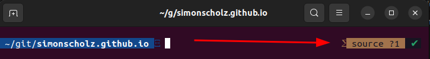

Fish shell is an alternative shell for linux, which comes with better content assist, a history of commands and many additional features contributed via plugins.

The official fish shell website can be found here: https://fishshell.com/

# Install fish

Run the following commands to install the Fishshell on Ubuntu.

```bash
sudo apt-add-repository ppa:fish-shell/release-3
sudo apt update
sudo apt install fish
```

For further details also see https://launchpad.net/~fish-shell/+archive/ubuntu/release-3

NOTE: In case you just `sudo apt install fish` without adding the repository mentioned above you might install an older version of the Fish shell.

# Setting fish as default shell

You can easily run the fish shell within your regular terminal by running `fish` in your bash/terminal.

In case you'd want to have fish as default shell so that it opens right away when opening a terminal or hitting `CTRL + ALT + T` then this command will help:

```bash
chsh -s $(which fish)
```

# Remove fish welcome message

The fish shell usually welcomes you with the following message:

```bash
Welcome to fish, the friendly interactive shell
Type help for instructions on how to use fish
```

This is quite nice, but not too helpful.

In order to remove this you can open the `config.fish` file by using nano like this:

```bash
nano ~/.config/fish/config.fish
```

Inside the `config.fish` file just add a new line with `set fish_greeting` as contents, which will basically remove the original welcome message.

# Setting persistent env variables

A universal variable is a variable whose value is shared across all instances of fish, now and in the future – even after a reboot. You can make a variable universal with set -U

In case you want to set a different editor for kubectl edits use the following command:

```bash
set -Ux KUBE_EDITOR "code --wait"
```

Also see https://fishshell.com/docs/current/tutorial.html#universal-variables

# Plugins for fish

The easiest way to install plugins for fish, is to use fisher.

Fisher can be installed by running:

```bash
curl -sL https://git.io/fisher | source && fisher install jorgebucaran/fisher
```

## The nvm Plugin

In order to use nvm (Node Version Manager) in the Fishshell you should use the following plugin:

```bash
fisher install FabioAntunes/fish-nvm edc/bass
```

With this plugin in place you can simply run `nvm install --lts` within the Fishshell to install the latest long term support version of node and npm.

## Tide Plugin

In order to improve the look of the shell I'd recommend the `Tide` plugin.

```bash
fisher install IlanCosman/tide@v5
```

After the installation you're usually promted to setup tide accoding to your needs, but you can always run `tide configure` to reconfigure the standard Tide setup.

The general features of Tide can be found here:
https://github.com/IlanCosman/tide#features

How to extend the configuration of Tide can be found here:
https://github.com/IlanCosman/tide/wiki/Configuration

### Adjusting the config of Tide

The defaults are already really fine, but I'd rather have the git information on the right hand side of the prompt.

So I listed what's configured for the left prompt by running `echo $tide_left_prompt_items`, which showed this:

```bash
vi_mode pwd git
```

In order to remove git from the left hand side I ran `set --universal tide_left_prompt_items vi_mode pwd` which basically has overridden the default.

In order to add `git` to the right prompt I ran:

```bash
set --universal tide_right_prompt_items git $tide_right_prompt_items
```

With these settings being applied my shell looks like this:



In case you're wondering what the `?1` behind the branch name means you'll find an explanation here: https://github.com/IlanCosman/tide/wiki/What-do-the-git-icons-mean%3F

# Sources

* https://github.com/FabioAntunes/fish-nvm