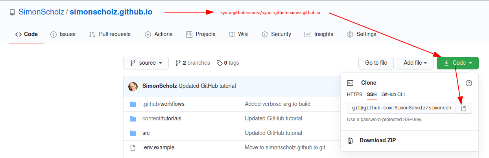
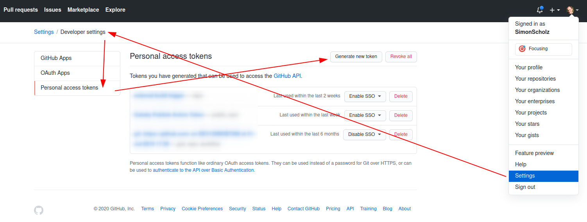
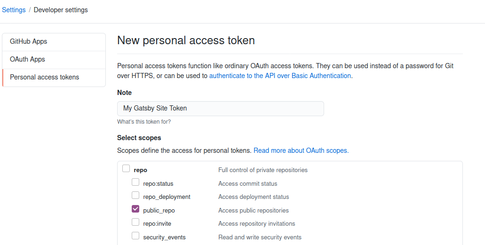
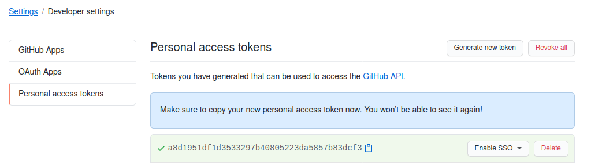
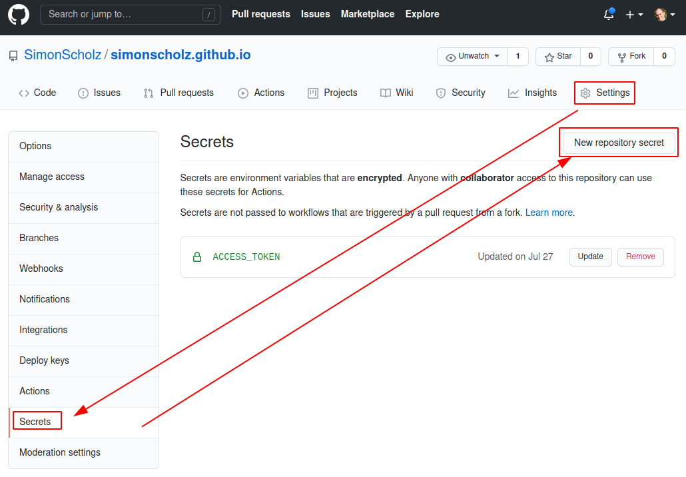

# GitHub Pages

You can create your custom GitHub Page by creating the following repository: "your-github-name".github.io, e.g., simonscholz.github.io.
Once you created this repository you can simply push an index.html file or whatever webpage content you like to the master branch of the repository.
This webpage will then be displayed when hitting "your-github-name".github.io, e.g., simonscholz.github.io, with your browser.

This feature is often used to provide a website for the project, which is being hosted on GitHub.
But I use this for my personal homepage.

Also see https://pages.github.com/ for more information about GitHub pages.

As you might already guess, this website can be found here: https://github.com/SimonScholz/simonscholz.github.io
The source code resides in the `source` branch and the actual site will be automatically build once I push something to the `source` branch.
After that build to build result can be found in the `master` branch.

# Steps to reproduce

## Create the repository

Create a new public repository called "your-github-name".github.io and GitHub will also tell you that this repo is special.

## Clone the repo and create a source branch

Go to your new repository and copy the clone url:



```bash
git clone git@github.com:{your-github-name}/{your-github-name}.github.io.git

e.g.

git clone git@github.com:SimonScholz/simonscholz.github.io.git
```

Creating the source branch works like this:

```bash
git checkout -b source
```

In the repository you can setup your website using gatsby.

## Create a Gatsby starter project

As a quick start you can install the `gatsby-cli` globally by running:

```bash
npm install -g gatsby-cli

or

yarn global add gatsby-cli
```

This assumes that you've already installed npm or yarn.

Then in the repository folder you can create a Gatsby starter project by calling `gatsby new gatsby-site https://github.com/gatsbyjs/gatsby-starter-hello-world` inside your repository.

Once this is done you can call `gatsby develop` and navigate to http://localhost:8000 to see the page.

Feel free to modify this starter project or even build a proper page according to your needs.
You'll find plenty of good docs, tutorials and examples on https://www.gatsbyjs.com/.

## Github action to automatically deploy your Gatsby website

You already know that the contents of the `master` branch will be used as source for your GitHub Pages website.
To avoid building your Gatsby locally by using the `gatsby build` command and pushing the result to the `master` branch over and over again, you can utilize GitHub actions to automate these steps.

Therefore create a `./github/workflows` folder inside the repo on the source branch, which contains a `main.yml` with the following contents:

```yaml
# Name of the action
name: 🚀 Deploy website

# Controls when the action will run.
# In this case the actions will be run when pushing to the source branch of your repository
on:
  push:
    branches: [source]

# A workflow run is made up of one or more jobs that can run sequentially or in parallel
jobs:
  # This workflow contains a single job called "build"
  build:
    # The type of runner that the job will run on
    runs-on: ubuntu-latest

    # Steps represent a sequence of tasks that will be executed as part of the job
    steps:
      # Checks-out your repository under $GITHUB_WORKSPACE, so your job can access it
      - uses: actions/checkout@v2

      - name: Gatsby Publish
        uses: enriikke/gatsby-gh-pages-action@v2.1.1
        with:
          # A personal access token needed to push your site after it has been built.
          access-token: ${{ secrets.ACCESS_TOKEN }}
          # The branch expected by GitHub to have the static files needed for your site.
          deploy-branch: master
          # Additional arguments that get passed to `gatsby build`.
          gatsby-args: --verbose
```

The contents of the `main.yml` file runs the jobs when pushing to the `source` branch.
First the code of the `source` branch will be checked out and thanks to https://github.com/enriikke/gatsby-gh-pages-action the Gatsby website will be built and then pushed to the master branch.

Your `main.yml` file can also contain secret variables, like `${{ secrets.ACCESS_TOKEN }}` for providing an access token.

## Personal access token with push repository rights

The `gatsby-gh-pages-action` needs access to your repository in order to be able to push to the `master` branch.
Personal access tokens can be created by navigating here: https://github.com/settings/tokens or by using the UI to your accounts `settings > developer settings > Personal access tokens`.



After hitting the `Generate new token` button you can enter a note and select proper scopes for the rights granted for the access token.



Assuming that the repo is public the `public_repo` scope should be sufficient.

Then just hit the `Generate token` button and copy the access token.



Make sure to copy this token in a save place, because you won't be able to see it any more after refreshing the page.

## Using the access token in the build file

Instead of directly pasting the generated personal access token into the `main.yml` file, you'd rather save it securely so that nobody can make use of it.
That's where repository secrets come into play.



After clicking on the `New repository secret` button you can give the enter a name and a value.
To be compliant with the given `main.yml` file the name should be `ACCESS_TOKEN` and the value has to be the personal access token, which was generated and copied earlier.

Congrats! After all these steps your Gatsby website will be build automatically when pushing to the source branch and then be deployed to the master branch.
